# Exercise 2: Create Actions in SAP Build to access the Onlineshop API

From this exercise on, we will switch to SAP Build Process Automation on the  Business Technology Platform (BTP).

In this exercise we will create Actions in SAP Build that access the Shopping Cart API on the BTP ABAP Environment from the previous chapter. There will be 2 actions, one to read all the shopping cart entries and another one that creates a new shopping cart entry. 

To create such Actions we need to prepare one thing first:
-Create a destination in BTP to create the secure connectivity in the BTP subaccount to the Shopping Cart API on the BTP ABAP Environment from the previous chapters

## Exercise 2.1: Create a Destination in a BTP subaccount to access the Shopping API

We will now create the destination in a BTP subaccount to our Shopping Cart API on the BTP ABAP Environment from the previous chapter. The destination will ensure secure connectivity.

1. In a browser open the [destinations (new) view in the BTP Cockpit](https://emea.cockpit.btp.cloud.sap/cockpit/?idp=lcap.accounts.ondemand.com#/globalaccount/47ae62c5-c35b-48a4-99b1-eee46b5b62bf/subaccount/f65e327c-d9e9-44cd-8d7b-e4e7ea8db474/destinationsnew). If you need to log on, log on with the user and the password that the instructors have given you

2. Press the *Create* button. On the pop up select 'From Scratch* and press *Create*

   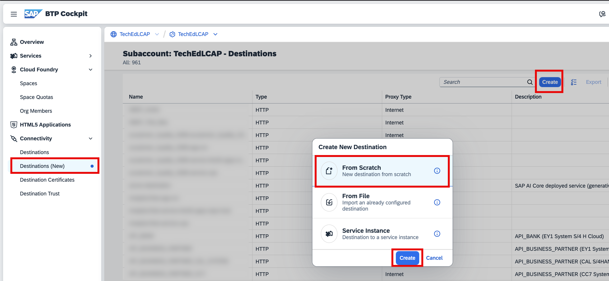

3. Fill in the following:

    |  Porperty   | Value |
    |  :------------- | :------------- |
    |  Name   | ShoppingCart### |
    |  Type   | HTTP |
    |  Description   | Shopping Cart API ### |
    |  URL   | https://3f652f6e-fef3-4c3a-8b7f-0ffd0f835d54.abap.eu10.hana.ondemand.com/sap/opu/odata/sap/Z_SHOPPINGCART_###_O2_API |
    |  Proxy Type   | Internet |
    |  Authentication   | BasicAuthentication |
    |  User   | INBOUND_USER_TECHEDLCAP |
    |  Password   | !!Password that is provided to you by the instructors!! |

    where *###* is your group number again (beware this has to be replaced in 3 values in the above list)    

   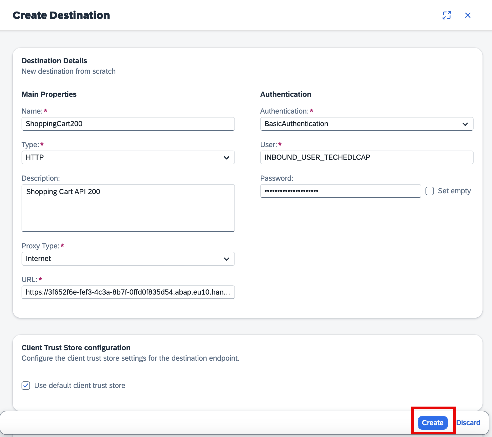

4. Under *Additional Properties* press *Add Property* and add
`sap.applicationdevelopment.actions.enabled` with value `true`

5. Under *Additional Properties* press *Add Property* again and add
`sap.processautomation.enabled` with value `true`

6. Under *Additional Properties* press *Add Property* again and add
`sap.build.usage` with value `RAP`

7. Press *Create*

   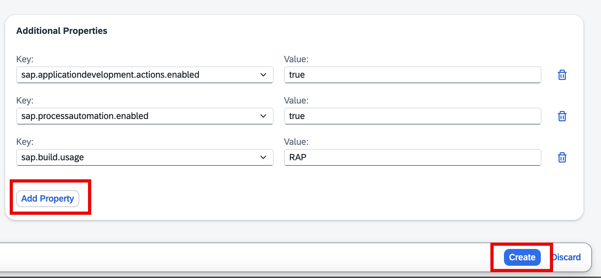

8. Back on the list of the destinations, select your new destination and press *Check Connection*. It should bring up a success messate

   

## Exercise 2.2: Enable the destination for Actions

1. Go to lobby https://lcapteched.eu10.build.cloud.sap/lobby. Select *Control Tower* on the left and select the *Destinations* tile on the right

   

2. Press *Add* to add a new destination

   

3. Search for your new destination *ShoppingCart###*, select it in the list and press *Next*

   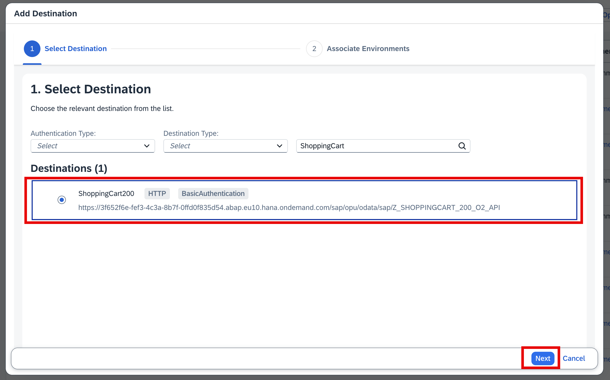

4. Select *All Environments* and press *Add Destination* 

   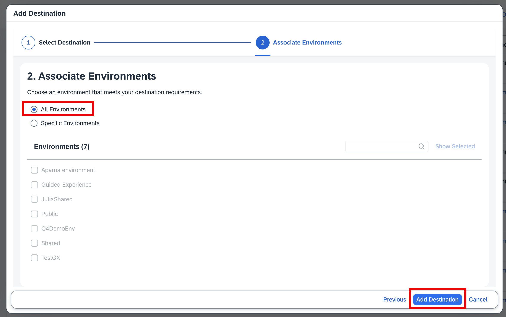

## Exercise 2.3: Create Actions from the Shopping Cart API

1. In the lobby select *Actions* on the left and then press *Add* to create a new action.

   

2. On the dialog choose the tile *ABAP RESTful Application Programming Model* as an API Source

   

3. find your service *ShoppingCart###* (with ### being you group number) and select it.

   

4. Browse through the possible actions you can create from your service and press *Next*

   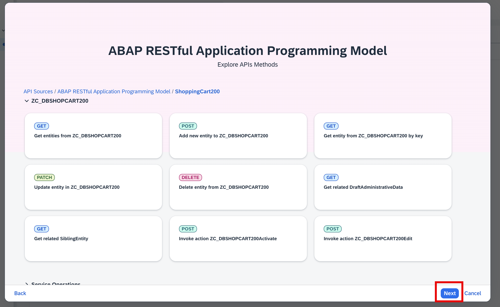

5. Give your new action project the name *ShoppingCart###Actions* and a description *Actions for API Shopping Cart ###* (with ### again your group name). Press *Create*

   

6. Now select the actions you want to create. Look for the name of your entity (like *ZC_DBSHOPPINFCART###*) and select both the *Get entities* and the *Add new entity* ones and press *Add*

   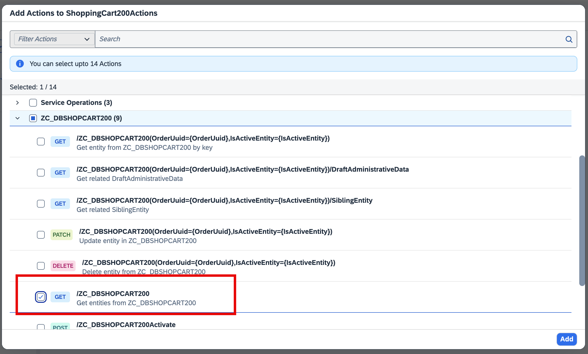

   

7. Test the Get Action: Select it on the left hand side. Select the *Test* tab, select your *ShoppingCart###* destination and press *Test*

   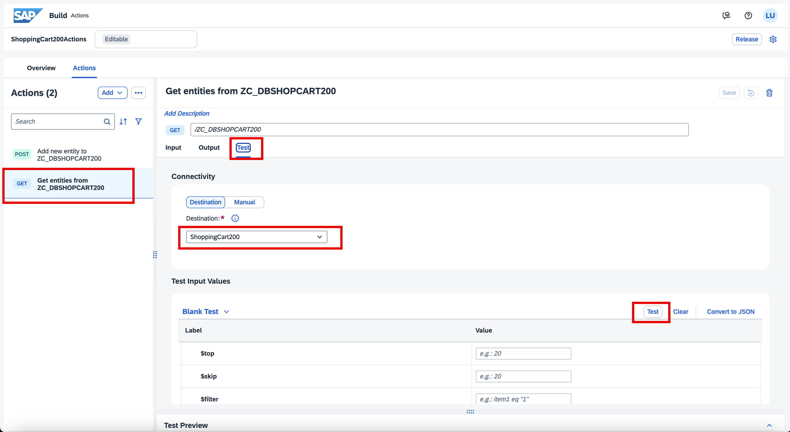

8. After a short while you should see a result like this (with the entry that you created earler on in the Fiori elements preview application that you created)

   

   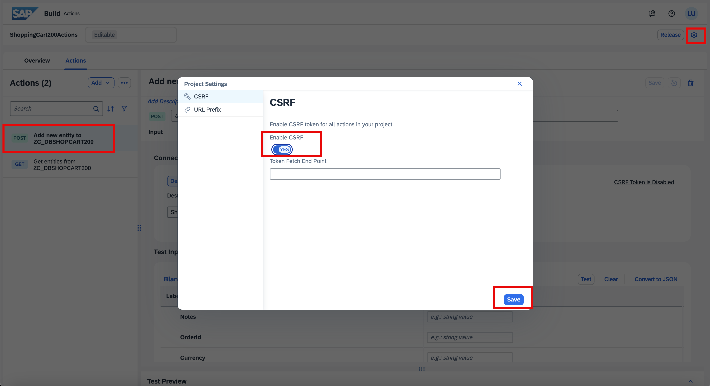

   
   
   
   
   
   
   
   
   
   
   

## Exercise 1.5: Release the Action and Publish to Library

In order to use the action inside SAP Build products like Process Automation, it has to be released first. Releasing means that the current state of the action is stored in an imutable way. Once the project is released, it can be published to library, which means that it is available inside SAP Build products like Process Automation, it can be discovered and used there.

1. In the upper right corner of your action press `Release`

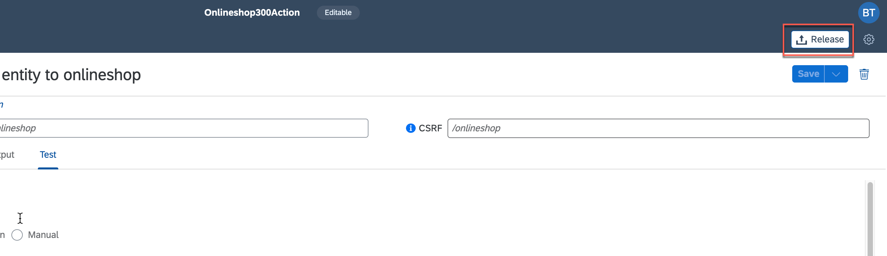

2. Optionally add some release notes and press `Release` on the dialog

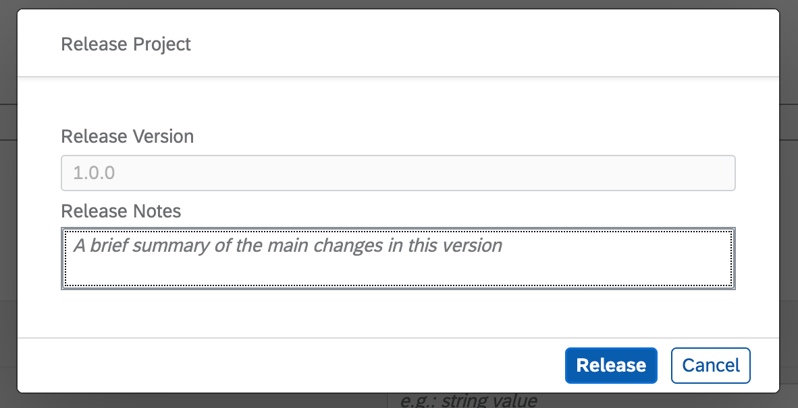

3. After you released the action, in the same upper right corner the button has changed to `release to library`, press it 

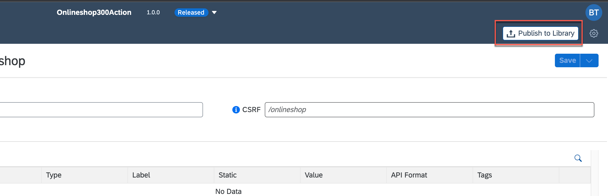

4. Confirm that you want to publish, pressing the button

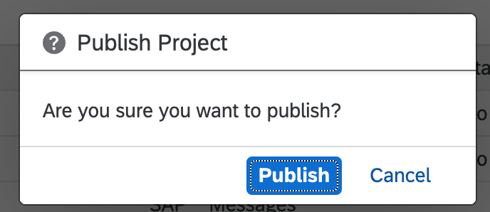

## Excercise 1.6: Add the Destination to the SAP Build Settings

You have set up a destination in the BTP Cockpit to test our new actions and in the last step made the actions available for usage in SAP Build Process Automation. You now also need to register the destination with SAP Build to be used in a real environment of a process, not just for tests of actions.

1. In the SAP Build choose `Settings` and then `Destinations` in the left pane.

2. Press `New Destination` and search for your destination `Onlineshop_###` where of course `###` is your group ID. Select the destination and press `Add`.

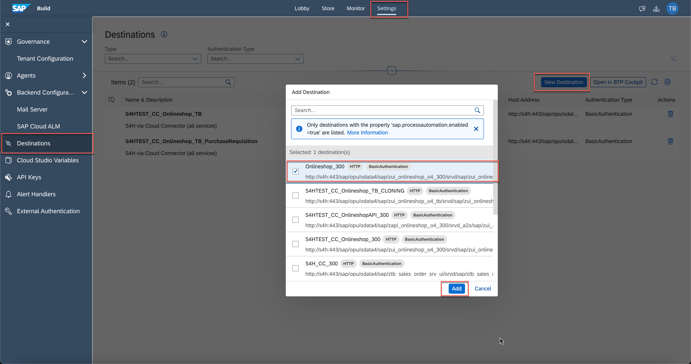

## Summary  
 
You have created 2 actions based on the Onlineshop Service, you built on ABAP Cloud in the previous exercises. You have created a BTP destination to connect to the Online Service and you have tested the actions. You have released the action and published it to a library, so you can use it in the following chapter in a new SAP Build Process Automation. You have also registered the destination for usage in SAP Build. 
 
You can continue with the next exercise - **[Exercise 2: Create a Process in SAP Build Process Automation based on the Onlineshop Service](../ex2/README.md)**
