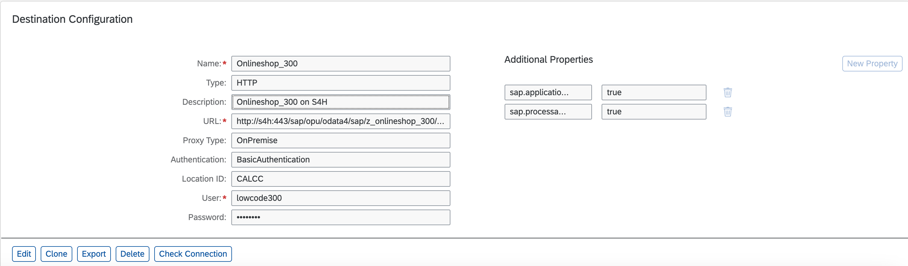

# Exercise 1: Create Actions in SAP Build to access the Onlineshop API

From this exercise on, we will switch to SAP's Business Technology Platform (BTP) on which SAP's solution for citizen developers, SAP Build run.

In this exercise we will create Actions in SAP Build that accesses the Onlineshop API on S/4 HANA from the previous chpater. There will be 2 actions, one to read all the onlineshop entries and another one that creates a new onlineshop entry. 

To create such Actions we need to prepare 2 things first:
- create a destination in BTP to create the secure connectivity from a BTP subaccount to the Onlineshop API on S/4 HANA from the previous chapters
- download the OData metadata document of the Onlineshop API from the previous chapter

## Exercise 1.1: Create a Destination in a BTP subaccount to access the Onlineshop API

In your ABAP Development Tools under **Business Services** -> **Service Bindings** -> **ZUI_ONLINESHOP_O4_XXX** copy the **Service URL** , it should be `/sap/opu/odata4/sap/zui_onlineshop_o4_XXX/srvd/sap/zui_onlineshop_XXX/0001/`

In a browser open the [destinations view in the BTP Cockpit](https://emea.cockpit.btp.cloud.sap/cockpit/#/globalaccount/47ae62c5-c35b-48a4-99b1-eee46b5b62bf/subaccount/f65e327c-d9e9-44cd-8d7b-e4e7ea8db474/destinations)

Press the `New Destination` button.

Name: Onlineshop_XXX
Type: HTTP
Description: Onlineshop_XXX on S4H
URL: http://s4h:443 + the copied Onlineshop URL (e.g. /sap/opu/odata4/sap/zui_onlineshop_o4_XXX/srvd/sap/zui_onlineshop_XXX/0001/)
Proxy Type: OnPremise
Authentication: BasicAuthentication
Location ID: CALCC
User: lowcode###
Password: xxxxxxxx

Then press the `New Property` button and add 
`sap.applicationdevelopment.actions.enabled` with value `true`

Press the `New Property` button again and add 
`sap.processautomation.enabled` with value `true`

Press `Save`

Press `Check Connection`: You should get a pop up that says `Connection to "Onlineshop_XXX" successful`

## Exercise 1.2: Download the OData metadata document of the Onlineshop API

## Exercise 1.3: Create Actions from the Onlineshop API

## Exercise 1.4: Test Actions from the Onlineshop API