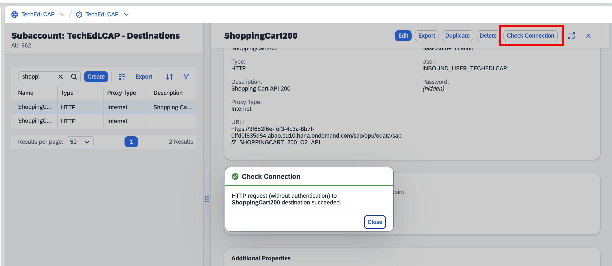

## Exercise 2.1: Create a destination in an SAP BTP subaccount to access the Shopping API

We will now create the destination in a BTP subaccount to our Shopping Cart API on the SAP BTP ABAP Environment from the previous chapter. The destination will ensure secure connectivity.

1. In a browser, open the [destinations (new) view in the BTP Cockpit](https://emea.cockpit.btp.cloud.sap/cockpit/?idp=lcap.accounts.ondemand.com#/globalaccount/47ae62c5-c35b-48a4-99b1-eee46b5b62bf/subaccount/f65e327c-d9e9-44cd-8d7b-e4e7ea8db474/destinationsnew). If you need to log on, log on with the user and the password that the instructors have given you.

2. Press the *Create* button. On the pop up select 'From Scratch* and press *Create*

   

3. Fill in the following:

    |  Porperty   | Value |
    |  :------------- | :------------- |
    |  Name   | ShoppingCart### |
    |  Type   | HTTP |
    |  Description   | Shopping Cart API ### |
    |  URL   | https://3f652f6e-fef3-4c3a-8b7f-0ffd0f835d54.abap.eu10.hana.ondemand.com/sap/opu/odata/sap/Z_SHOPPINGCART_###_O2_API |
    |  Proxy Type   | Internet |
    |  Authentication   | BasicAuthentication |
    |  User   | INBOUND_USER_TECHEDLCAP |
    |  Password   | !!Password that is provided to you by the instructors!! |

    where *###* is your group number again (beware this has to be replaced in 3 values in the above list)    

   

4. Under *Additional Properties* press *Add Property* and add
`sap.applicationdevelopment.actions.enabled` with value `true`

5. Under *Additional Properties* press *Add Property* again and add
`sap.processautomation.enabled` with value `true`

6. Under *Additional Properties* press *Add Property* again and add
`sap.build.usage` with value `RAP`

7. Press *Create*

   

8. Back on the list of the destinations, select your new destination and press *Check Connection*. It should bring up a success messate

   

   # Summary
   You have now created a destination on the BTP with which the Shopping Cart API can be envoked from outside the BTP ABAP Environment. It can now be inovked from a Build action which we will create in the follow up chapters
   
   You can continue with the next exercise - **[Exercise 2.2: Enable the destination for Actions](../ex2.2/README.md)**