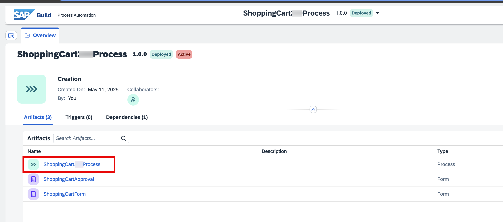
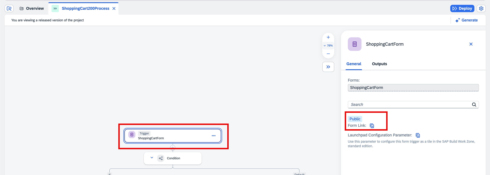
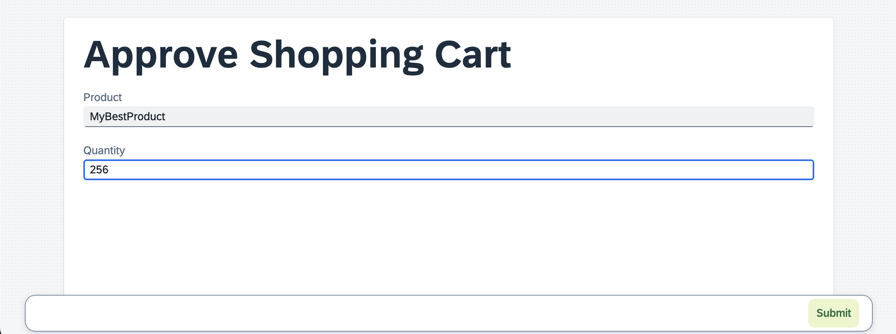
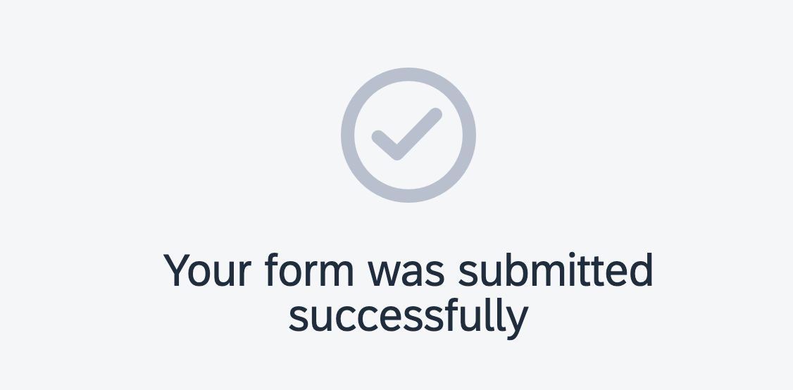
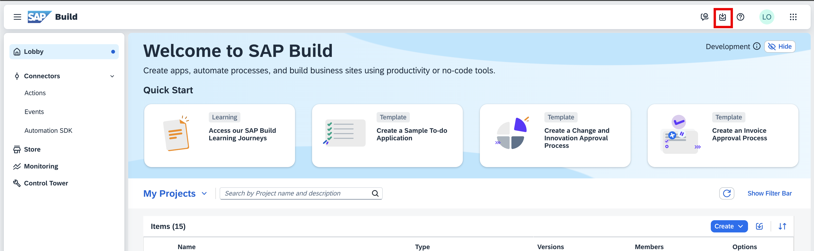
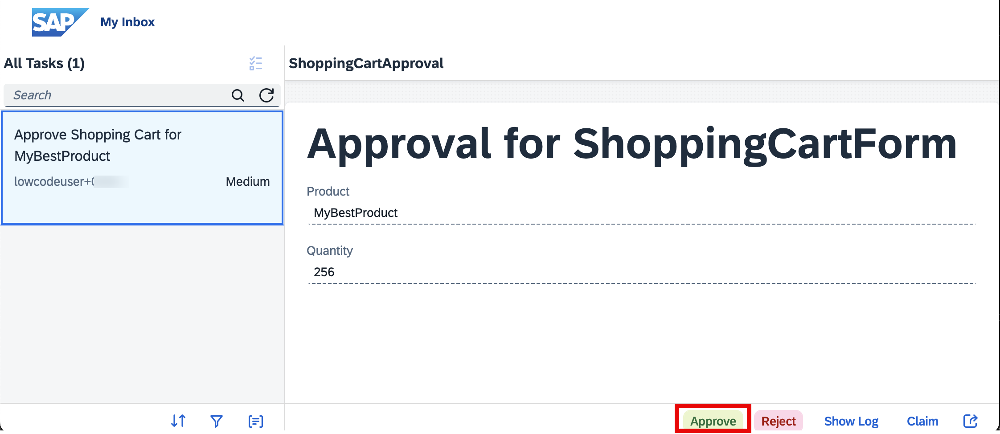
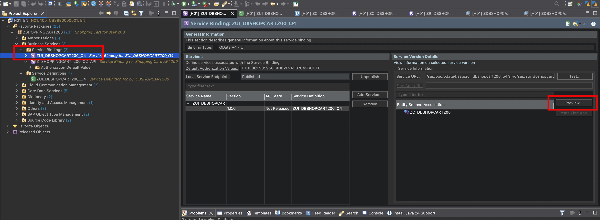
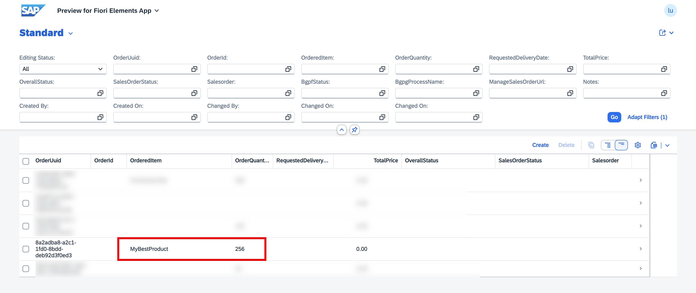

## Exercise 2.5: Test the process, the approval, and the invocation of the RAP API 

   In this section we will test the process. First we will fill out a new shopping cart request and submit it. Then we will put ourselves into the shoes of the approver and enter the approver's inbox. Then we will approve the request and check whether this resulted in the proper invocation of the action and in turn the shopping cart RAP API on ABAP.

   1. As a first step we need to get a URL for the start UI. For this, switch to the *Overview* tab of the process. Click the link of the *ShoppingCart###Process*.

   

   2. Back on the canvas, select the trigger and then on the right hand side copy the *public* link. 

   

   3. Switch to a new browser tab and paste the URL that you just copied. The start UI comes up. Enter a product name and a quantity of your liking and then press *Submit*.

   

   4. After a couple of seconds you will see a message telling you that you successfully submitted the form.

   

   5. Now that the shopping cart request was submitted, we switch to the approver person in order to approve or reject the shopping cart. For this, switch back to the browser tab with the SAP Build Lobby. Invoke the *Inbox* button which you find as the second on the left on the top of the lobby screen.

   

   6. In your inbox on the left side a task should be shown which is the approval for the shopping cart that you just submitted. Click on it to bring up the details on the right. You should see the form with the values that were submitted. Press *Approve*.

   

   7. Now let's check whether the invocation of the action and the RAP API was successful after the approval. For this, switch back to the ABAP developer tools again and the service binding of the UI service. Press *Preview* to bring up the Fiori UI with all the shopping cart entries.

   

   8. Press *Go*. Your new entry should come up in the list

   

   This concludes the test of the process end to end.

## Summary  
 
 This concludes this hand on workshop! You have created a shopping cart OData API with the ABAP Restful Programming Model (RAP) using ABAP Cloud on the BTP ABAP Environment. You have made this API available for consumption outside of the ABAP Envrionment. You have created SAP Build actions from the RAP API. Then you created an SAP Build Process which consists out of several steps: A start UI to create a shopping cart for a product and a quantity, a condition that auto approvs when the quantity is only 1, an approval step for approvers to approve or reject shopping carts with quantities other than 1 and an invocation of an action that creates a shopping cart entry by calling the RAP API. At the end you tested the entire process.

 
