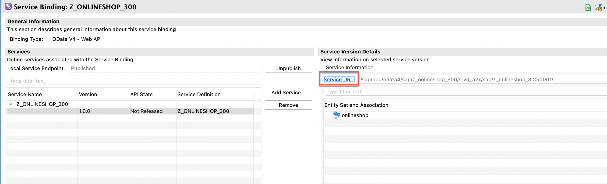
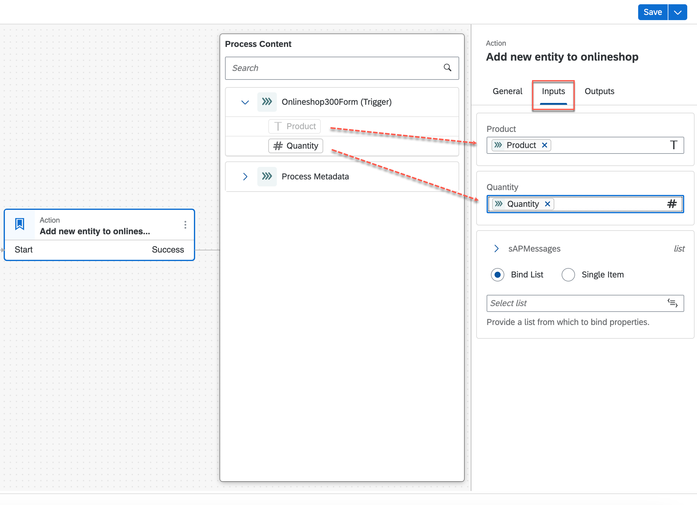

# Exercise 2: Create a Process in SAP Build Process Automation based on the Onlineshop Service

In this chapter you will build a whole process in SAP Build Process Automation. It will contain a UI with a form with which users can create requests for products in our onlineshop. Depending on the quantity there will then be an approval step where a manager will have to approve or reject the onlineshop request. If the quantity is low, the request will automatically be approved. In case of an approval an action to create a new onlineshop entry based on the onlineshop service you have built in the S/4HANA system using ABAP Cloud. The result can then be seen in the Fiori elements preview application based on the onlineshop service.

Remember that whereever in this exercise you see `###` to replace it with your **group number** that was given to you by the instructors.

## Exercise 2.1: Create a new Process in SAP BUild Process Automation

You will create the project for a process.

1. Choose `Lobby`in SAP Build. Press `Create`. Select `Build and Automated Process` and then `Business Process`.

2. Choose `Onlineshop###Process` as your Project Name and press `Create`.

3. The process project is being created and your are prompted to create a process within this project. Choose `Onlineshop####` as a name, leave the identifier as suggested by the system.

## Exercise 2.2: Add a Form to the Process

You will create a UI form for the process, where users can request the order of a product with a quantitiy in the onlineshop.

1. On the canvas of the process, press `+` on the trigger step that the system has already generated for you. Choose `Formss` and `New Form`.

2. Choose `Onlineshop###Form` as a name and press `Create`.

The new form is now embedded into the trigger of the process.

3. On the form choose `Open Editor`.

You can now see a new canvas on which you can place a number of UI elements that make up your form. This is what users will see when they want to request a product in the onlineshop.

4. From the left side pane, choose `Headline 1` and drag it to the Canvas and drop it there. Write `Enter the product and the quantity that you want to order` into the headline. Now choose `Text` and drag and drop it to the canvas. Change the fields label to `Product`. Now choose `Number` and drag and drop it to the canvas. Change the fields label to `Quantity`. Finally, press `Save`.

## Exercise 2.3: Add an Approval step to the Process

You will create a an approval step for the onlineshop request. This is a UI that will pop up in an approver's (e.g. manager) `My Inbox` application, where the approver will see the product and the quantity that was ordered and can approve or reject the request.

1. On the process canvas, press on the `+` after the process trigger, then choose `Approvals` and `New Approval Form`.

2. Choose `Onlineshop###Approval` as a name. Mark the `Based on a Form` checkbox and select the form that you have created in the previous step. Press `Create`

If you hadn't chosen to base the approval on the form, you would get an empty canvas and you could design the approval UI from scratch. However, since approvals usually contain a lot of information that was entered in the original form, it is a good idea to copy the forms UI elements over into the approval and then adjust where needed.

3. Click on the new approval step on the canvas. On the right side pane choose the `General` tab. Place the cursor into the the `Subject` field and write `Approve order of`, then select the `Product` field that is suggested to you from your form. Under `Users` enter the email address of the user that was given to you by the instructor. 

This step determines who gets the approval request in their `My Inbox` application. In a real scenario the reveiver might be determined dynamically and of course the requestor would not be the approver. For yor tests however, you want to see the approval in your inbox, make sure you use the right email address. 

4. Switch to the `Inputs` tab. Assign the `Product` and `Quantity` fields from your form to the corresponding fields of the approval. Press `Save`

This is a general pattern in Process Automation: There are outputs from a previous step, in this case the form that triggers the process and there are inputs for the follow up step like our approvals. Inputs and outputs need to be mapped.

5. On the approval on the canvas press `Open Editor`

6. On the approval UI that now pops up and that contains the fields from your form, change the headline to be `Approval for order`, leave the rest of the fields as they are. `Save` your work

## Exercise 2.4: Add an Action step to the Process

You will now add an action step that uses the action to add a new entry to the onlineshop that you have created in the exercise before. This action is invoked when the request from the form has been successfully approved.

1. Press the `+` to the right of the approval step and choose `Actions` and `Browser Library`.

2. On the dialog search for the action `Onlineshop###Action`that you created before. Choose the `Add new entity to onlineshop` one and close the dialog.

3. On the right hand pane, choose to `Create Destination Variable`. On the following dialog, choose `MyDestination` as an identifier. Press `Create`

This variable will later contain the name of the destination that you have created in an earler exercise.

3.

