# Create Sales Order Business Process
<!-- description --> Create a Business Project and Process to build and extend business processes

## Prerequisites
  TODO
  - [Configure SMTP Destination](https://help.sap.com/docs/build-process-automation/sap-build-process-automation/configuring-smtp-mail-destination) to send mail notifications.

## You will learn
  - How to create a SAP Build Process Automation project
  - How to create a process that automates sales order creation and approval
  - How create an API trigger to integrate with any applications like SAP Build Apps, CAP etc.
  - How to use Decisions artifact.
  - How to send an Email notification.

---

## Intro
With the new citizen automation user experience, you will get access to a new scope of opportunities for running your day-to-day workflows. In this tutorial, you will learn how a low-code and no-code tool can help you build the Business process you need at the speed your business demands, using visual drag and drop tools for application development.

There are many use cases where you can make a difference using SAP Build Process Automation. During this tutorial, you will see how the Sales Order Approval process can be built using forms where a sales order is a document which confirms a sale that is generated by the seller after receiving a purchase order from the buyer. These sale order requests have to be reviewed and approved by the supplier to ensure that the sales orders are delivered on time. Once approved or rejected, the requester will be notified.

---

### Create a business process project

1. In the **Lobby**, choose **Create**.

    > The lobby is a central page for creating, accessing, and managing your projects in SAP Build. You can access business application processes, company configured templates, and other resources for your end-to-end business process.

    

2. Pick **Build an Automated Process**.

    

3. Select **Business Process**.

    > Business Process Projects are a collection of skills in SAP Build Process Automation. Projects are part of the internal business processes of a company and are defined based on business scenarios. A project can contain a set of processes, forms, automations and decisions, which are reusable artifacts.

    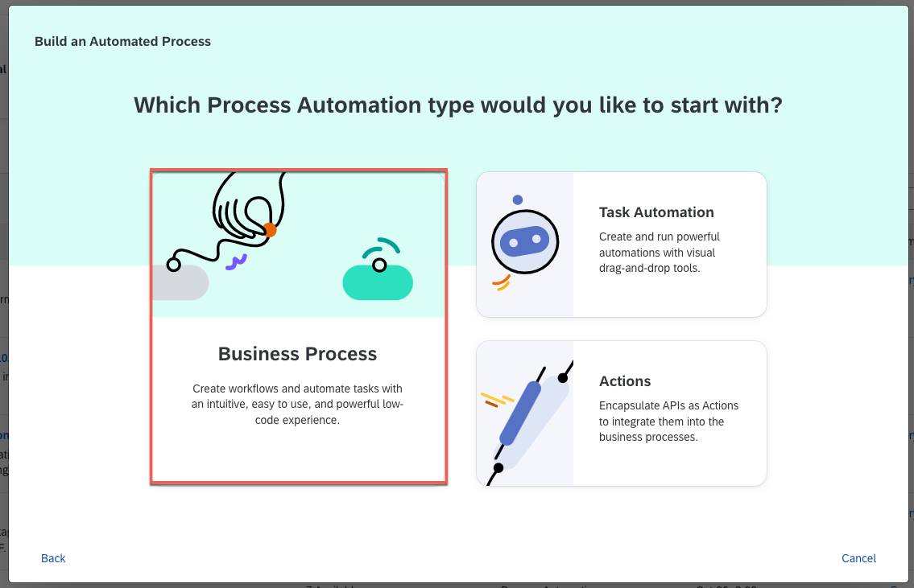

4. In the **Create a Business Process** dialog box, do the following:

    - Enter a **Project Name**: Sales Orders Management.In workshops, use: `<your unique identifier>_Sales Management`.

    >Tip: Always use a name that would help users distinguish your workspace from others.

    - Enter a **Short Description**: Sales Orders Management Project.
    - Choose **Create**.

    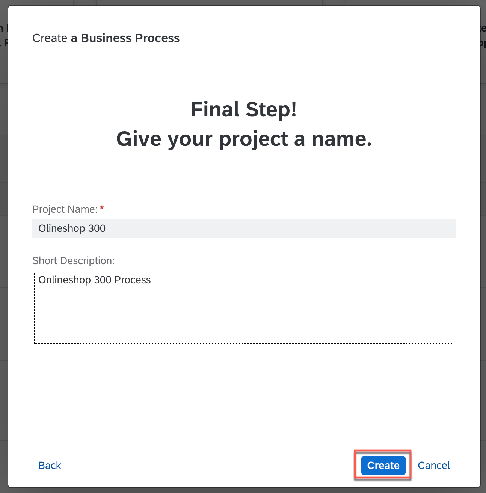

### Create a business process

1. A new tabs opens with the newly created project.

2. In the **Create Process** dialog box, provide the following:

    - Enter a **Name**: Order Processing.
    - Enter a **Description** for your process: A process to handle sales orders.
    - Choose **Create**.

    > Inside a project, you can create a process. This process is equivalent to a workflow in any business scenario. You can create this process from different skills such as forms, decisions, automations.

    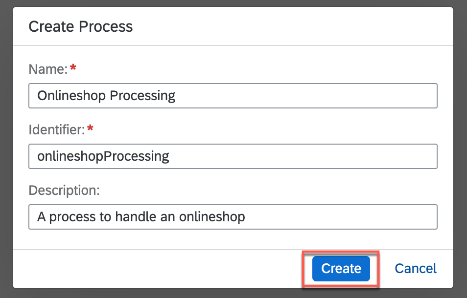

    > The form **Identifier** field is auto-filled.

### Create a Data Type

1.  Click on **+** > **Create** > **Data Type**.

    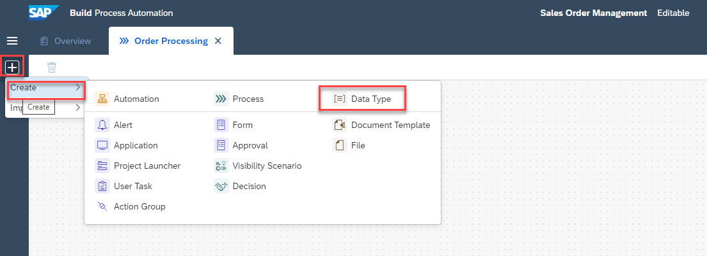

2.  Create a datatype **Sales Order**.

    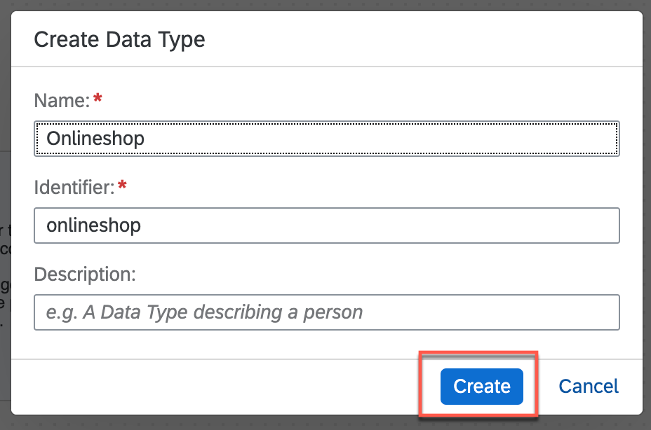

3. Click on **New Field** to add new fields to the datatype **Sales Order**.

    

4.  Repeat the  process to add all the fields of the type as shown below.

    |  Field Name   | Type
    |  :------------- | :-------------
    |  material   | String  |
    |  `orderAmount`     | Number |
    |  `shipToParty`    | String|
    |  `salesOrderType`    | String|
    |  `salesOrganisation`    | String|
    |  `distributionChannel`  | String|
    |  `shippingCountry`    | String|
    |  `expectedDeliveryDate`  | Date|
    |  division  | String |

    Your final data type looks as below.

    

### Create and configure API trigger

1.  Click on **+** > **API** > **New API Trigger**.

    

2.  Enter the name as **Sales Order Trigger**.

    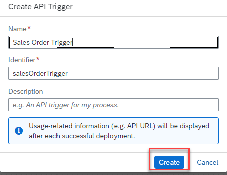

3.  Click on the process canvas and in the **Process Details** choose **Inputs**. Then choose **Configure** to configure inputs.

    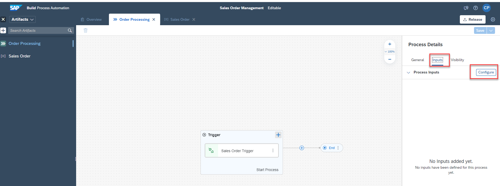

4.  In the **Configure Process Inputs** window, choose **Add Input** to add parameters.

    Add the following parameter:

    |  **Name**    | **Type**
    |  :------------- | :-------------
    |  `salesorderdetails`       | `Sales Order`

    **Apply** changes.

    

5. **Save**  the project.

### Create and configure Approval form

Navigate back to the Process builder Canvas to  create an Approval Form.

1. Click on **+** > **Approval** > **New Approval Form**.

    

2. Enter the name as **Approval Form**.

    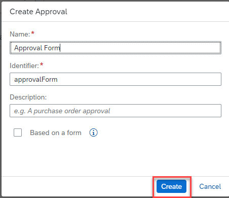

3. Click on **Edit form**.

    

4. Design the form by dragging and dropping the corresponding form elements as shown below.

    |  **Form Fields**    | **Field Settings with Label** | **Configuration(Read Only)**
    |  :------------- | :-------------
    | Approve Sales Order   | HeadLine1 | |
    | A new order has been received. Please review and confirm whether the requirements can be met or not.| Paragraph | |
    | Material | Text | X |
    | Order Amount | Number | X|
    | Customer Name | Text | X
    | Expected Delivery Date | Date | X|
    | I acknowledge that we have received your order and will process it based on the availability | Checkbox | |
    | Message to Buyer | Text Area | |

    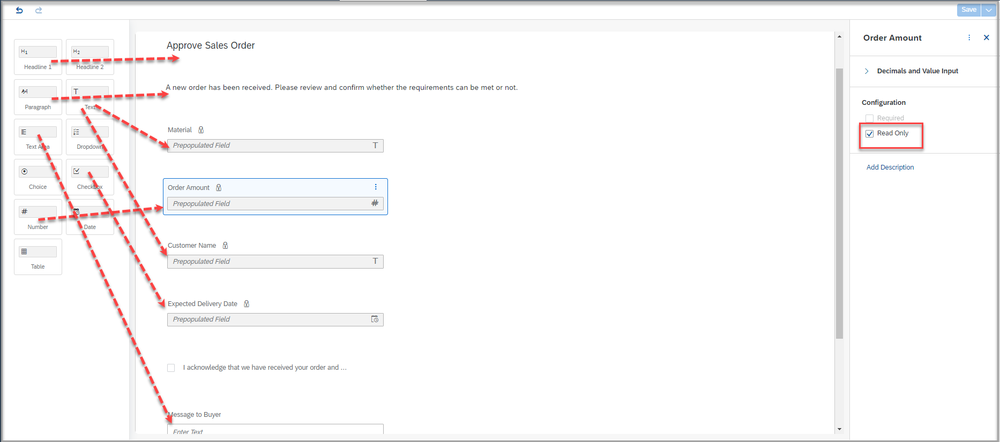

5. **Save** the form.

6. Click on the **Approval Form**  and configure the **Subject** and **Recipients**.

    In the **Subject** section:

    - Enter **Please review**.
    - Select **Material** from the sales order details.

    Enter your login ID(email) in the **Recipients** section.

    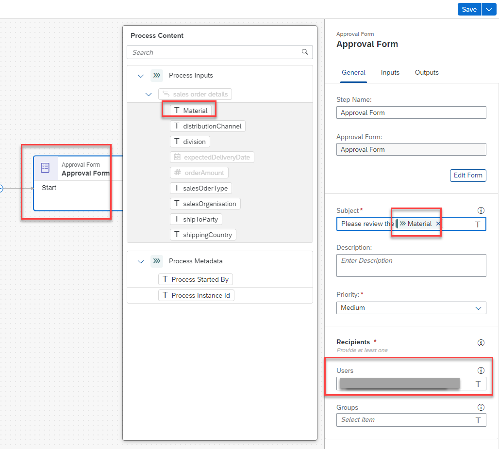

7. Configure the inputs of **Approval Form**. Navigate to Inputs and map the fields accordingly.

    

### Create and configure Order Approval Notification form

1.  Click on **+** > **Forms** > **New Form**.

    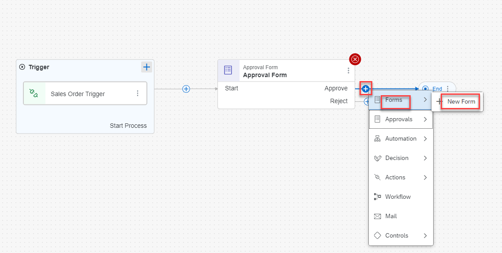

2.  Enter the name as **Order Confirmation Form**.

    

3.  Click on **Edit form**.

    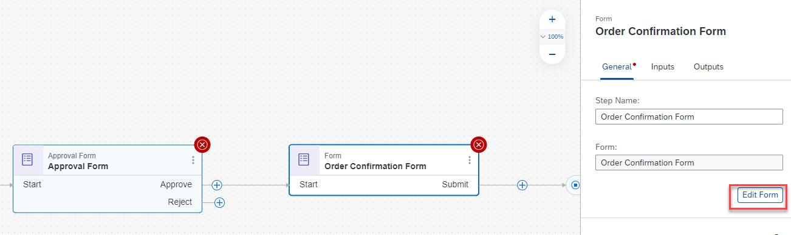

4.  Design the form by dragging and dropping the corresponding Form elements as shown below.

    |  **Form Fields**    | **Field Settings with Label** | **Configuration(Read Only)**
    |  :------------- | :-------------
    | Headline 1 | Order Confirmation | |
    | Paragraph  |Your order has been received and accepted for delivery. We will send you the details as soon as the order is shipped. You can find the details of your order below, please review and verify your request: | |
    | Text Area  | Message from the supplier: | X
    | Text | Material | X
    | Text | Customer Name | X
    | Number | Order Amount | X
    | Date | Expected Delivery Date | X
    | Paragraph | Please press the SUBMIT button to acknowledge the order status.| |

    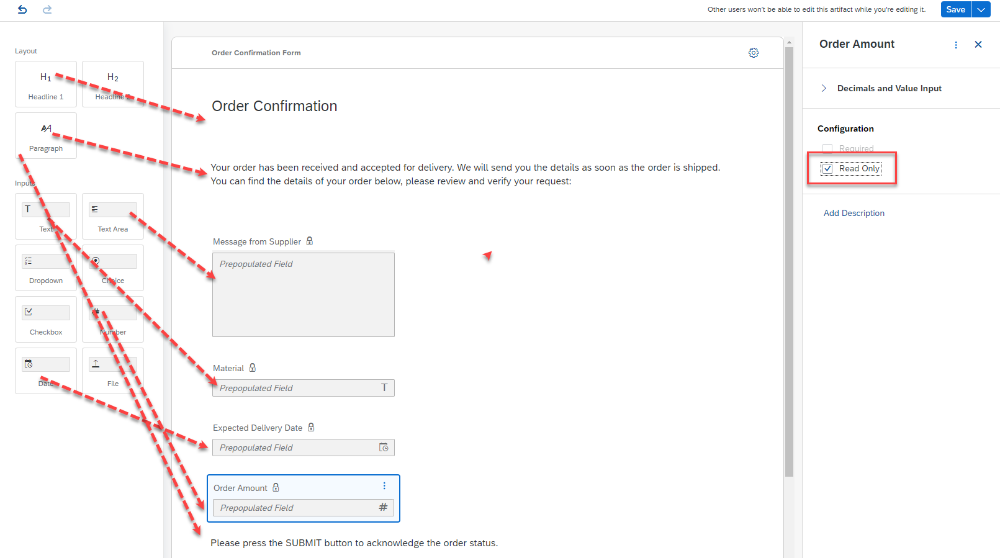

5. **Save** the form.

6. Click on the **Order Confirmation Form**  and configure the **Subject** and **Recipients**.

    In the **Subject** section:

    - Enter **Your Order**.
    - Select **Material** from the sales order details.
    - Enter **has been approved**.

    Enter your login ID(email) in the **Recipients** section.

    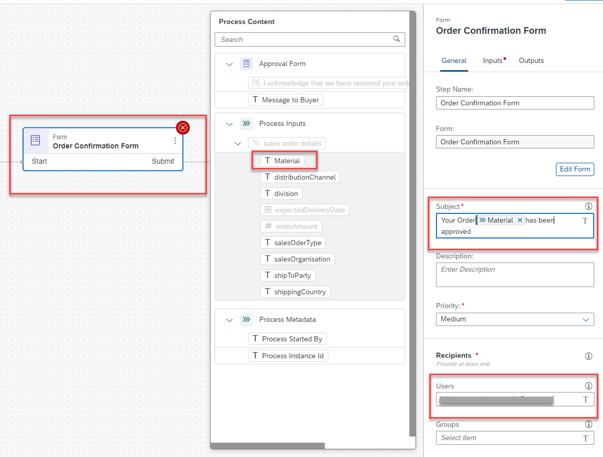

7. Configure the inputs of **Order Approval Form**.Navigate to Inputs and map the fields accordingly.

    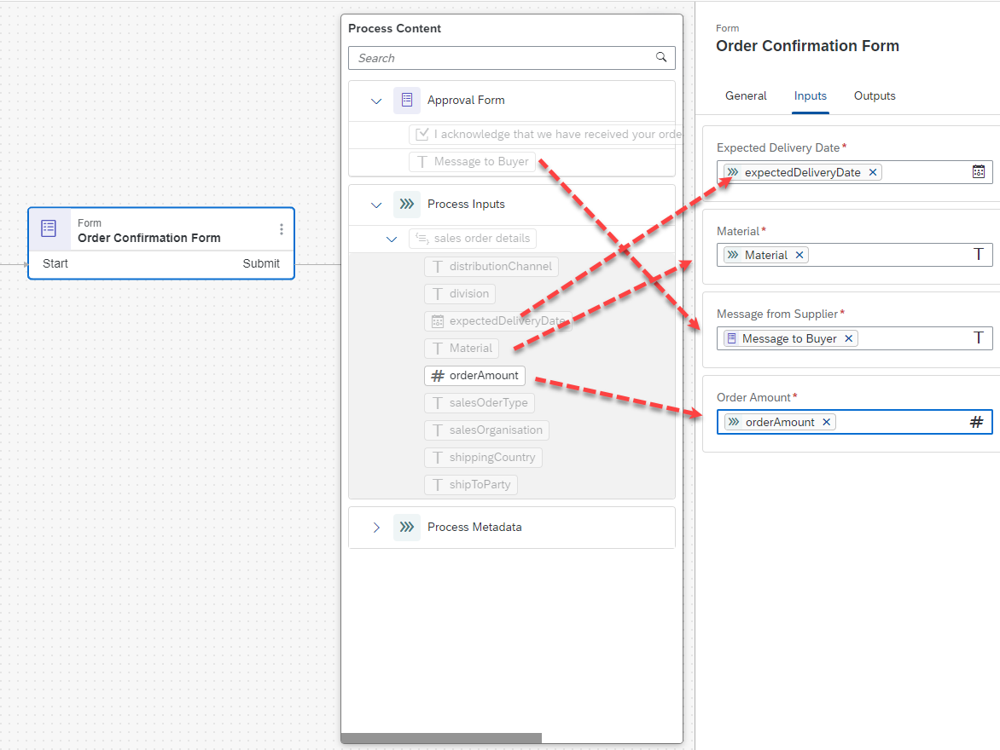

### Create and configure Order Rejection Notification through an Email

In this step,you will send out an email notification if the order is rejected.

1. Select the **Approval Form** and add **Mail** to the Rejection node.

    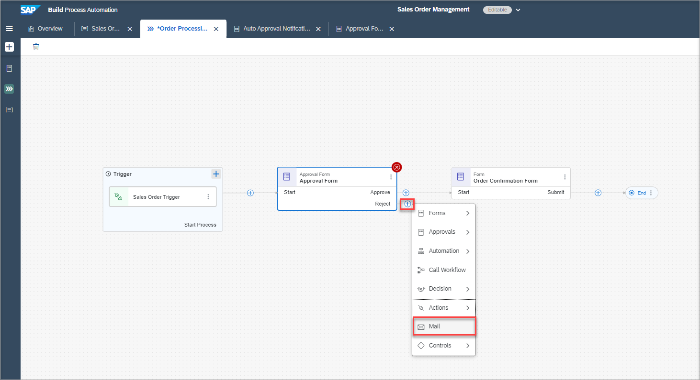

2.  Once you have successfully added Mail ,let's configure **Mail Header** and **Mail Body**. Enter the your email address in the **To** section.
    
    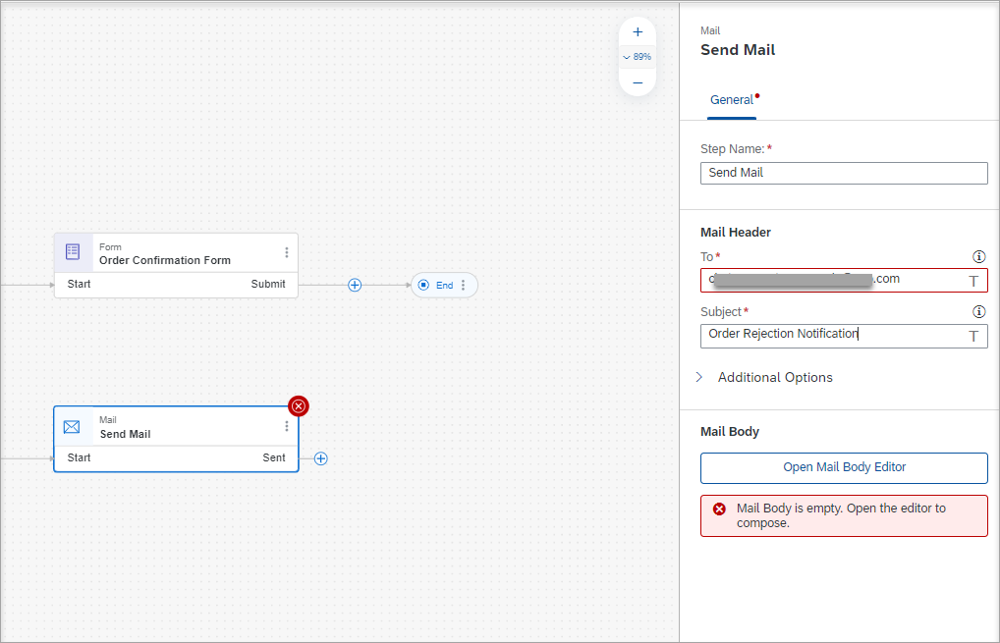   

3. Click on **Open Mail Body Editor**.

    - Enter **Your order**
    - Select **material** from the `salesorderDetails`. 
    - Enter **has been rejected**.
    - Click on **Apply**.

    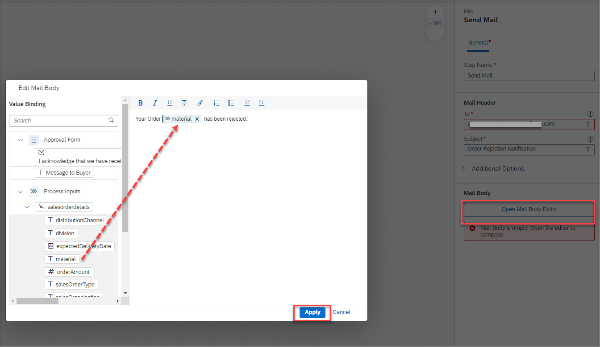  

4. Link your **Send Mail** to **End**.

    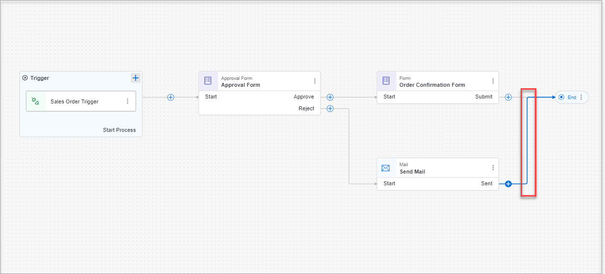  

### Create and configure Process Condition

Once the process with forms is designed, define which process flow should run based on if/else condition criteria.  

1. To add a condition to a process open the **Process Builder**. Choose **+** next to the Trigger. Select **Controls** then **Condition**.

    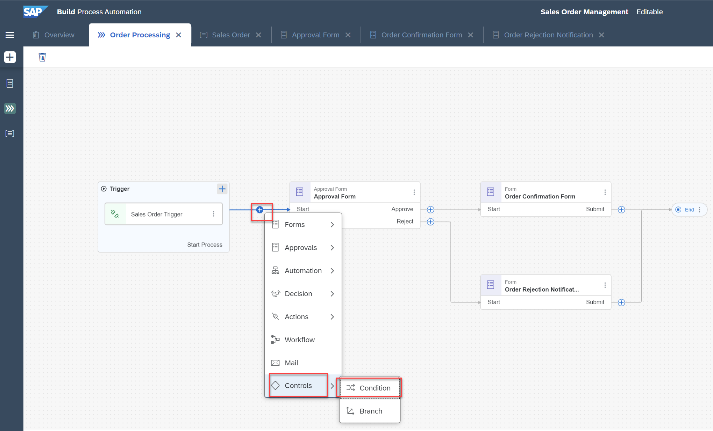

2. To configure the condition, choose **Open Condition Editor**.

    

    > Process content will contain a list of attributes that have been defined in previous skills. For example: in the screenshot, you can see attributes from the API trigger. You will use this process content to configure different skills during business process modelling.

3. Edit your branch condition:

    - Set `orderAmount` from the process content.
    - Select **is greater than**.
    - Enter **100000** as the value.
    - Choose **Apply**.

    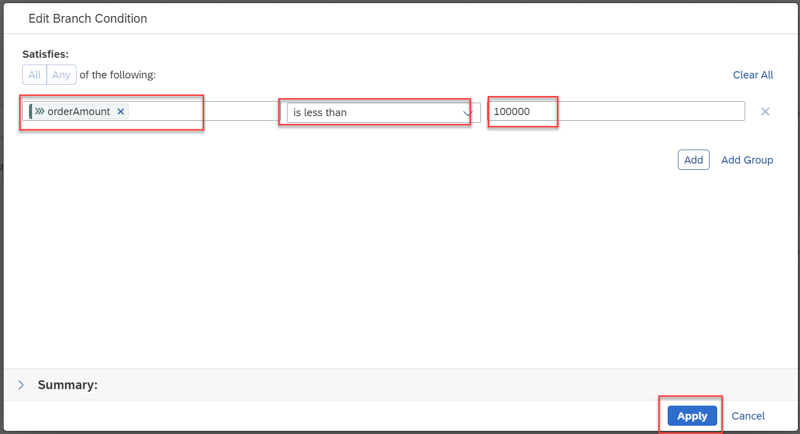

    You have configured your **if** branch to: **if Order Amount is greater than 100000**.

### Create and configure Auto Approval Notification Form

In this step,you will create a notification form which would be received by supplier if the order is approved automatically with out any approvals.

1. To add the new form, you will use the **Duplicate** feature. Select the **Overview**.
    - Find **Order Confirmation Form** under the Artifacts section and select three dots **(...)**.
    - Choose **Duplicate**.

    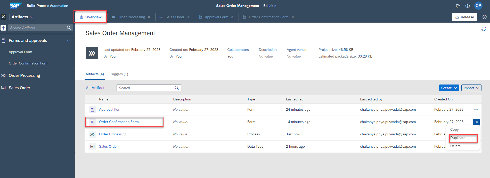

2. In the duplicate artifact pop-up window change the name to **Auto Approval Notification** and select **Duplicate**.

    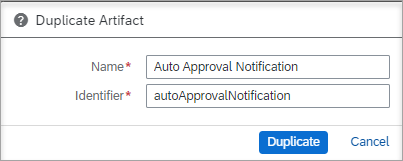

3. The form is automatically opened in the form builder. Change the Auto approval form in the form builder to reflect the data for auto approval use case.
    Design the notification form, the same way as in the previous steps, to send another notification to the  requester about auto-approval.

    Modify the  **Layout fields**:

    | **Form Fields** | **Field Settings with Label** | **Configuration(Read Only)**
    |  :------------- | :-------------
    | Headline 1 | Automatic Order Confirmation | |
    | Paragraph  | Your order has been received and we will send you the details as soon as the order is shipped. You can find the details of your order below, please review and verify your request:| |
    | Paragraph  | Your Sale's Order Details: | |
    | Text |  Material Name  | X
    | Text |  Customer | X
    | Number | Order Amount | X
    | Date | Expected Delivery Date | X
    | Paragraph | Please press the SUBMIT button to acknowledge the order status| |

    
    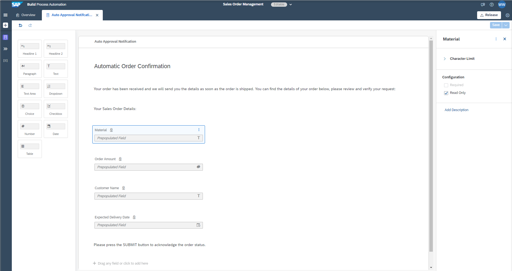

4. **Save** your work.

5. Go back to the process builder and add the auto approval form to the **Default** node.

    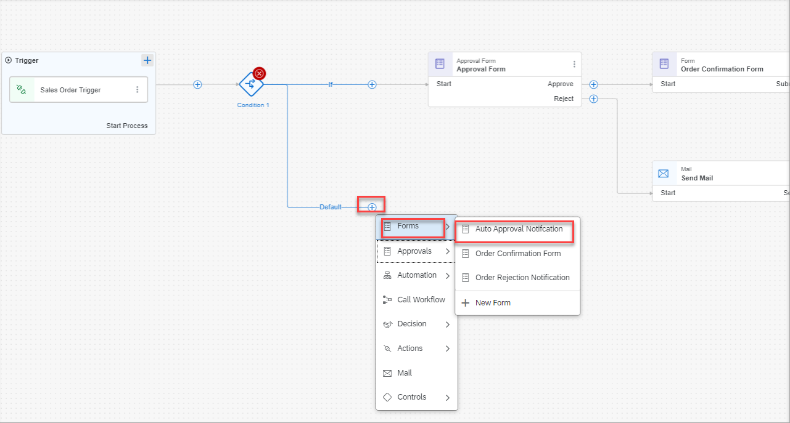

6. Configure the **General** section.
   
    Under Subject:

    - Enter: **Your order**.
    - Choose: **material** from `salesorderdetails`.
    - Enter: **has been approved automatically**.

    Under **Recipients** Enter your login ID(email).

    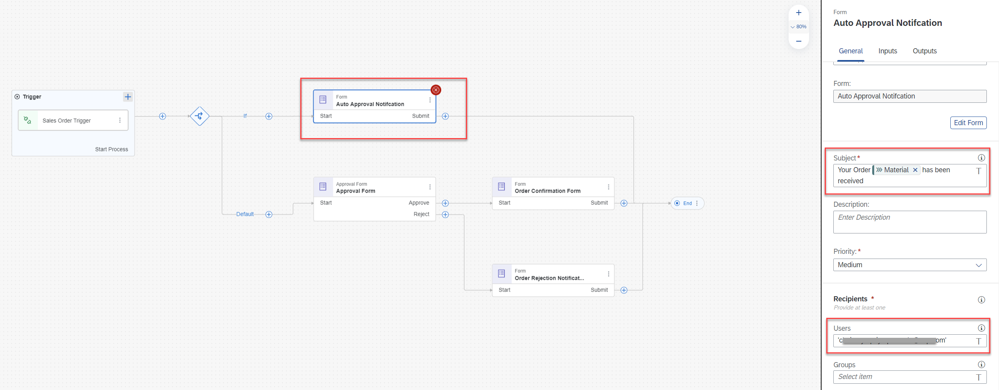

7. Configure the **Inputs** section.

    | Form Input Fields| Process Content Entry
    |  :------------- | :-------------
    | Customer Name | `shipToParty`    
    | Material Name| material
    | Order Amount | `orderAmount`
    | Expected Delivery Date | `expectedDeliveryDate`

    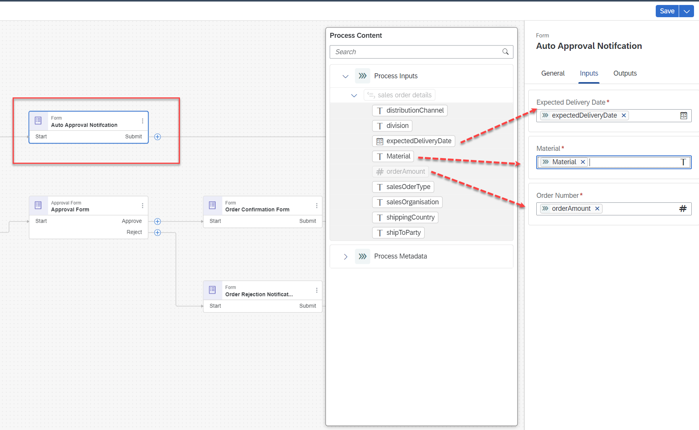

8. Connect the outgoing flow of the **Auto-approval Notification form** to the **End** activity.

    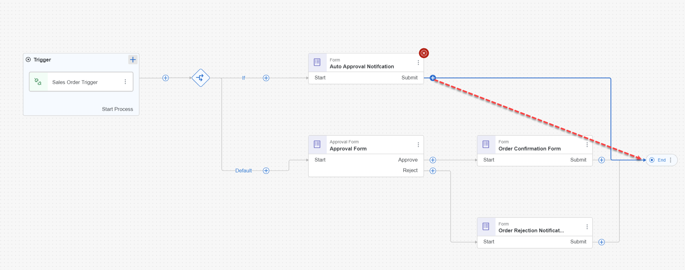

### Save the project    

 Click on **Save** to save your work.

Once you have successfully completed project ,your final process looks as below.

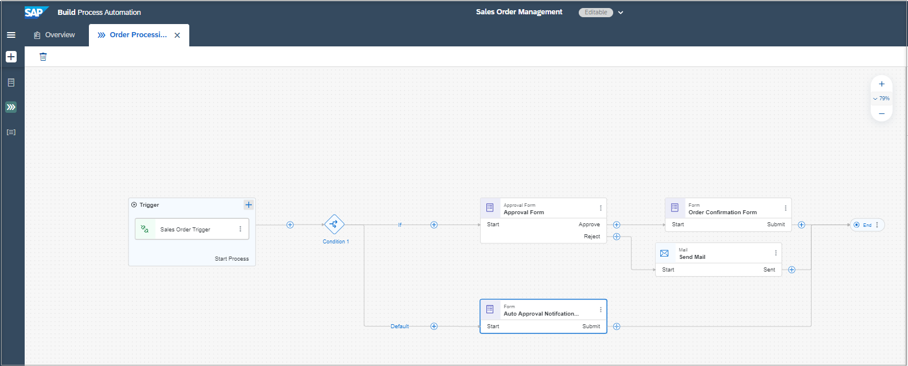

 This completes the process design with condition criteria that will decide what process flow is executed and whether there will be an auto-approval or a one-step approval route.
 Now the business process is ready to integrate with SAP Build Apps.
