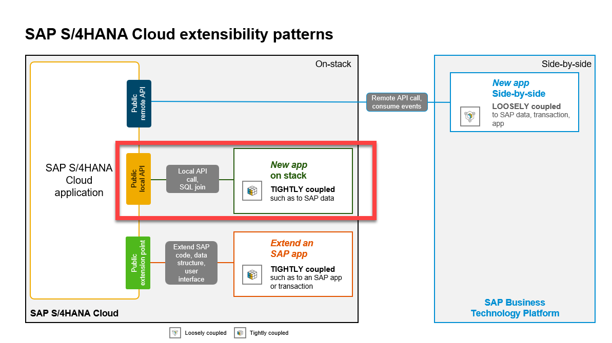

 # Use ABAP Cloud for SAP S/4HANA (Cloud) extensions

## Overview

**ABAP Cloud**  
… is the ABAP development model to build cloud-ready business apps, services and extensions  
… comes with SAP BTP and SAP S/4HANA  
… works with public or private cloud, and even on-premise  

This hands-on workshop will guide you to build developer extensions using *ABAP Cloud* on a BTP ABAP Environment using RAP facades. 

A RAP facade is a *released* business object interface built with the ABAP RESTful Application Programming Model (RAP).

You will create your own app with the ABAP RESTful Application Programming Model (RAP) and preview it via a Fiori elements app. 

### Business Scenario 

 The scenario we will implement will be a shopping cart
 
 - A customer/partner wants to create a new business application that will allow employees of a company to order certain articles such as laptops for quick delivery using this shopping app. This can be realized with the ABAP RESTful Application Programming Model (RAP). 
 
 - You’ll build the application starting from a database table using an ADT wizard that generates a starter project wich contains all the needed development RAP artefacts that have to be implemented. 

The figure below illustrates the high-level architecture components of the cloud extensibility model used in SAP S/4HANA public Cloud, SAP S/4HANA private cloud and SAP S/4HANA on premise systems.
 
 
 

Continue to - [Create an ABAP Cloud based RAP OData Service](exercises/ex1/README.md)

