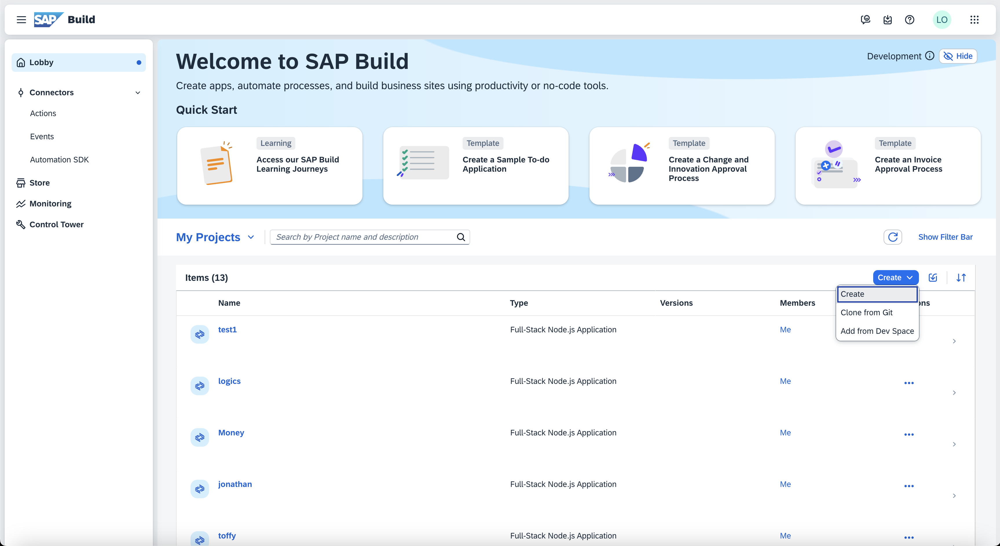

# Exercise 1.1: Create an ABAP Package form the SAP Build Lobby

1. Open the lobby https://lcapteched.eu10.build.cloud.sap/lobby 
   
   Use the user that the instructors have given you and which contains the three digit group number. The password has also been given to you by the instructors

   In the Lobby press the *Create* button and choose *Create*

   

2. In the wizard that comes up, choose the *Application* Tile and press *Next*

   

3. On the next step of the wizard choose *Full Stack*

   

4. On the next step choose *Full Stack ABAP* and press *Next*

   

5. Now select the system *H1* and under *Package* select *New* to create a new package. Type *ZLCOAL* as a superpackage and *ZSHOPPINGCART###* as the name for your package. *###* needs to be replaced by your group number. Type in a description for you package, e.g. *Shopping Cart for User ###*. Press *Next*.

   

6. Select *Create new transport request* and provide a description like *ShoppingCart###*, where *###* again is you shopping cart number. Press *Next*

   

7. Provide a name for your project *ShoppingCart###*, where ### is replaced by your group number.

   

8. In the Summary you can review all you choices. Press *Create* if everything is fine.

   

The following points 9. - 11. might or might not pop up after you pressed create. This very much depends on whether Eclipse has been opened before and what happened for your user. Don't worry if any of these pop ups come up and you immediately are at step 12., this is fine.

9. Possibly your browser now asks whether Eclipse should be openend. If it does press *Open Eclipse*. The ABAP Development Tools, which are based on Elipse should bow be openend.

   

10. Possibly you are now asked whether a command shoud be executed. if this happens, press *OK*

   

11. Possibly you are asked whether you want to open an existing project or create a new one. Choose *Create a new project from the link* 

   

12. In this step, your new ABAP project is connected to your BTP ABAP Environment instance. The ABAP Service Instance Service URL (https://3f652f6e-fef3-4c3a-8b7f-0ffd0f835d54.abap.eu10.hana.ondemand.com) should already be prefilled 

   

13. To log on press *Open Logon Page in Browser*. This will open a browser tab and after a couple of seconds it should say that you are logged on. Back in the ABAP Development tools you should then see the next wizard step already.

   

14. In this step you finalize the connection. You can take over the project name that is suggested to you and press *Finish*

   

15. In this next step you could already create a new ABAP Restful Programming Model (RAP) service. However, in order to do so, you would need to base it on something, e.g. a data base table. In our case we don't have such a base yet, we need to first create it. Therefore, press *Cancel* to terminate this step

   

16. On the left hand side in the *Project Explorer* add your new package to the *Favorite Packages* section. In order to do so, select *Favorite Packages* and press the right mouse button. In the menu select *Add package*

   

17. Start typing *ZSHOP* and in the list of packages that comes up, choose the one that you just created, with ### as your group number

   

# Summary
TODO: Add summary
