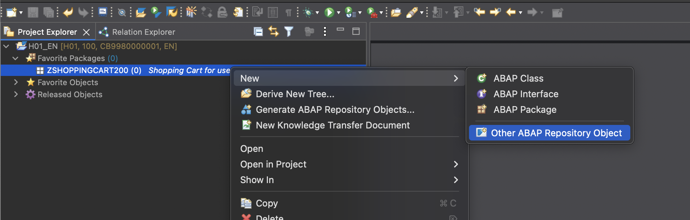
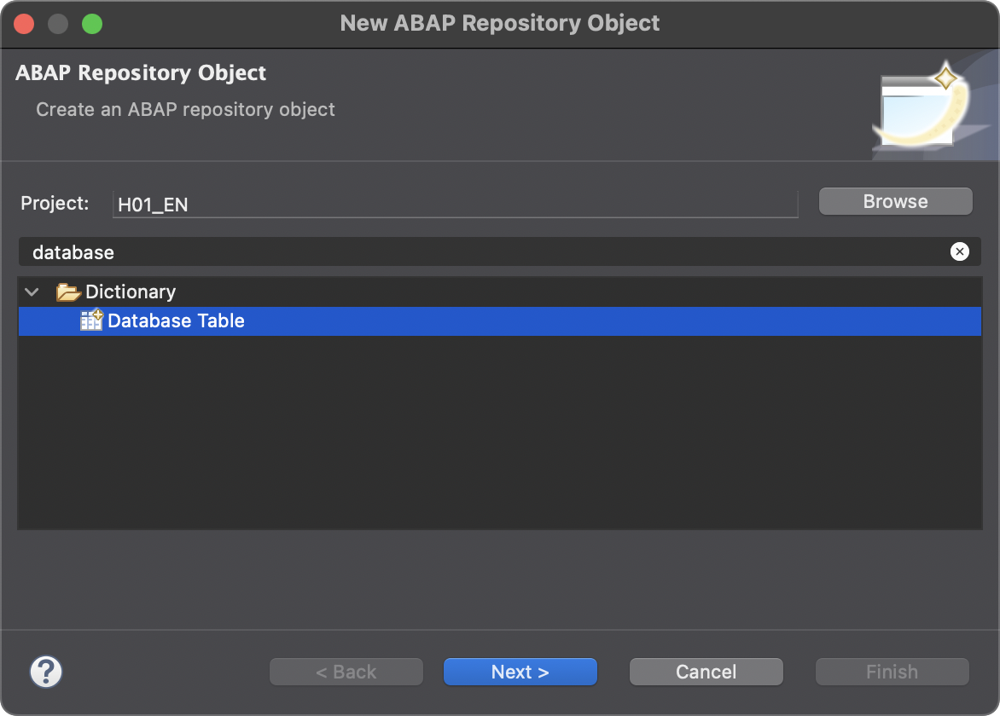
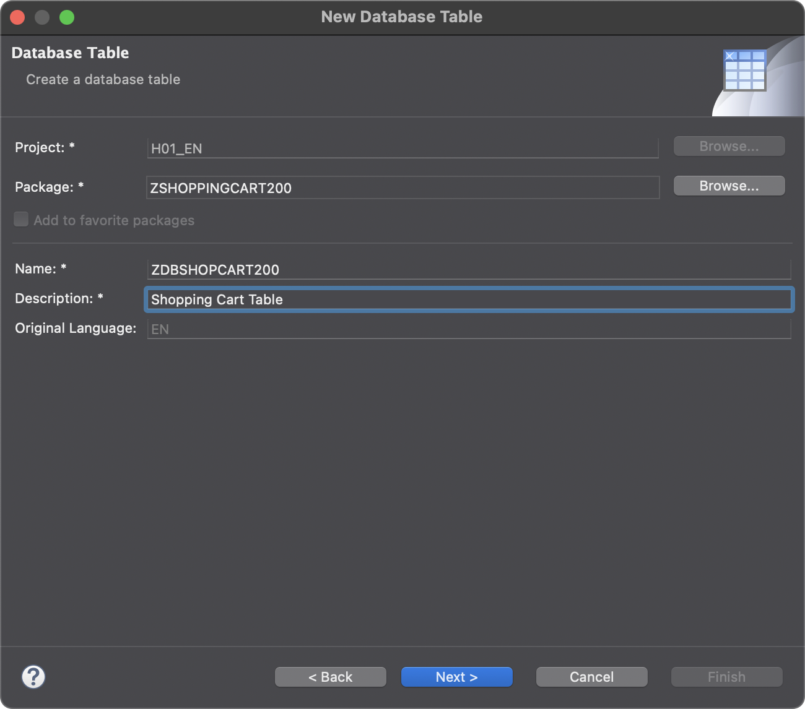
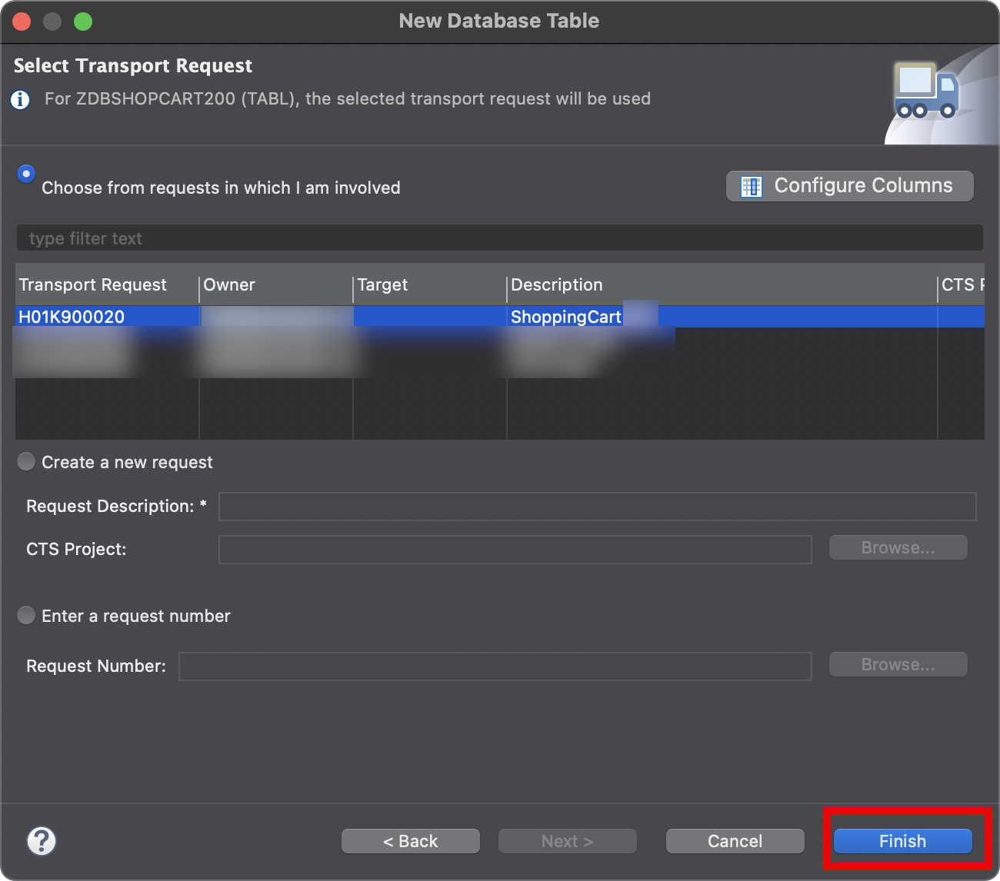
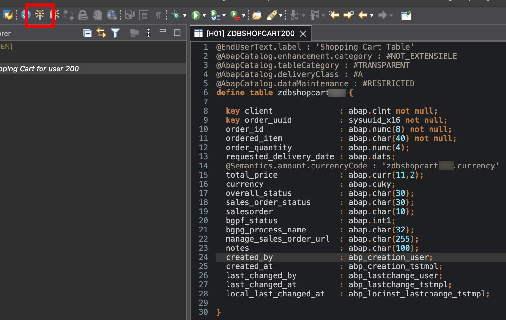

# Exercise 1.2 Create a new database table

1. Select this package in the tree in the project explorer. Once again invoke the right mouse button and choose *New->Other ABAP Repository Objec*

   

2. Type *database" to filter and then select *Database Table* and press *Next*

   

3. Provide the name *ZDBSHOPCART###* with ### being your group number for the database table. Choose a description for your table. Then press *Next*    

   

4. Choose the tranport that you have already created and select it. Press *Finish*

   

5. As a result a new editor is opened, it already contains a stub for your new database table which represents shopping cart data. Now let's add some properties to your table. Copy the below properties. Make sure that you replace the ### with your group number

```CDS
@EndUserText.label : 'Shopping Cart Table'
@AbapCatalog.enhancement.category : #NOT_EXTENSIBLE
@AbapCatalog.tableCategory : #TRANSPARENT
@AbapCatalog.deliveryClass : #A
@AbapCatalog.dataMaintenance : #RESTRICTED
define table zdbshopcart### {

  key client              : abap.clnt not null;
  key order_uuid          : sysuuid_x16 not null;
  order_id                : abap.numc(8) not null;
  ordered_item            : abap.char(40) not null;
  order_quantity          : abap.numc(4);
  requested_delivery_date : abap.dats;
  @Semantics.amount.currencyCode : 'zdbshopcart###.currency'
  total_price             : abap.curr(11,2);
  currency                : abap.cuky;
  overall_status          : abap.char(30);
  sales_order_status      : abap.char(30);
  salesorder              : abap.char(10);
  bgpf_status             : abap.int1;
  bgpg_process_name       : abap.char(32);
  manage_sales_order_url  : abap.char(255);
  notes                   : abap.char(100);
  created_by              : abp_creation_user;
  created_at              : abp_creation_tstmpl;
  last_changed_by         : abp_lastchange_user;
  last_changed_at         : abp_lastchange_tstmpl;
  local_last_changed_at   : abp_locinst_lastchange_tstmpl;

}
```

6. Save and activate your changes.

   

# Summary
TODO: Add summary here
