# Exercise 1.3: Create a new RAP service

   In this part of the exercise you will create a new ABAP RESTful programming Model (RAP) based OData service that can be used for consumption in a Fiori UI. The service will be based on the database table that you created in the last part.

   1. In the project explorer select your new database table and press the right mouse button. In the menu select *Generate ABAP Repository Objects...*

   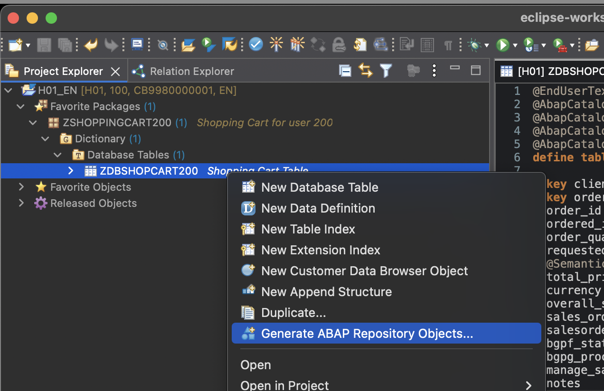

   2. Select *OData UI Service* and press *Next*

   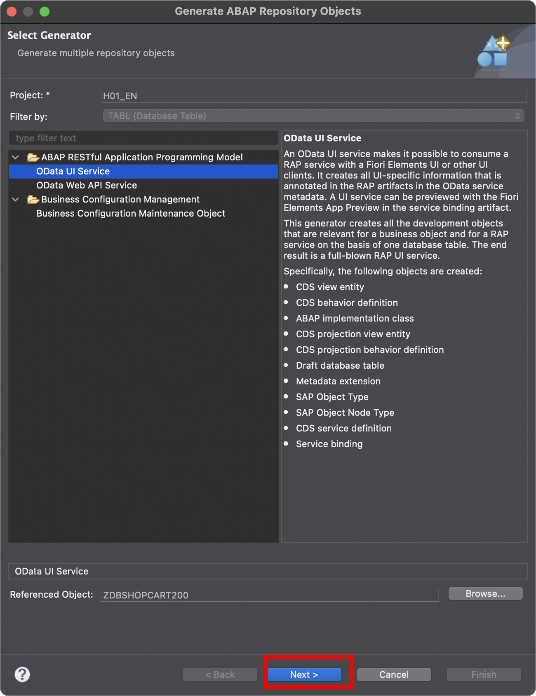

   3. Select the package you have created earlier called *ZSHOPPINGCART###* where *###* is your group number. Press *Next*

   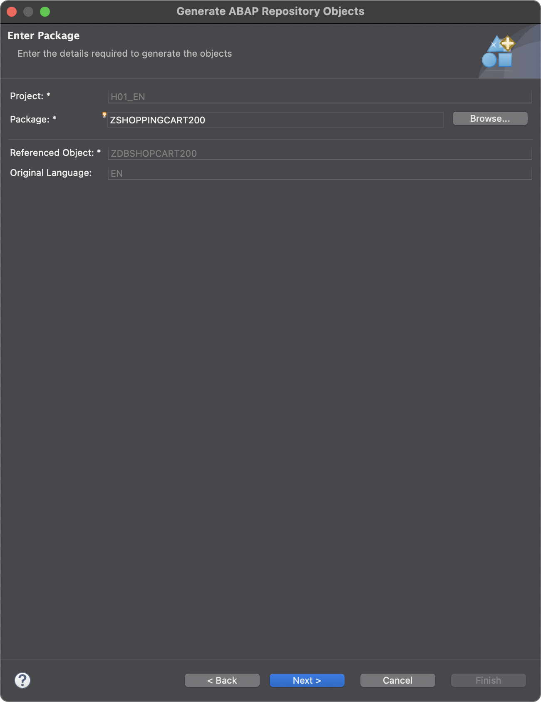

   4. Now you can review all the assets that the generator is going to create by clicking on the different entities in the hierarchy on the left. If needed you can adjust the suggested names, here you can just take them over as they are suggested. Press *Next*

   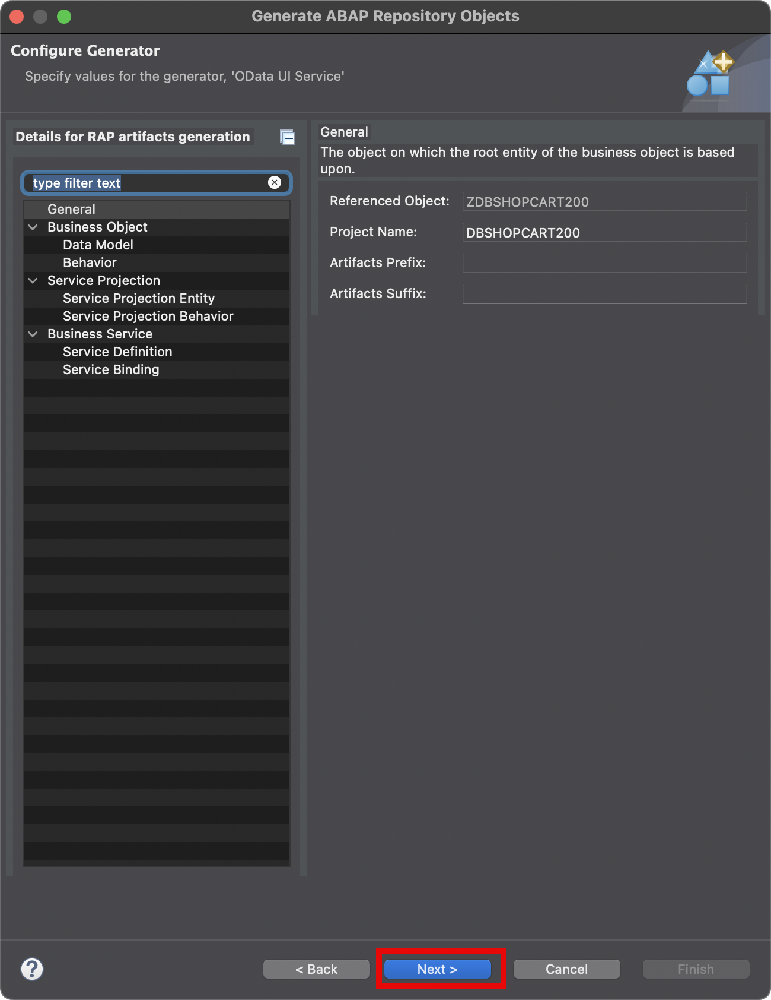

   5. In this step you can also review the content of the different objects to be generated, for example the CDS. Press *Next*

   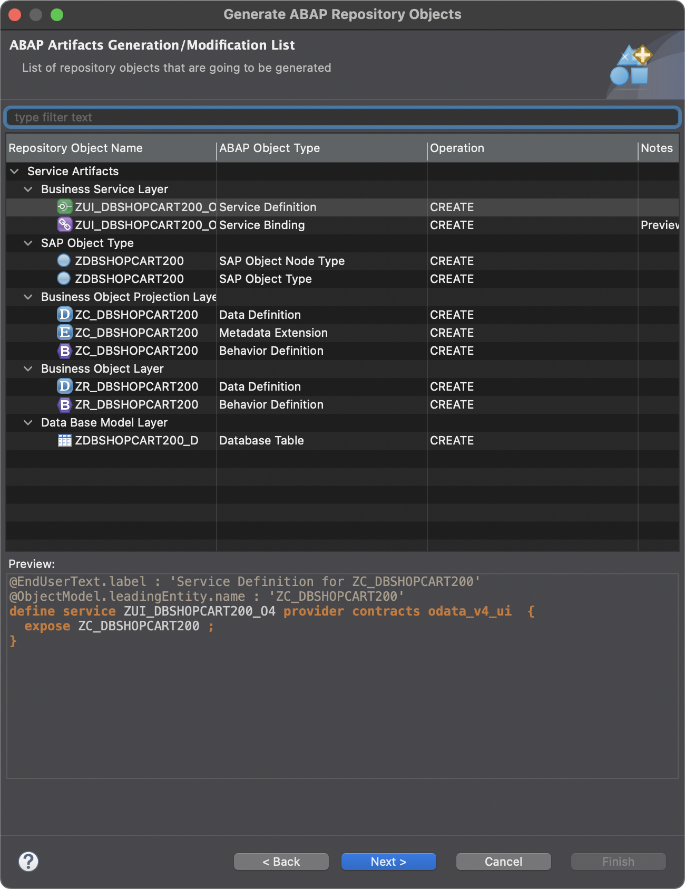

   6. Choose the transport request again that you have created eariler. Press *Finish*. The generation process starts and takes a couple of seconds.

   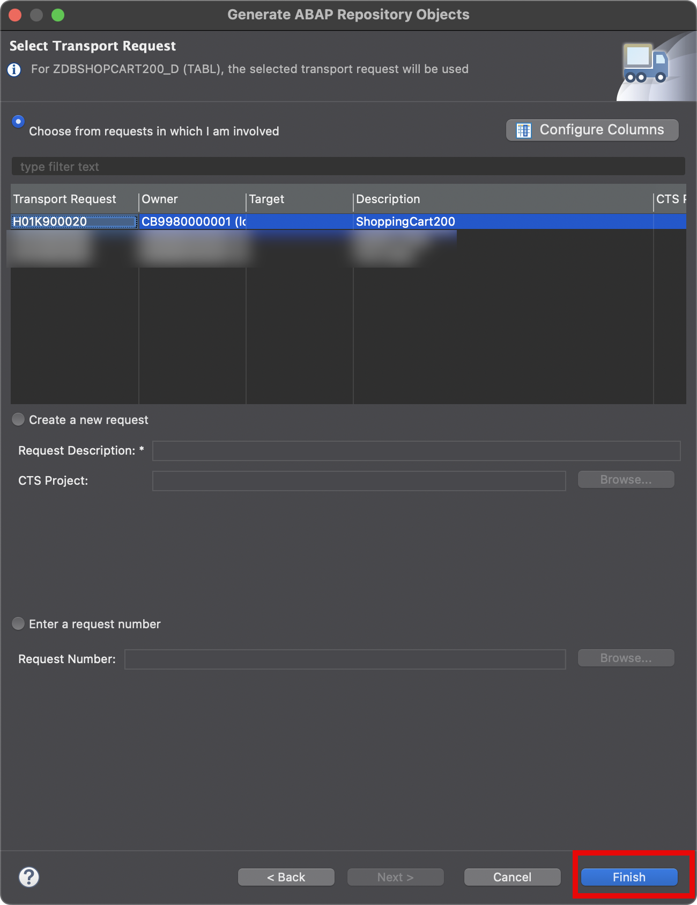

   7. At the end of the generation process a number of new objects appear in the hierarchy of your package in the project explorer. Select the object in the *Service Binding* folder to bring up its details in an editor on the right. In this editor press *Publish*, this will expose the service.

   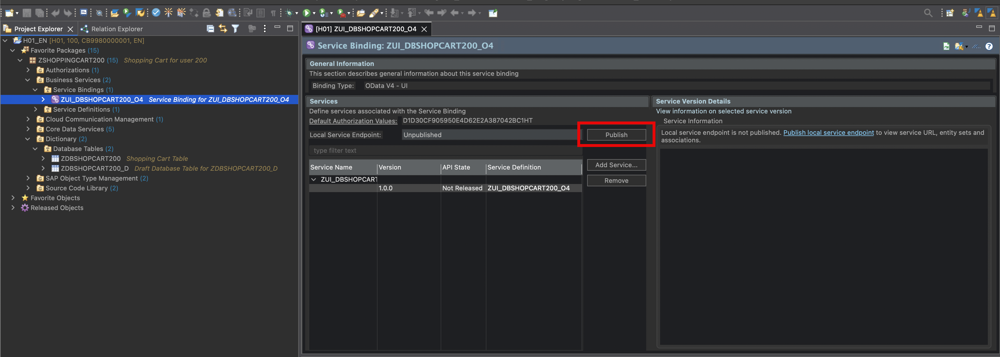

   8. Once the service is published, the service's entity appears on the right. Press *Preview* to test the service in a Fiori elements UI.

   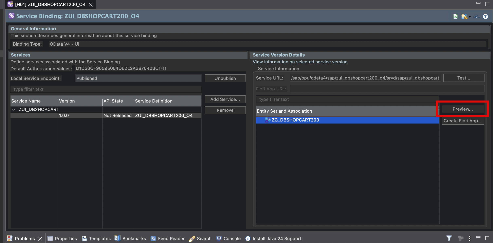

   9. A browser window opens and shows the list report of your application. As there are no entries in the database yet, the list is empty. Press *Create* to create a new entry.

   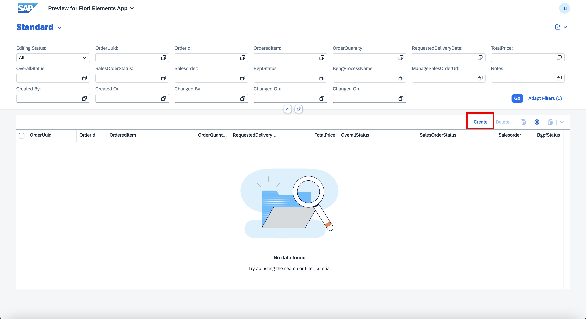

   10. Enter some values in the form that comes up, e.g. an *OrderQuantity* and some *Notes*. At the end press *Create* at the bottom
   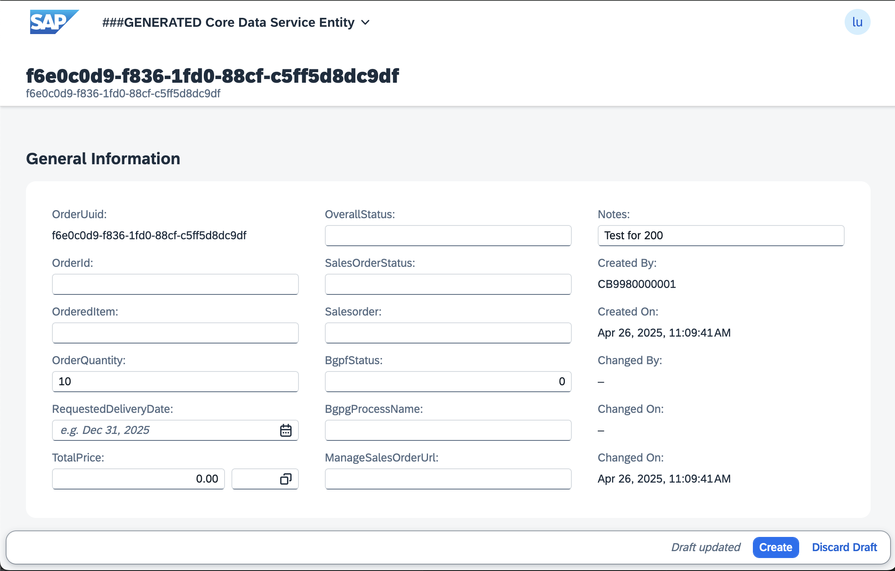

   11. Your screen will now look along the lines of the below screenshot

   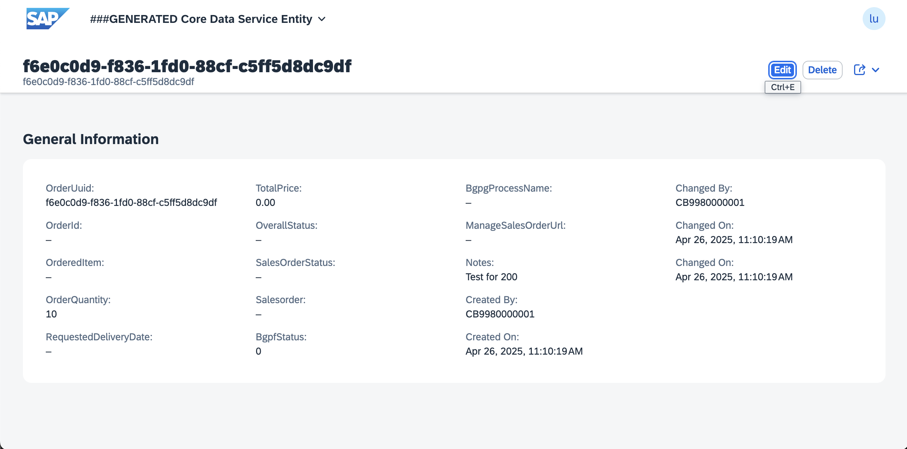

This concludes the creation of the UI service and a test using a Fiori elements UI application.

TODO: POSITION AI EXPLAIN FUNCTIONALITY HERE?

# Summary
TODO: Add summary here
