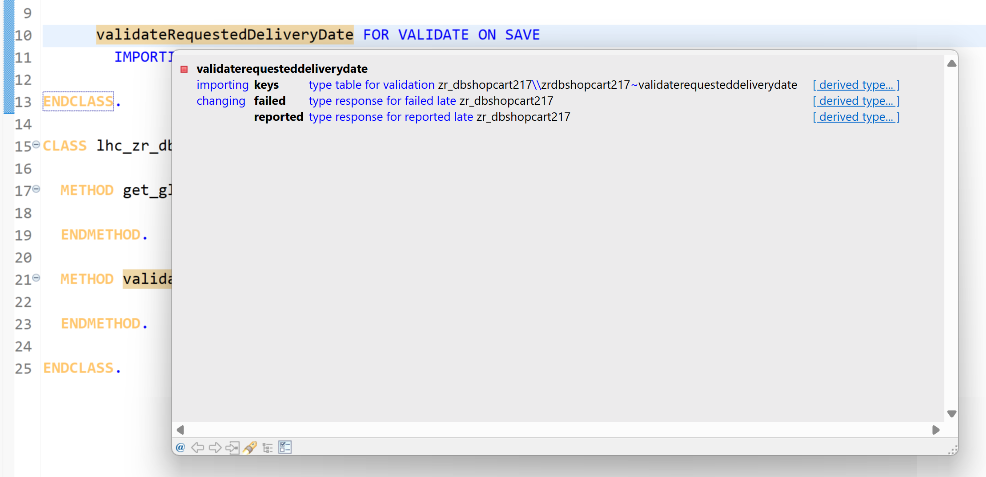

# Exercise 1.4: Define a validation

## Introduction

In the previous exercises, you have defined and implemented determinations during the creation of new instances of BO entity _ShoppingCart_ and your application used an OData API call to create a sales order asynchronously side-by-side.

Since the content (e.g. the field `RequestedDeliveryDate`) can be invalid which would prevent the creation of a sales order we would to check the data quality upfront.   

In the present exercise, you're going to define and implement one back-end validation `validateRequestedDeliveryDate` to respectively check the following:
- The value for the field `RequestedDeliveryDate` shall not be intial and shall not lie in the past.

The validation is only performed in the back-end (not on the UI) and is triggered independently of the caller, i.e. Fiori UIs or EML APIs.

> ℹ **Frontend validation & Backend validations**
> Validations are used to ensure the data consistency.
> As the name suggests, **frontend validations** are performed on the UI. They are used to improve the user experience by providing faster feedback and avoiding unnecessary roundtrips. In the RAP context, front-end validations are defined using CDS annotation or UI logic.  
> On the other hand, **backend validations** are performed on the back-end. They are defined in the BO behavior definitons and implemented in the respective behavior pools.
> Frontend validations can be easily bypassed - e.g. by using EML APIs in the RAP context. Therefore, **backend validations are a MUST** to ensure the data consistency.

## About Validations

A validation is an optional part of the business object behavior that checks the consistency of business object instances based on trigger conditions.

A validation is implicitly invoked by the business object’s framework if the trigger condition of the validation is fulfilled. Trigger conditions can be `MODIFY` operations and modified fields. The trigger condition is evaluated at the trigger time, a predefined point during the BO runtime. An invoked validation can reject inconsistent instance data from being saved by passing the keys of failed instances to the corresponding table in the `FAILED` structure. Additionally, a validation can return messages to the consumer by passing them to the corresponding table in the `REPORTED` structure.

> **Further reading**: [Validations](https://help.sap.com/viewer/923180ddb98240829d935862025004d6/Cloud/en-US/171e26c36cca42699976887b4c8a83bf.html)


## Exercise 1.4.1: Define the Validation

> In this exercise you will define the validation **`validateRequestedDeliveryDate`**.
  
1. Open your behavior definition **`ZR_{placeholder|userid}`**  

2. Because empty values will not be accepted for the field **`RequestedDeliveryDate`** specify it as _mandatory_ field 
   by adding the following code snippet after the determination as shown on the screenshot below.
 
```ABAP  
    // mark mandatory fields
    field ( mandatory ) RequestedDeliveryDate;
```    

   Your source code should look like this:   

   

3. Define the validation **`validateRequestedDeliveryDate`**.

   For that, add the following code snippet after the determination as shown on the screenshot below.

 ```ABAP
      // define a validation
      validation validateRequestedDeliveryDate on save { create; field RequestedDeliveryDate; }
 ```   

4. In order to have draft instances being checked by validations and determinations being executed before they become active, they have to be specified for the **`draft determine action prepare`** in the behavior definition.
  
   Replace the code line **`draft determine action Prepare;`** with the following code snippet as shown on the screenshot below

```ABAP
    draft determine action Prepare
    {
     validation validateRequestedDeliveryDate;
    }
```

   Your source code should look like this: 

   

   **Short explanation**:
   - Validations are always invoked during the save and specified with the keyword `on save`.
   - `validateRequestedDeliveryDate` is a validation with trigger operation `create` and trigger field `RequestedDeliveryDate`.

   **ℹ Hint**:
   > In case a validation should be invoked at every change of the BO entity instance, then the trigger conditions `create`and `update`
   > must be specified: e.g. `validation validateRequestedDeliveryDate on save { create; update; }`

5. Save and activate the changes.

6. Add the appropriate **`FOR VALIDATE ON SAVE`** methods to the local handler class of the behavior pool of the _ShoppingCart_ BO entity via quick fix.  

   For that, set the cursor on one of the validation names and press **Ctrl+1** to open the **Quick Assist** view and select the entry _**`Add the missing method of entity zr_{placeholder|userid} ...`**_.

   

   As a result, the **`FOR VALIDATE ON SAVE`** method **`validateRequestedDeliveryDate`** will be added to the local handler class `lcl_handler` of the behavior pool of the _ShoppingCart_ BO entity `ZBP_R_{placeholder|userid}`.

   

7. Save and activate the changes.

> Hint:  
> If you get an error message in the behavior implementation `The entity "ZR_{placeholder|userid}" does not have a validation "VALIDATEREQUESTDELIVERYDATE".` try to activate the behvavior definition once again.  


## Exercise 1.4.2: Implement the Validations  

> Implement the validation, e.g. the validation `validateRequestedDeliveryDate` which checks if the respective date of field `RequestedDeliveryDate` is in the future.  
> An appropriate message should be raised and displayed on the UI for each invalid value.  


1. First, check the interface of the new methods in the declaration part of the local handler class `lcl_handler` of the behavior pool of the _ShoppingCart_ BO entity **`ZBP_R_{placeholder|userid}`**.

   For that, set the cursor on the method name, e.g. **`validateRequestedDeliveryDate`**, press **F2** to open the **ABAP Element Info** view, and examine the full method interface.

    

   **Short explanation**:  
   - The addition **`FOR VALIDATE ON SAVE`** indicates that the method provides the implementation of a validation executed on save. Validations are always executed on save.
   - Method signature for the validation method:
     - `IMPORTING`parameter **`keys`** - an internal table containing the keys of the instances on which the validation should be performed.
     - Implicit `CHANGING` parameters (aka _implicit response parameters_):  
       - **`failed`**   - table with information for identifying the data set where an error occurred
       - **`reported`** - table with data for instance-specific messages

   You can go ahead and implement the validation method.

2. Now implement the method in the implementation part of the class.
  
    The logic consists of the following main steps:
    1. Read the ShoppingCart instance(s) of the transferred keys (**`keys`**) using the EML statement **`READ ENTITIES`**.
    2. The addition **`FIELDS`** is used to specify the fields to be read. E.g. only **`OrderedItem`** is relevant for the  validation `validateOrderedItem`.  
       The addition `ALL FIELDS` can be used to read all fields.
    3. The addition **`IN LOCAL MODE`** is used to exclude feature controls and authorization checks.
    4. Read all the transfered (distinct, non-initial) customer IDs and check if they exist.  
    5. Prepare/raise messages for all transferred _ShoppingCart_ instances with initial and non-existing `OrderedItem`  
       and set the changing parameter **`reported`**


   TODO: POSITION AI CODE COMPLETION HERE 


   Replace the current method implementation with following code snippets.

    - **`validateRequestedDeliveryDate`**

   You can use the **F1 Help** to get detailed information on the different ABAP and EML statements.  


2. Save and activate the changes.

####  Code snippet **`validateRequestedDeliveryDate`**

<hr>

<details>

<summary>Click to expand the source code</summary>

```ABAP
  
 METHOD validateRequestedDeliveryDate.

    "For your convinience there is a central class ZAX_AC_EXCEPTIONS that is beeing used here.
    
    READ ENTITIES OF zr_{placeholder|userid} IN LOCAL MODE
       ENTITY ShoppingCart
         FIELDS (  RequestedDeliveryDate )
         WITH CORRESPONDING #( keys )
       RESULT DATA(entities).

    LOOP AT entities INTO DATA(entity).
      APPEND VALUE #(  %tky               = entity-%tky
                       %state_area        = 'VALIDATE_DATES' ) TO reported-shoppingcart.

      APPEND VALUE #(  %tky               = entity-%tky
                       %state_area        = 'OUTDATED_DATES' ) TO reported-shoppingcart.

      IF entity-RequestedDeliveryDate IS INITIAL.
        APPEND VALUE #( %tky = entity-%tky ) TO failed-shoppingcart.

        APPEND VALUE #( %tky               = entity-%tky
                        %state_area        = 'VALIDATE_DATES'
                         %msg              = NEW zcx_ac_exceptions(
                                                 textid   = zcx_ac_exceptions=>enter_requested_delivery_date
                                                 severity = if_abap_behv_message=>severity-error )
                        %element-requesteddeliverydate = if_abap_behv=>mk-on ) TO reported-shoppingcart.

      ELSEIF entity-RequestedDeliveryDate < cl_abap_context_info=>get_system_date( ).
        APPEND VALUE #( %tky               = entity-%tky ) TO failed-shoppingcart.

        APPEND VALUE #( %tky               = entity-%tky
                        %state_area        = 'OUTDATED_DATES'
                         %msg              = NEW zcx_ac_exceptions(
                                                                textid     = zcx_ac_exceptions=>out_dated_req_delivery_date
                                                                severity   = if_abap_behv_message=>severity-error )
                        %element-requesteddeliverydate = if_abap_behv=>mk-on ) TO reported-shoppingcart.
      ENDIF.
    ENDLOOP.
  ENDMETHOD.
```

</details>

<hr>


## Exercise 1.4.3: Preview and Test the enhanced Shopping Cart App

> Now the SAP Fiori elements app can be tested.    

You can either refresh your application in the browser using **F5** if the browser is still open - or go to your service binding **`ZUI_{placeholder|userid}_O4`** and start the Fiori elements App preview for the **`ShoppingCart`** entity set.

1. Click **Create** to create a new entry.

2. Select `TG11` as OrderdItem, enter an quantity and a requested delivery date **that lies in the past**. 

   The draft will be updated.

3. Now click **Create**. You should get following error messages displayed:  
   **Requested delivery date is in the past** .

    


# Summary 

Now that you have... 

- defined a validation in the behavior definition, 
- implemented them in the behavior pool, and
- previewed and tested the enhanced Fiori elements app,

you can continue with the next exercise.
