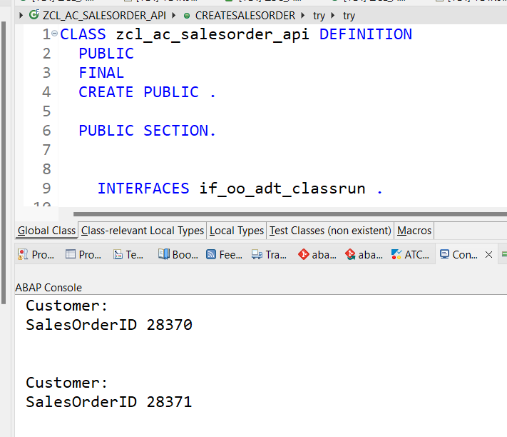
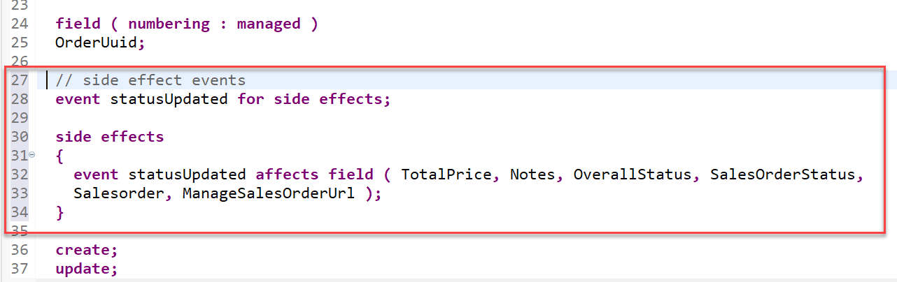
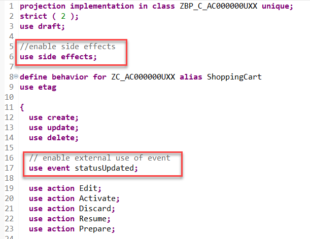
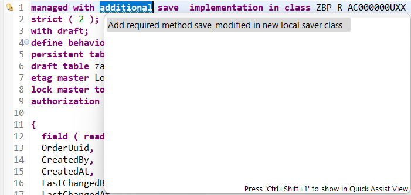
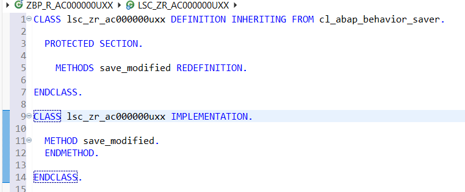
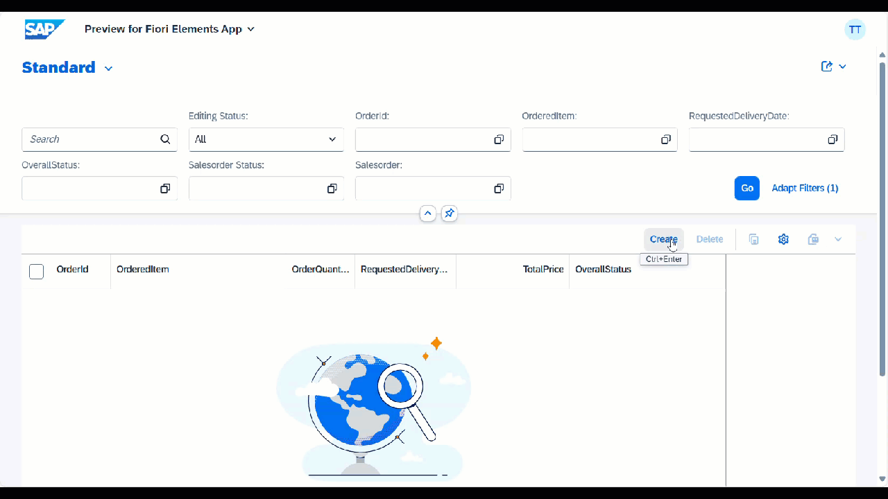

# Excercise 1.5: Create a sales order within S/4HANA

## Introduction
  
**Side-by-Side extension**

In the current exercise we want to trigger the creation of a sales order using a sales order API class that we have provided for your convenience. 
The problem with side-by-side scenarios in general is, to have a logical unit of work that spans both systems, in our case the SAP BTP ABAP Environment and the SAP S/4HANA Cloud System.  
To be on the safe side we will trigger the creation of the sales order in the SAP S/4HANA backend only after the order has been successully created in our RAP based application in the SAP BTP ABAP Environment. 

Since the sales order api class performs an OData call to the SAP S/4HANA system this will trigger an implicit commit.
This would however violate the logical unit of work in RAP and will lead to a dump as described in the [SAP Online Help](https://help.sap.com/docs/abap-cloud/abap-rap/rap-transactional-model-and-sap-luw).  

Fortunately we can make use of the Background Processing Framework (BGPF) which allows us to start a process asynchronously from within the save sequence thereby leaving the transactional control of the RAP framework.  

```ABAP
zcl_ac000000uxx_start_bgpf=>run_via_bgpf_tx_uncontrolled( i_rap_bo_key = create_shoppingcart-OrderUuid ).         
```
   
<br>
   
## Exercise 1.5.1: Investigate the implementation of the sales order API `zcl_ac_salesorder_api`

   The sales order API [`zcl_ac_salesorder_api`](adt://TDI/sap/bc/adt/oo/classes/zcl_ac_salesorder_api) has been provided for your convenience.  
   
   You can test the class `zcl_ac_salesorder_api` by simply opening it in ADT using this [ADT Link](adt://TDI/sap/bc/adt/oo/classes/zcl_ac_salesorder_api) or by pressing `Ctrl`+`Shift`+`A` and entering the name of the class  `zcl_ac_salesorder_api`.   
   
   Then press `F9` to run the `main()` method as an **ABAP Application (console)**.  
   
   This method calls the `CreateSalesorder()` method which uses an OData Proxy Client that performs an OData call to the SAP S/4HANA backend. The OData Proxy Client uses the Service Consumption Model `ZSC_AC_API_SALESORDER` as a parameter and it uses an http client object that is using the predefined destination `S4HANA_ODATA_SalesOrder`.
   
   It creates a **Salesorder** in the SAP S/4HANA Cloud backend system.

   


## Exercise 1.5.2: Build a class for asynchronous sales order creation

>  In this step we will create a class that uses the background processing framework (BGPF) that allows us to start a class asynchronously which will trigger the creation of a sales order. This approach is required since the sales order API performs an OData call. An OData call like any other call of a remote API causes implicit commits. Since it is not allowed to perform any commit within the save sequence of the RAP framework since this would cause a short dump, this call has be performed outside the transactional control of the RAP framework.

1. Right-click on your ABAP package **`Z{placeholder|userid}`** and select **New** > **ABAP class** from the context menu.

2. Maintain the required information and click **Next >**.

      - Name: **`ZCL_{placeholder|userid}_START_BGPF`**
      - Description: **Start salesorder creation via BGPF**

3. Select a transport request and click **Finish**

4. Replace the default code with the code snippet provided below.

   **Hint**: Grab the code snippet using copy and paste.

>[!TIP]
> Source code **`zcl_{placeholder|userid}_start_bgpf`**
> <details>
> 
> <summary>Click to expand the source code</summary>
> 
> ```abap
> CLASS zcl_shoppingcart###_start_bgpf DEFINITION
>     PUBLIC
>     FINAL
>     CREATE PUBLIC.
> 
>   PUBLIC SECTION.
> 
>     INTERFACES if_serializable_object.
>     INTERFACES if_bgmc_operation.
>     INTERFACES if_bgmc_op_single_tx_uncontr.
>     INTERFACES if_bgmc_op_single.
> 
>     CLASS-METHODS run_via_bgpf
>       IMPORTING i_rap_bo_key                    TYPE sysuuid_x16
>       RETURNING VALUE(r_process_monitor_string) TYPE string.
> 
>     CLASS-METHODS run_via_bgpf_tx_uncontrolled
>       IMPORTING i_rap_bo_key                    TYPE sysuuid_x16
>       RETURNING VALUE(r_process_monitor_string) TYPE string.
> 
>     METHODS constructor
>       IMPORTING i_rap_bo_key TYPE sysuuid_x16.
> 
>     CONSTANTS:
>       BEGIN OF bgpf_state,
>         unknown         TYPE int1 VALUE IS INITIAL,
>         erroneous       TYPE int1 VALUE 1,
>         new             TYPE int1 VALUE 2,
>         running         TYPE int1 VALUE 3,
>         successful      TYPE int1 VALUE 4,
>         started_from_bo TYPE int1 VALUE 99,
>       END OF bgpf_state.
> 
>   PROTECTED SECTION.
>   PRIVATE SECTION.
>     DATA rap_bo_key TYPE sysuuid_x16.
>     CONSTANTS wait_time_in_seconds TYPE i VALUE 5.
> ENDCLASS.
> 
> 
> CLASS zcl_shoppingcart###_start_bgpf IMPLEMENTATION.
>   METHOD constructor.
>     rap_bo_key = i_rap_bo_key.
>   ENDMETHOD.
> 
>   METHOD if_bgmc_op_single~execute.
>     "implement if controlled behavior is needed
>   ENDMETHOD.
> 
>   METHOD if_bgmc_op_single_tx_uncontr~execute.
> 
>     DATA start_sales_order_create TYPE REF TO zcl_ac_salesorder_api.
>     DATA update                   TYPE TABLE FOR UPDATE zr_dbshopcart###\\ZrDbshopcart###.
>     DATA update_line              TYPE STRUCTURE FOR UPDATE zr_dbshopcart###\\ZrDbshopcart###.
>     DATA error_message            TYPE string.
> 
>     READ ENTITIES OF zr_dbshopcart###
>             ENTITY ZrDbshopcart###
>             ALL FIELDS
>             WITH VALUE #( ( %is_draft = if_abap_behv=>mk-off
>                             %key-OrderUuid = rap_bo_key
>                            )  )
>             RESULT DATA(entities)
>             FAILED DATA(failed).
> 
>     IF entities IS NOT INITIAL.
>       LOOP AT entities INTO DATA(entity).
>         start_sales_order_create = NEW zcl_ac_salesorder_api(
>           i_material = entity-OrderedItem
>           i_purchase_order_by_customer = CONV #( sy-uname )
>           i_quantity = entity-OrderQuantity
>           i_requested_delivery_date = entity-RequestedDeliveryDate
>         ).
> 
>         DATA(r_data) = start_sales_order_create->CreateSalesorder(
>           IMPORTING
>             r_error_message = error_message
>         ).
> 
>         update_line-%is_draft = if_abap_behv=>mk-off.
>         update_line-OrderUuid = entity-OrderUuid.
> 
>         IF r_data-sales_order IS NOT INITIAL.
>           update_line-Salesorder            = r_data-sales_order.
>           update_line-TotalPrice            = r_data-total_net_amount.
>           update_line-SalesOrderStatus      = 'CREATED'.
>           update_line-OverallStatus         = 'SAVED'.
>           update_line-ManageSalesOrderUrl   =
>            | https://my301102-api.s4hana.ondemand.com/ui#SalesOrder-manageV2&/SalesOrderManage('{ r_data-sales_order }') |.
>         ELSE.
>           update_line-Notes                 = error_message.
>           update_line-OverallStatus         = 'SAVED'.
>           update_line-SalesOrderStatus      = 'FAILED'.
>         ENDIF.
> 
>         APPEND update_line TO update.
>       ENDLOOP.
> 
>       MODIFY ENTITIES OF zr_dbshopcart###
>        ENTITY ZrDbshopcart###
>          UPDATE FIELDS ( SalesOrder OverallStatus SalesOrderStatus TotalPrice  ManageSalesOrderUrl Notes )
>            WITH update
>        REPORTED DATA(reported_ready)
>        FAILED DATA(failed_ready).
>     ENDIF.
> 
>     COMMIT WORK.
>   ENDMETHOD.
> 
>   METHOD run_via_bgpf.
>     TRY.
>         DATA(process_monitor) = cl_bgmc_process_factory=>get_default( )->create(
>                                               )->set_name( |Calculate order data { i_rap_bo_key }|
>                                               )->set_operation(  NEW zcl_shoppingcart###_start_bgpf( i_rap_bo_key = i_rap_bo_key )
>                                               )->save_for_execution( ).
> 
>         r_process_monitor_string = process_monitor->to_string( ).
>       CATCH cx_bgmc INTO DATA(lx_bgmc).
>     ENDTRY.
>   ENDMETHOD.
> 
>   METHOD run_via_bgpf_tx_uncontrolled.
>     TRY.
>         DATA(process_monitor) = cl_bgmc_process_factory=>get_default( )->create(
>                                               )->set_name( |Calculate order data { i_rap_bo_key }|
>                                               )->set_operation_tx_uncontrolled(  NEW zcl_shoppingcart###_start_bgpf( i_rap_bo_key = i_rap_bo_key )
>                                               )->save_for_execution( ).
> 
>         r_process_monitor_string = process_monitor->to_string( ).
>       CATCH cx_bgmc INTO DATA(lx_bgmc).
>     ENDTRY.
>   ENDMETHOD.
> 
> ENDCLASS.
> ```  
> 
> </details>

5. Save and activate the changes.  

## Exercise 1.5.3: Add side effects

> Because our RAP business object will be updated asynchronously we will leverage a new feature that allows us to trigger a side effect that refreshes the UI automatically.  

1. Open the behavior definition `ZR_{placeholder|userid}` and add an `event for side effects` called `statusUpdated`.  

In addition specify which fields the event `statusUpdated` shall effect.

Here we list a number of fields that are going to be updated asynchronously via BGPF.

   ```ABAP
   // side effect events
   event statusUpdated for side effects;

   side effects
   {
    event statusUpdated affects field ( TotalPrice, Notes, OverallStatus, SalesOrderStatus,
    Salesorder, ManageSalesOrderUrl );
   }

   ```

 

## Exercise 1.5.4: Enable side effects for events in the projection layer

After having created the **event for side effects** in the behavior defintion **`ZR_{placeholder|userid}`** we have to enable it using the behavior definition on projection level `ZC_{placeholder|userid}`.
Here we have have to add additional statements at two locations.

First we have to add this statement right after the **`use draft;`** statement.  

```ABAP    
//enable side effects  
use side effects;   
```

And in addition we have to add the following statement in order to enable the external use of the event **`statusUpdated`**. 

```ABAP    
 // enable external use of event
 use event statusUpdated;   
```



## Exercise 1.5.5: Add an additional save 

As mentioned above we have to add the use of an additional save to the behavior of our RAP business object since the API that we plan to call has to be called asynchronously via BGPF.

Navigate to the behavior definition `ZR_{placeholder|userid}` either in the *Project Explorer* or by opening it as a development object using the short cut **Ctrl+Shift+A**.


  1. Open the behavior definition and add the statement `with unmanaged save` right after the `managed` statement.

   Before

   ```ABAP
   managed implementation in class ZBP_R_{placeholder|userid} unique;
   ```

   after

   ```ABAP
   managed with additional save implementation in class ZBP_R_{placeholder|userid} unique;
   ```

  2. Activate your changes.

  3. After having activated your changes select the key word `additional` and select **Ctrl + 1** to start the code assistant.

       
  
     This will add a local saver class `lsc_zr_{placeholder|userid}` to the local classes of your behavior implementation class. The method `save_modified` is added to the      DEFINITION and the IMPLEMENTATION section of this local class.   

       
     
     <!---
     <pre ABAP>
      CLASS lsc_zr_{placeholder|userid} DEFINITION INHERITING FROM cl_abap_behavior_saver.
        PROTECTED SECTION.
      METHODS save_modified REDEFINITION.
      ENDCLASS.
      CLASS lsc_zr_{placeholder|userid} IMPLEMENTATION.
      ENDCLASS.
     </pre>
     --->  
     
4. Implement the `save_modified()` method as follows:

>[!TIP]
> Source code **`zcl_{placeholder|userid}_start_bgpf`**
> <details>
> 
> <summary>Click to expand the source code</summary>
> 
> ```abap
> CLASS lsc_zr_dbshopcart### DEFINITION INHERITING FROM cl_abap_behavior_saver.
> 
>   PROTECTED SECTION.
> 
>     METHODS save_modified REDEFINITION.
> 
> ENDCLASS.
> 
> CLASS lsc_zr_dbshopcart### IMPLEMENTATION.
> 
>   METHOD save_modified.
>      DATA : ShoppingCarts       TYPE STANDARD TABLE OF zr_dbshopcart###,
>             ShoppingCart        TYPE                   zr_dbshopcart###,
>             events_to_be_raised TYPE TABLE FOR EVENT zr_dbshopcart###~statusUpdated.
> 
>      "Create a sales order in S/4HANA if Order Quantity is given  
>      IF create-zrdbshopcart### IS NOT INITIAL.
>        LOOP AT create-zrdbshopcart### INTO DATA(create_shoppingcart).
>          IF create_shoppingcart-%control-OrderQuantity = if_abap_behv=>mk-on.
>            zcl_shoppingcart###_start_bgpf=>run_via_bgpf_tx_uncontrolled( i_rap_bo_key = create_shoppingcart-OrderUuid ).
>          ENDIF.
>        ENDLOOP.
>      ENDIF.
> 
>      "Aync process will update additional fields (like total price). Once they have changed, an event-driven side effect will update the UI
>      IF update-zrdbshopcart### IS NOT INITIAL.
>        LOOP AT update-zrdbshopcart### into data(update_shoppingcart).
> 
>         IF update_shoppingcart-%control-TotalPrice = if_abap_behv=>mk-on.
>            CLEAR events_to_be_raised.
>            APPEND INITIAL LINE TO events_to_be_raised.
>            events_to_be_raised[ 1 ] = CORRESPONDING #( update_shoppingcart ).
>            RAISE ENTITY EVENT zr_dbshopcart###~statusUpdated FROM events_to_be_raised.
>          ENDIF.
>        ENDLOOP.
>      ENDIF.
> 
>   ENDMETHOD.
> 
> ENDCLASS.
> ```  
> 
> </details>

## Exercise 1.5.6: Preview and Test the enhanced ShoppingCart App

> Now the SAP Fiori elements app can be tested.  

You can either refresh your application in the browser using **F5** if the browser is still open - or go to your service binding `ZUI_{placeholder|userid}_O4` and start the Fiori elements App preview for the **`ShoppingCart`** entity set.

You can go ahead and test the business logic that will trigger the creation of a sales order in the SAP S/4HANA Cloud system.

For example, create a new _ShoppingCart_ instance, maintain the needed data.

- **OrderedItem:** `TG11`      
- **OrderedQuantity:** `2`     
- **RequestedDeliveryDate:** `<Select a date in the future>`      

When you press the **Create** button the data will be saved and an order will be created with the status **order_created**.  

In the `save_modified()` method of local saver class the class `zcl_{placeholder|userid}_start_bgpf` will start an asynchronous call of the sales order api class.  

```zcl_{placeholder|userid}_start_bgpf=>run_via_bgpf_tx_uncontrolled( i_rap_bo_key = create_shoppingcart-OrderUuid ).```   

In this asynchronous call the sales order api will create a sales order by calling the **Sales Order (A2X)** OData service and it will update the **ShoppingCart** business object with the sales order id and it will add a URL pointing the the SAP Fiori Sales Order app in the SAP S/4HANA backend system using this code.

```ABAP 
         IF r_data-sales_order IS NOT INITIAL.
           update_line-Salesorder    = r_data-sales_order.
           update_line-TotalPrice    = r_data-total_net_amount.
           update_line-SalesOrderStatus = zbp_r_{placeholder|userid}=>sales_order_state-created.
           update_line-OverallStatus = zbp_r_{placeholder|userid}=>order_state-released.
           update_line-ManageSalesOrderUrl =
            | https://my413601.s4hana.cloud.sap/ui#SalesOrder-manageV2&/SalesOrderManage('{ r_data-sales_order }') |.
         ELSE.
           update_line-Notes = error_message.
           update_line-OverallStatus = zbp_r_{placeholder|userid}=>order_state-new.
           update_line-SalesOrderStatus = zbp_r_{placeholder|userid}=>sales_order_state-failed.
         ENDIF.

```


     


# Summary

Now that you have...

- created a BGPF starter class, 
- enabled and implemented side effects, and 
- created a special `save_modified()` method,

you can continue with the next exercise - **[Exercise 1.6: Create a Web API](../ex1.6/README.md)**
