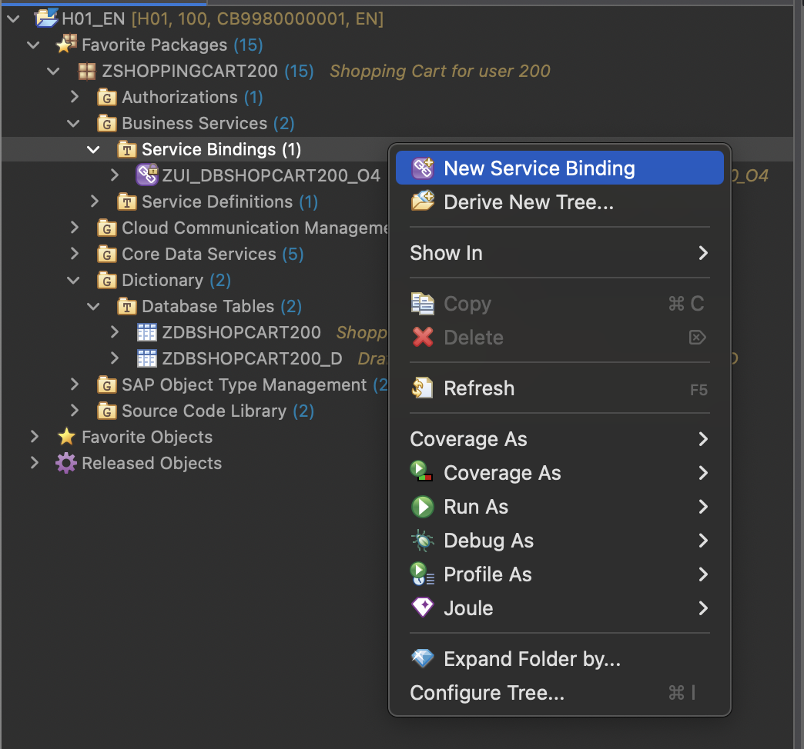
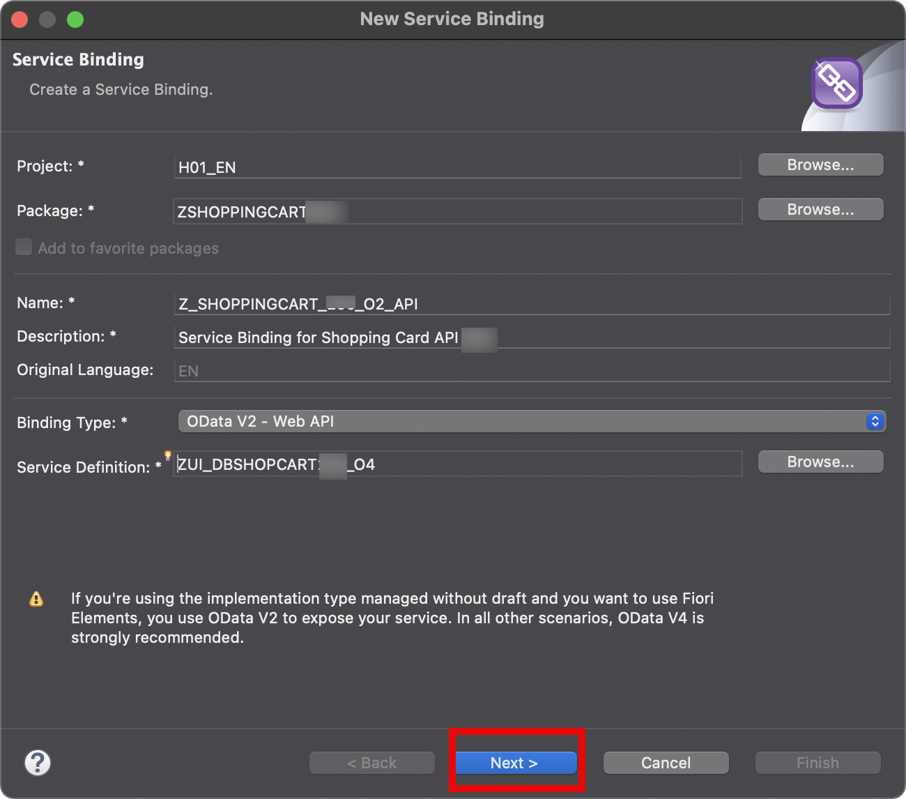
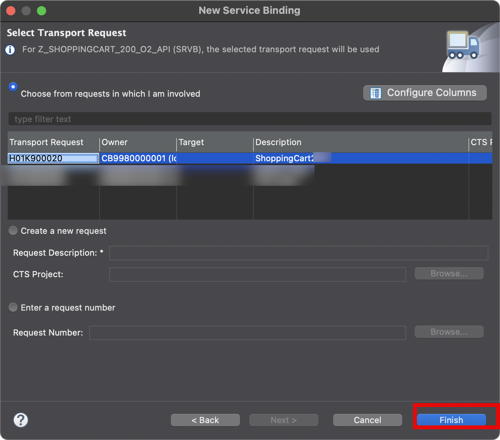
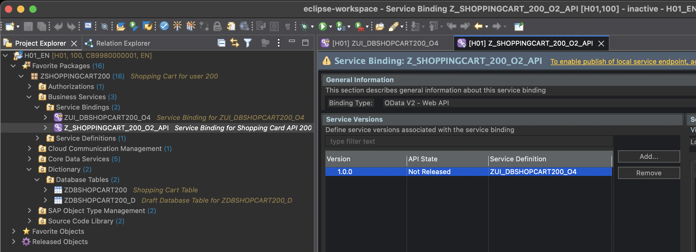
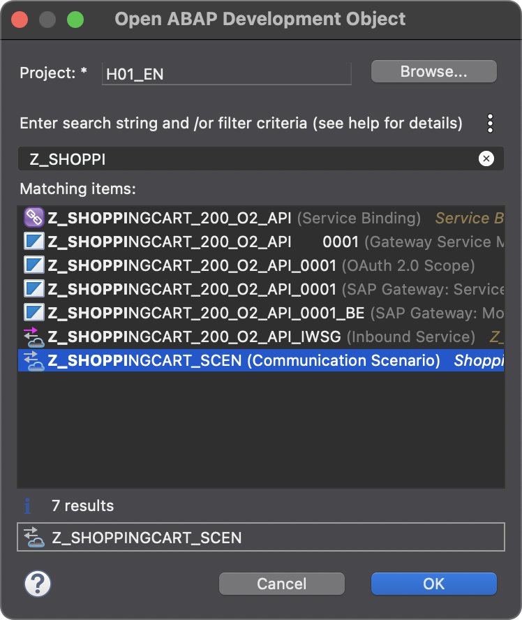
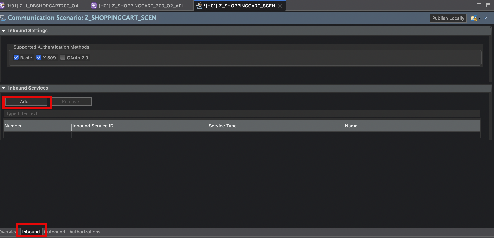
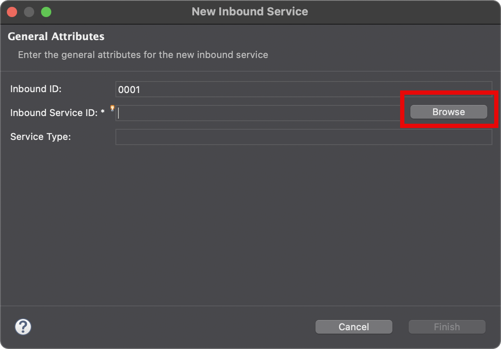
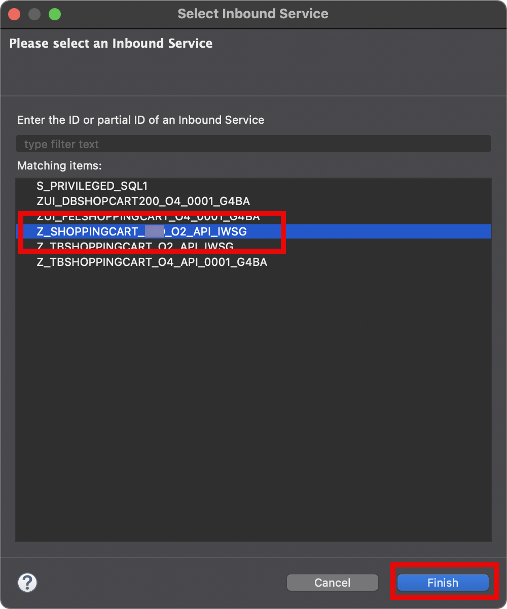
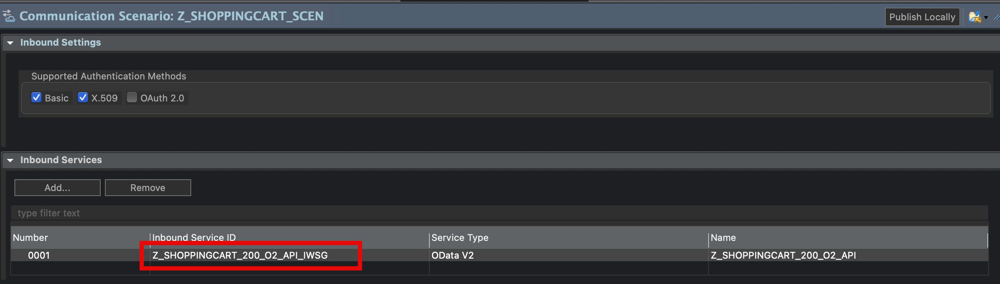

# Exercise 1.6: Create a Web API

Now we need to create a version of a service that is not going to be consumed in a UI but later in a Build Process. For this the service does need other qualities than a UI one, for example, the service should not have draft qualtities that save data from the UI for the current user only, even if the user has not yet pressed the save button.

   1. In order to create a new API, you need to create a new service binding. Select the *Service Bindings* folder under *Business Services* in you project in the project explorer. Invoke the right mouse button and select *New Service Binding* in the menu.

   

   2. Give the new service binding a name *Z_SHOPPINGCART_###_O2_API* where *###* is your group name. As description you can put *Service Binding for Shopping Card API ###*. Select the Binding Type *OData V2 - Web API* and choose the Service Definition that was generated for you before: *ZUI_DBSHOPCART_###_O4* (again *###* is always your group number). Press *Next*

   

   3. In the next step - as before - choose your transport request and press *Finish*

   

   Your new service binding will appear in the project explorer

   
   
 
# Exercise 1.6: Expose the new API via a Communication System

While the new API is now already activated, it cannot be consumed from outside the BTP ABAP Environment. Our goal however is, that this API can be called from a Build Process which runs on the BTP but not in the ABAP enviroment. Thus, we need to make the API consumable from outside. This can be achieved via so-called Communication Systems consisting of Communication Scenarios and Arrangements. To achieve this, we need to add our service to a Communication Scenario.

   1. In order to add your service to the communication scenario, we need to select the communication scenario. For this press *Command/CTRL+Shift+A*. A pop up is openend. Now type in *Z_SHOPPINGCART_SCEN* and select the entry in the list. Press *Ok*

   

   2. Pick the *ZSHOPPINGCART* package. Expand *Cloud Communication Management->Communication Scenario* and click on *Z_SHOPPINGCART_SCEN* to show the details in the editor on the right. Switch to the *Inbound* tab and press *Add* there.

   > *Potential blocking issue**   
   > As a number of people might access this scenario at the same time and want to add their service to it, it might be temporarily blocked by another user at the time you want to change it. In this case you have to wait for the user to be finished with this step for your turn.

   

   3. On the pop up that comes up, press *Browse*

   

   4. Type in *Z_SHOPPINGCART_###_O2_API_IWSG* and select this entry in the list. As usual ### is your group number. Press *Finish*. 

   

   5. Back on the pop up from before, also press *Finish*. Your service should now appear in the list

   

This concludes the ABAP Cloud part. 

# Summary  
 
You have now created a new ABAP project from the Build Lobby. In the ABAP project you have created a new RAP service based on the ABAP Cloud Programming Model. You tested this service with a Fiori elements preview app. Then you enabled the service for consumption from outside the BTP ABAP envrionment by adding it to a communication scenario
 
You can continue with the next exercise - **[Exercise 2: Create a Process in SAP Build Process Automation based on the Shopping Cart Service](../../../build/exercises/ex2/README.md)**
