[Home ](../../README.md)  

# Exercise 1: Create an ABAP Package form the SAP Build Lobby

In this exercise, you will create an ABAP project from the Build Lobby

> **Reminder:**   
> Don't forget to replace all occurences of the placeholder **`###`** with your group ID in the exercise steps below.    
> If you don't have a group ID yet, please check with your instructor.    

## Exercise 1.1: Create Package with language version ABAP for Cloud Development

<!--
   
   1. In ADT, again the **Project Explorer** right-click on the package **`ZLOCAL`**, and select **New** > **ABAP Package** from the context menu. 

   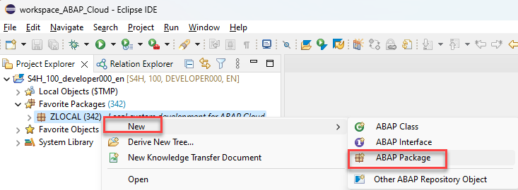

   
   2. Maintain the required information (`###` is your group ID):
       - Name: **`Z_ONLINESHOP_###`**
       - Description: _**`Online Shop ###`**_
       - Select the box **Add to favorites package**
       
      Click **Next >**.

   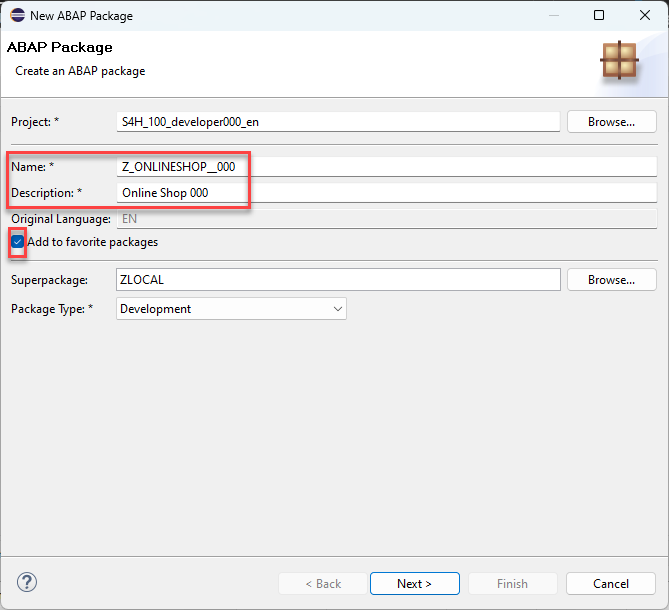.

-->

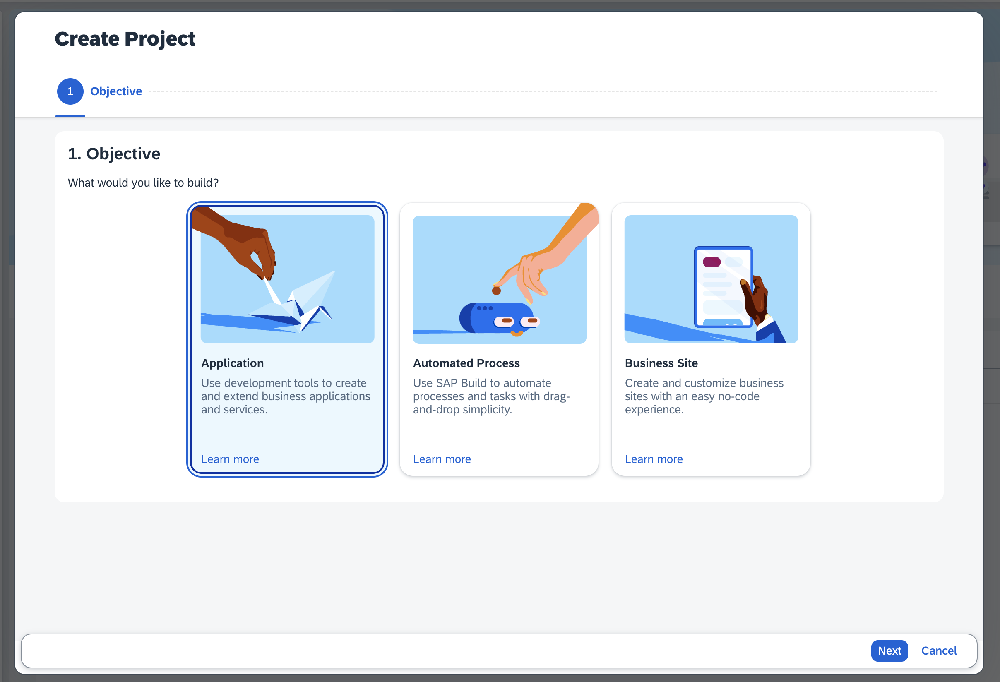
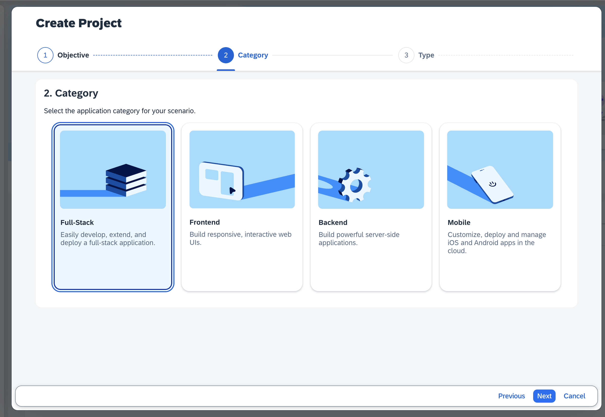
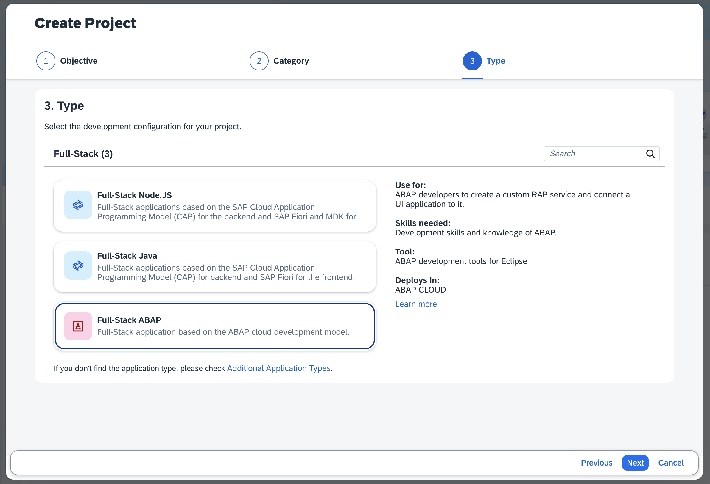
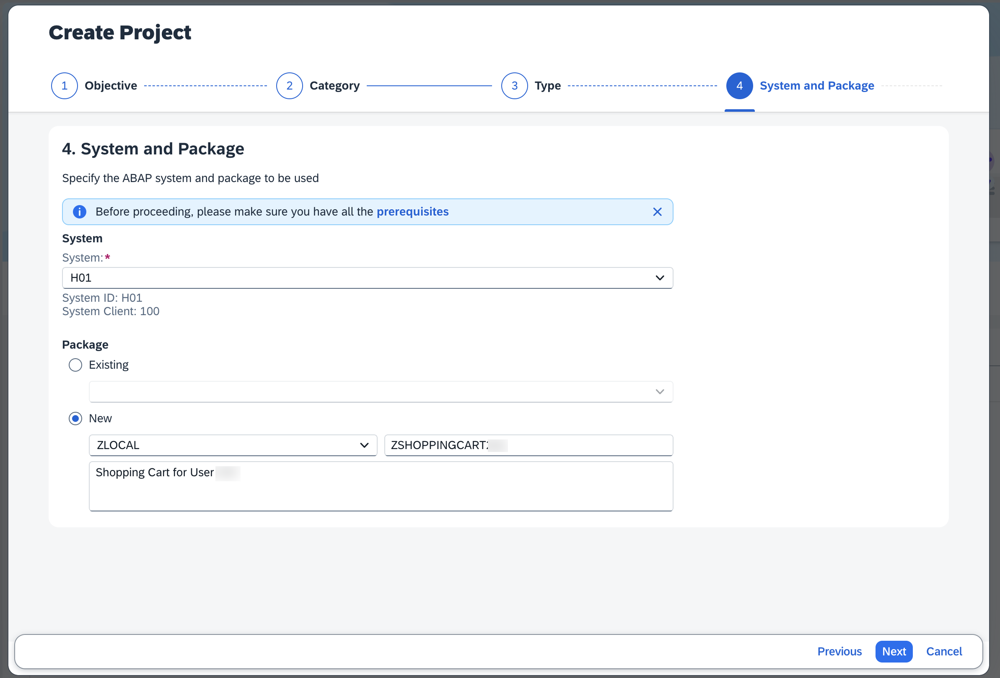
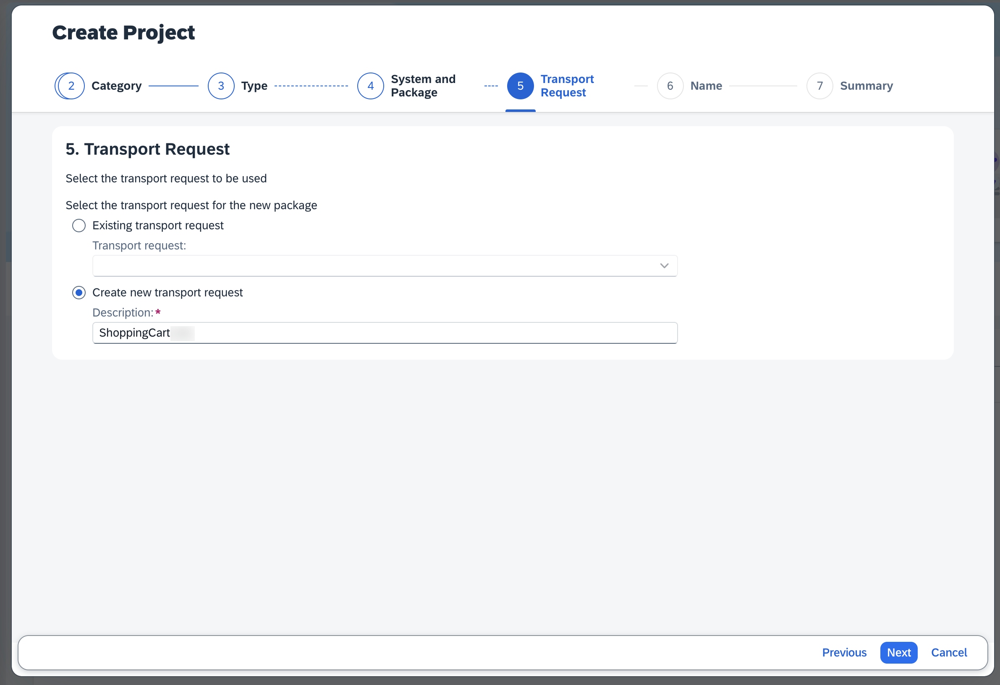
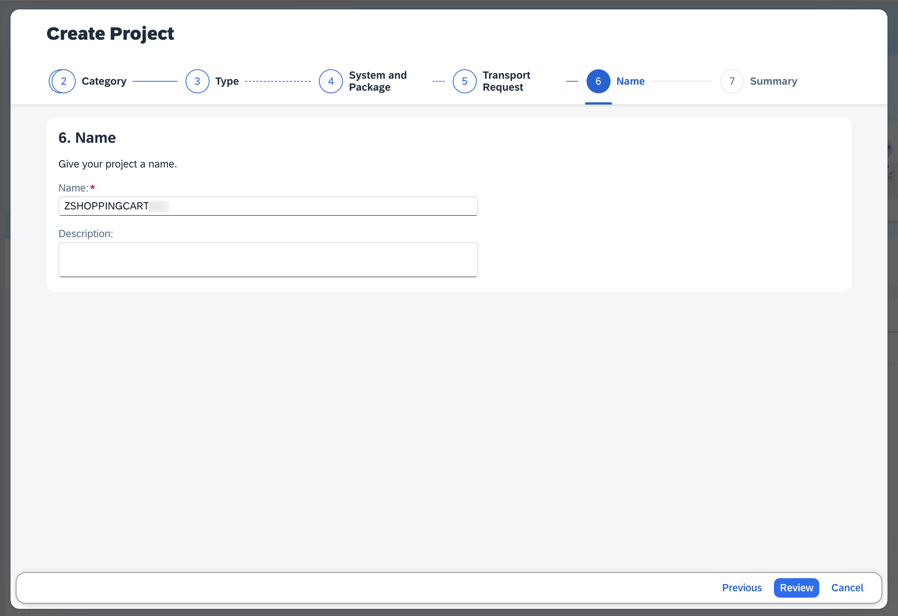
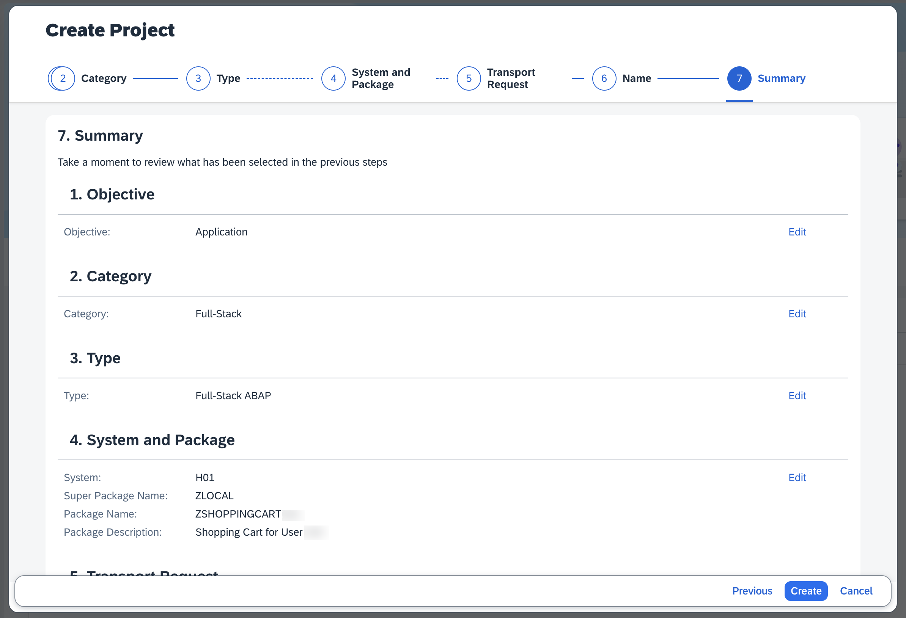
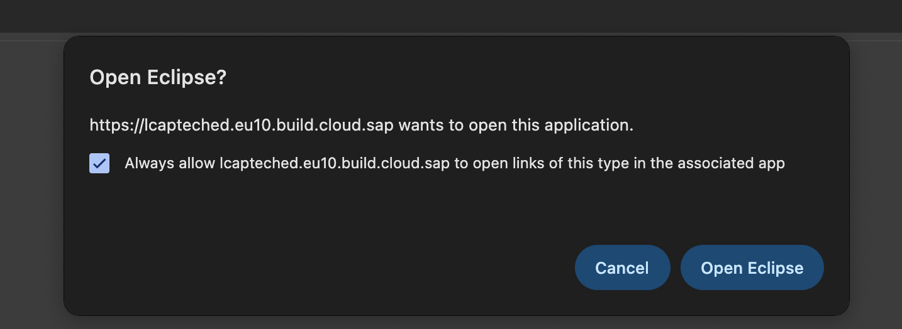
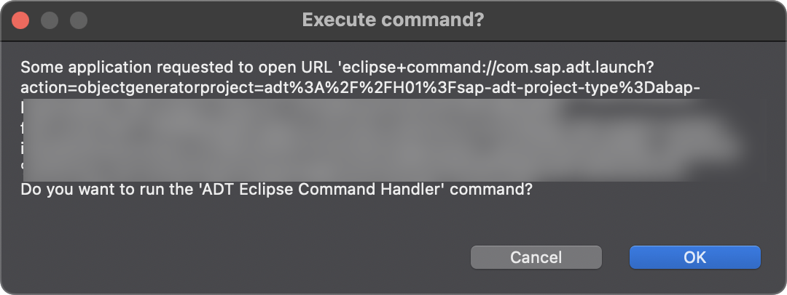
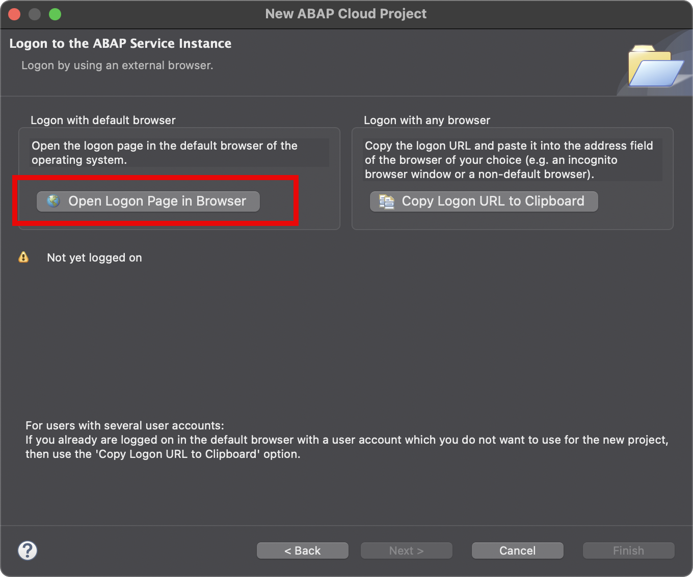
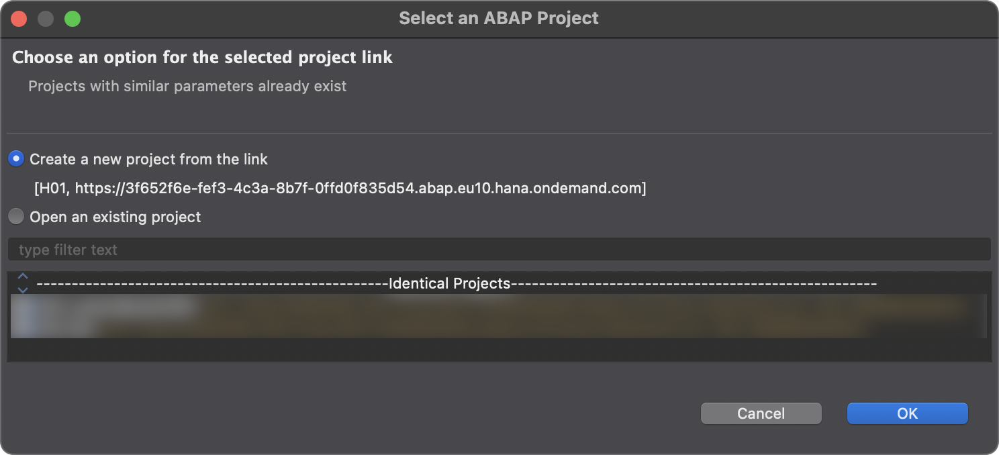
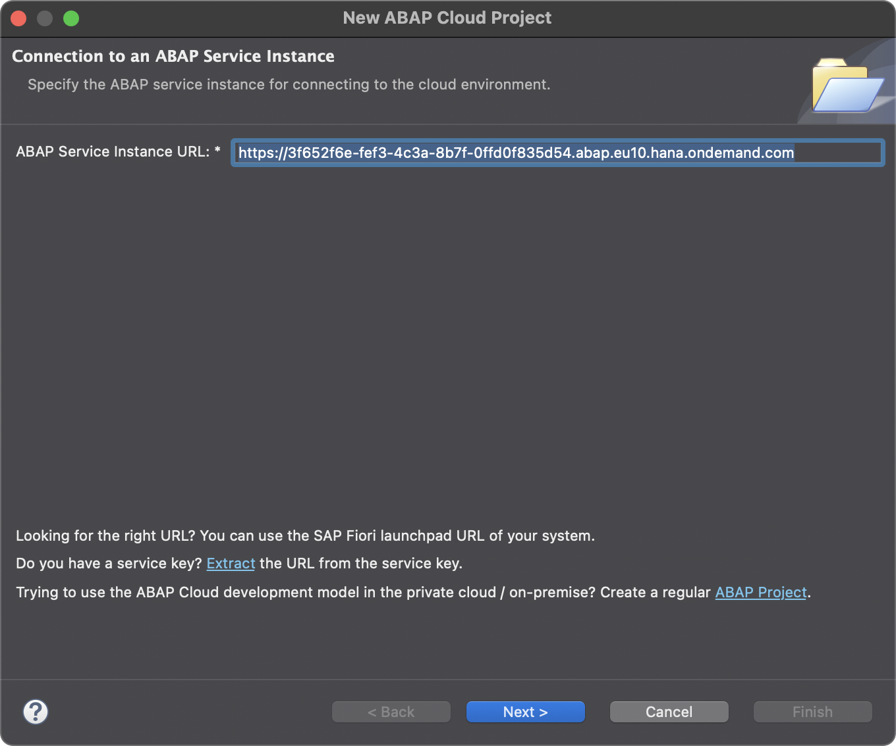
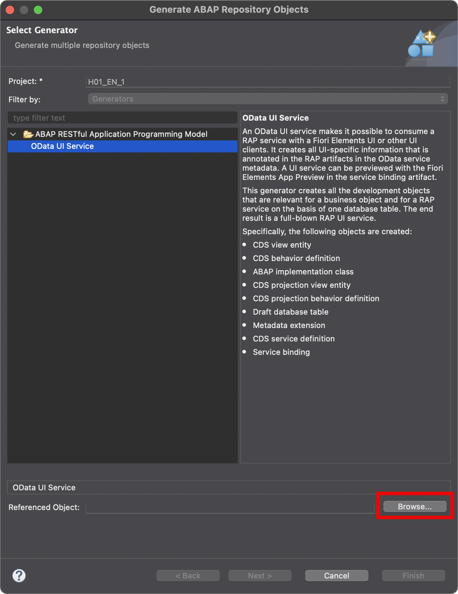

