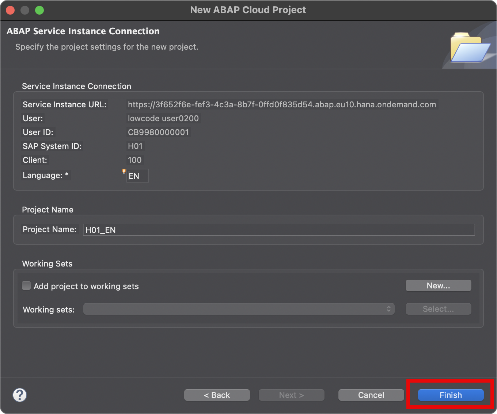
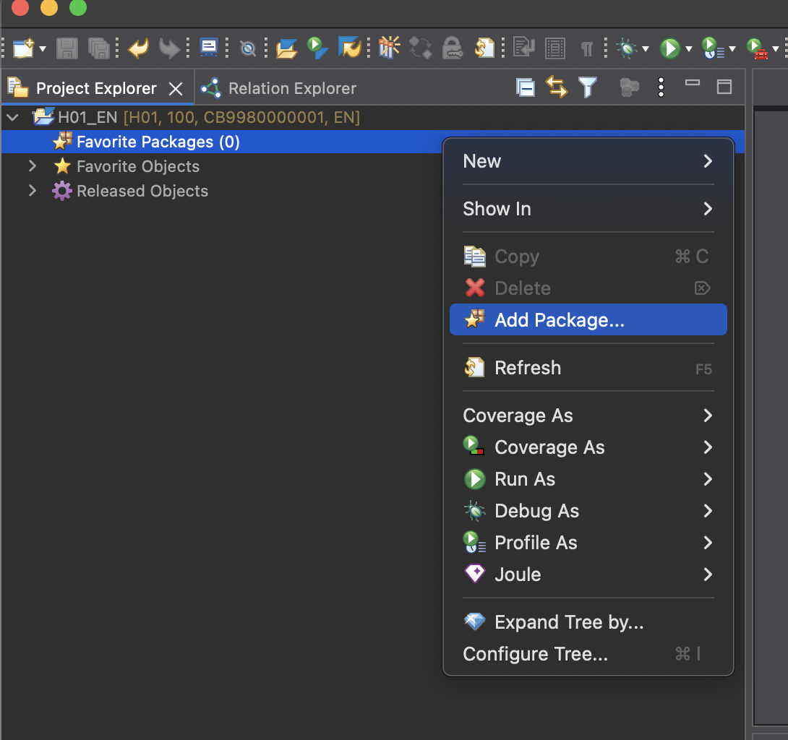
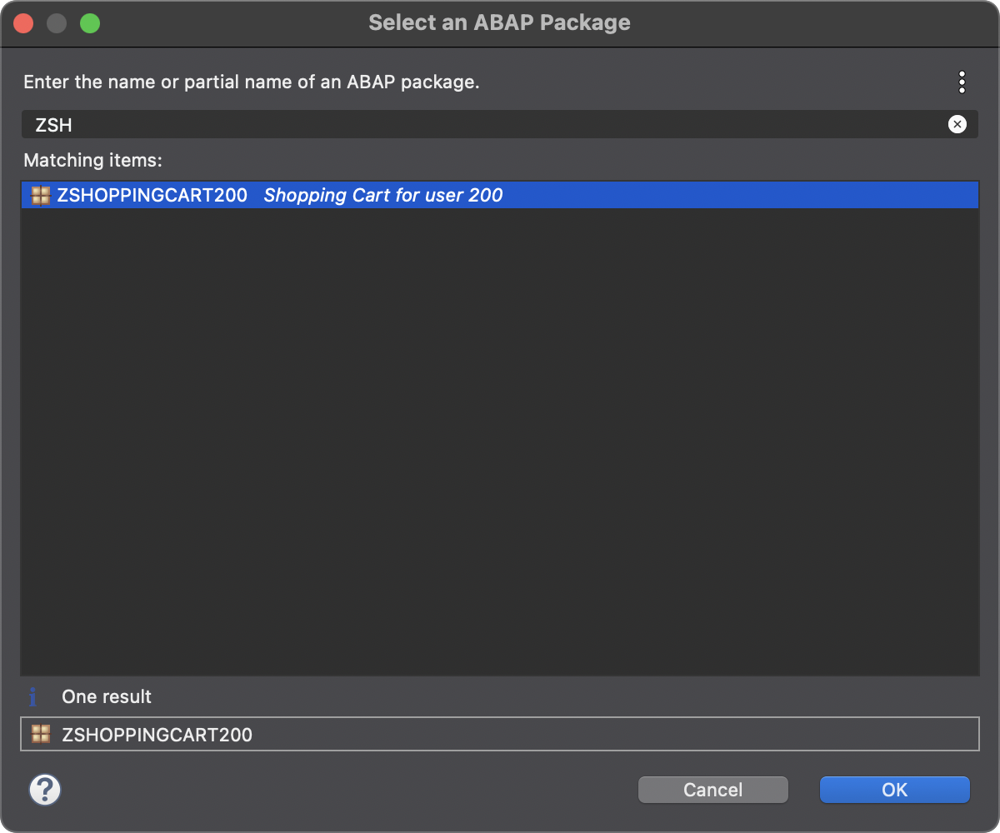

[Home ](../../README.md)  

# Exercise 1: Create an ABAP Cloud based RAP OData Service

In this exercise, you will create an ABAP project from the Build Lobby

> **Reminder:**   
> Don't forget to replace all occurences of the placeholder **`###`** with your group ID in the exercise steps below.    
> If you don't have a group ID yet, please check with your instructor.    

## Exercise 1.1: Create an ABAP Package form the SAP Build Lobby

1. Open the lobby https://lcapteched.eu10.build.cloud.sap/lobby 
   
   Use the user that the instructors have given you and which contains the three digit group number. The password has also been given to you by the instructors

   In the Lobby press the *Create* button and choose *Create*

   

2. In the wizard that comes up, choose the *Application* Tile and press *Next*

   

3. On the next step of the wizard choose *Full Stack*

   

4. On the next step choose *Full Stack ABAP* and press *Next*

   

5. Now select the system *H1* and under *Package* select *New* to create a new package. Type *ZLCOAL* as a superpackage and *ZSHOPPINGCART###* as the name for your package. *###* needs to be replaced by your group number. Type in a description for you package, e.g. *Shopping Cart for User ###*. Press *Next*.

   

6. Select *Create new transport request* and provide a description like *ShoppingCart###*, where *###* again is you shopping cart number. Press *Next*

   

7. Provide a name for your project *ShoppingCart###*, where ### is replaced by your group number.

   

8. In the Summary you can review all you choices. Press *Create* if everything is fine.

   

The following points 9. - 11. might or might not pop up after you pressed create. This very much depends on whether Eclipse has been opened before and what happened for your user. Don't worry if any of these pop ups come up and you immediately are at step 12., this is fine.

9. Possibly your browser now asks whether Eclipse should be openend. If it does press *Open Eclipse*. The ABAP Development Tools, which are based on Elipse should bow be openend.

   

10. Possibly you are now asked whether a command shoud be executed. if this happens, press *OK*

   

11. Possibly you are asked whether you want to open an existing project or create a new one. Choose *Create a new project from the link* 

   

12. In this step, your new ABAP project is connected to your BTP ABAP Environment instance. The ABAP Service Instance Service URL (https://3f652f6e-fef3-4c3a-8b7f-0ffd0f835d54.abap.eu10.hana.ondemand.com) should already be prefilled 

   

13. To log on press *Open Logon Page in Browser*. This will open a browser tab and after a couple of seconds it should say that you are logged on. Back in the ABAP Development tools you should then see the next wizard step already.

   

14. In this step you finalize the connection. You can take over the project name that is suggested to you and press *Finish*

   

15. In this next step you could already create a new ABAP Restful Programming Model (RAP) service. However, in order to do so, you would need to base it on something, e.g. a data base table. In our case we don't have such a base yet, we need to first create it. Therefore, press *Cancel* to terminate this step

   

16. On the left hand side in the *Project Explorer* add your new package to the *Favorite Packages* section. In order to do so, select *Favorite Packages* and press the right mouse button. In the menu select *Add package*

   

17. Start typing *ZSHOP* and in the list of packages that comes up, choose the one that you just created, with ### as your group number

   

## Exercise 1.2 Create a new database table

1. Select this package in the tree in the project explorer. Once again invoke the right mouse button and choose *New->Other ABAP Repository Objec*

   

2. Type *database" to filter and then select *Database Table* and press *Next*

   

3. Provide the name *ZDBSHOPCART###* with ### being your group number for the database table. Choose a description for your table. Then press *Next*    

   

4. Choose the tranport that you have already created and select it. Press *Finish*

   

5. As a result a new editor is opened, it already contains a stub for your new database table which represents shopping cart data. Now let's add some properties to your table. Copy the below properties. Make sure that you replace the ### with your group number

```CDS
@EndUserText.label : 'Shopping Cart Table'
@AbapCatalog.enhancement.category : #NOT_EXTENSIBLE
@AbapCatalog.tableCategory : #TRANSPARENT
@AbapCatalog.deliveryClass : #A
@AbapCatalog.dataMaintenance : #RESTRICTED
define table zdbshopcart### {

  key client              : abap.clnt not null;
  key order_uuid          : sysuuid_x16 not null;
  order_id                : abap.numc(8) not null;
  ordered_item            : abap.char(40) not null;
  order_quantity          : abap.numc(4);
  requested_delivery_date : abap.dats;
  @Semantics.amount.currencyCode : 'zdbshopcart###.currency'
  total_price             : abap.curr(11,2);
  currency                : abap.cuky;
  overall_status          : abap.char(30);
  sales_order_status      : abap.char(30);
  salesorder              : abap.char(10);
  bgpf_status             : abap.int1;
  bgpg_process_name       : abap.char(32);
  manage_sales_order_url  : abap.char(255);
  notes                   : abap.char(100);
  created_by              : abp_creation_user;
  created_at              : abp_creation_tstmpl;
  last_changed_by         : abp_lastchange_user;
  last_changed_at         : abp_lastchange_tstmpl;
  local_last_changed_at   : abp_locinst_lastchange_tstmpl;

}
```

6. Save and activate your chenages, press the according button.

   

## Exercise 1.3: Create a new RAP service

   In this part of the exercise you will create a new ABAP RESTful programming Model (RAP) based OData service that can be used for consumption in a Fiori UI. The service will be based on the database table that you created in the last part.

   1. In the project explorer select your new database table and press the right mouse button. In the menu select *Generate ABAP Repository Objects...*

   

   2. Select *OData UI Service* and press *Next*

   

   3. Select the package you have created earlier called *ZSHOPPINGCART###* where *###* is your group number. Press *Next*

   

   4. Now you can review all the assets that the generator is going to create by clicking on the different entities in the hierarchy on the left. If needed you can adjust the suggested names, here you can just take them over as they are suggested. Press *Next*

   

   5. In this step you can also review the content of the different objects to be generated, for example the CDS. Press *Next*

   


   6. Choose the transport request again that you have created eariler. Press *Finish*. The generation process starts and takes a couple of seconds.

   

   7. At the end of the generation process a number of new objects appear in the hierarchy of your package in the project explorer. Select the object in the *Service Binding* folder to bring up its details in an editor on the right. In this editor press *Publish*, this will expose the service.

   

   8. Once the service is published, the service's entity appears on the right. Press *Preview* to test the service in a Fiori elements UI.

   

   9. A browser window opens and shows the list report of your application. As there are no entries in the database yet, the list is empty. Press *Create* to create a new entry.

   

   10. Enter some values in the form that comes up, e.g. an *OrderQuantity* and some *Notes*. At the end press *Create* at the bottom
   

   11. Your screen will now look along the lines of the below screenshot

   

This concludes the creation of the UI service and a test using a Fiori elements UI application.

TODO: POSITION AI EXPLAIN FUNCTIONALITY HERE?

## Exercise 1.5: Define a validation

### Introduction

In the previous exercises, you have defined and implemented determinations during the creation of new instances of BO entity _ShoppingCart_ and your application used an OData API call to create a sales order asynchronously side-by-side.

Since the content (e.g. the field `RequestedDeliveryDate`) can be invalid which would prevent the creation of a sales order we would to check the data quality upfront.   

In the present exercise, you're going to define and implement one back-end validation `validateRequestedDeliveryDate` to respectively check the following:
- The value for the field `RequestedDeliveryDate` shall not be intial and shall not lie in the past.

The validation is only performed in the back-end (not on the UI) and is triggered independently of the caller, i.e. Fiori UIs or EML APIs.

> ℹ **Frontend validation & Backend validations**
> Validations are used to ensure the data consistency.
> As the name suggests, **frontend validations** are performed on the UI. They are used to improve the user experience by providing faster feedback and avoiding unnecessary roundtrips. In the RAP context, front-end validations are defined using CDS annotation or UI logic.  
> On the other hand, **backend validations** are performed on the back-end. They are defined in the BO behavior definitons and implemented in the respective behavior pools.
> Frontend validations can be easily bypassed - e.g. by using EML APIs in the RAP context. Therefore, **backend validations are a MUST** to ensure the data consistency.

### About Validations

A validation is an optional part of the business object behavior that checks the consistency of business object instances based on trigger conditions.

A validation is implicitly invoked by the business object’s framework if the trigger condition of the validation is fulfilled. Trigger conditions can be `MODIFY` operations and modified fields. The trigger condition is evaluated at the trigger time, a predefined point during the BO runtime. An invoked validation can reject inconsistent instance data from being saved by passing the keys of failed instances to the corresponding table in the `FAILED` structure. Additionally, a validation can return messages to the consumer by passing them to the corresponding table in the `REPORTED` structure.

> **Further reading**: [Validations](https://help.sap.com/viewer/923180ddb98240829d935862025004d6/Cloud/en-US/171e26c36cca42699976887b4c8a83bf.html)

### Exercise 1.5.1: Define the Validation

> In this exercise you will define the validation **`validateRequestedDeliveryDate`**.
  
1. Open your behavior definition **`ZR_{placeholder|userid}`**  

2. Because empty values will not be accepted for the field **`RequestedDeliveryDate`** specify it as _mandatory_ field 
   by adding the following code snippet after the determination as shown on the screenshot below.
 
```ABAP  
    // mark mandatory fields
    field ( mandatory ) RequestedDeliveryDate;
```    

   Your source code should look like this:   

   

3. Define the validation **`validateRequestedDeliveryDate`**.

   For that, add the following code snippet after the determination as shown on the screenshot below.

 ```ABAP
      // define a validation
      validation validateRequestedDeliveryDate on save { create; field RequestedDeliveryDate; }
 ```   

4. In order to have draft instances being checked by validations and determinations being executed before they become active, they have to be specified for the **`draft determine action prepare`** in the behavior definition.
  
   Replace the code line **`draft determine action Prepare;`** with the following code snippet as shown on the screenshot below

```ABAP
    draft determine action Prepare
    {
     validation validateRequestedDeliveryDate;
    }
```

   Your source code should look like this: 

   

   **Short explanation**:
   - Validations are always invoked during the save and specified with the keyword `on save`.
   - `validateRequestedDeliveryDate` is a validation with trigger operation `create` and trigger field `RequestedDeliveryDate`.

   **ℹ Hint**:
   > In case a validation should be invoked at every change of the BO entity instance, then the trigger conditions `create`and `update`
   > must be specified: e.g. `validation validateRequestedDeliveryDate on save { create; update; }`

5. Save and activate the changes.

6. Add the appropriate **`FOR VALIDATE ON SAVE`** methods to the local handler class of the behavior pool of the _ShoppingCart_ BO entity via quick fix.  

   For that, set the cursor on one of the validation names and press **Ctrl+1** to open the **Quick Assist** view and select the entry _**`Add the missing method of entity zr_{placeholder|userid} ...`**_.

   

   As a result, the **`FOR VALIDATE ON SAVE`** method **`validateRequestedDeliveryDate`** will be added to the local handler class `lcl_handler` of the behavior pool of the _ShoppingCart_ BO entity `ZBP_R_{placeholder|userid}`.

   

7. Save and activate the changes.

> Hint:  
> If you get an error message in the behavior implementation `The entity "ZR_{placeholder|userid}" does not have a validation "VALIDATEREQUESTDELIVERYDATE".` try to activate the behvavior definition once again.  

### Exercise 1.5.2: Implement the Validations  

> Implement the validation, e.g. the validation `validateRequestedDeliveryDate` which checks if the respective date of field `RequestedDeliveryDate` is in the future.  
> An appropriate message should be raised and displayed on the UI for each invalid value.  


1. First, check the interface of the new methods in the declaration part of the local handler class `lcl_handler` of the behavior pool of the _ShoppingCart_ BO entity **`ZBP_R_{placeholder|userid}`**.

   For that, set the cursor on the method name, e.g. **`validateRequestedDeliveryDate`**, press **F2** to open the **ABAP Element Info** view, and examine the full method interface.

    

   **Short explanation**:  
   - The addition **`FOR VALIDATE ON SAVE`** indicates that the method provides the implementation of a validation executed on save. Validations are always executed on save.
   - Method signature for the validation method:
     - `IMPORTING`parameter **`keys`** - an internal table containing the keys of the instances on which the validation should be performed.
     - Implicit `CHANGING` parameters (aka _implicit response parameters_):  
       - **`failed`**   - table with information for identifying the data set where an error occurred
       - **`reported`** - table with data for instance-specific messages

   You can go ahead and implement the validation method.

2. Now implement the method in the implementation part of the class.
  
    The logic consists of the following main steps:
    1. Read the ShoppingCart instance(s) of the transferred keys (**`keys`**) using the EML statement **`READ ENTITIES`**.
    2. The addition **`FIELDS`** is used to specify the fields to be read. E.g. only **`OrderedItem`** is relevant for the  validation `validateOrderedItem`.  
       The addition `ALL FIELDS` can be used to read all fields.
    3. The addition **`IN LOCAL MODE`** is used to exclude feature controls and authorization checks.
    4. Read all the transfered (distinct, non-initial) customer IDs and check if they exist.  
    5. Prepare/raise messages for all transferred _ShoppingCart_ instances with initial and non-existing `OrderedItem`  
       and set the changing parameter **`reported`**


   TODO: POSITION AI CODE COMPLETION HERE 


   Replace the current method implementation with following code snippets.

    - **`validateRequestedDeliveryDate`**

   You can use the **F1 Help** to get detailed information on the different ABAP and EML statements.  


2. Save and activate the changes.

####  Code snippet **`validateRequestedDeliveryDate`**

<hr>

<details>

<summary>Click to expand the source code</summary>

```ABAP
  
 METHOD validateRequestedDeliveryDate.

    "For your convinience there is a central class ZAX_AC_EXCEPTIONS that is beeing used here.
    
    READ ENTITIES OF zr_{placeholder|userid} IN LOCAL MODE
       ENTITY ShoppingCart
         FIELDS (  RequestedDeliveryDate )
         WITH CORRESPONDING #( keys )
       RESULT DATA(entities).

    LOOP AT entities INTO DATA(entity).
      APPEND VALUE #(  %tky               = entity-%tky
                       %state_area        = 'VALIDATE_DATES' ) TO reported-shoppingcart.

      APPEND VALUE #(  %tky               = entity-%tky
                       %state_area        = 'OUTDATED_DATES' ) TO reported-shoppingcart.

      IF entity-RequestedDeliveryDate IS INITIAL.
        APPEND VALUE #( %tky = entity-%tky ) TO failed-shoppingcart.

        APPEND VALUE #( %tky               = entity-%tky
                        %state_area        = 'VALIDATE_DATES'
                         %msg              = NEW zcx_ac_exceptions(
                                                 textid   = zcx_ac_exceptions=>enter_requested_delivery_date
                                                 severity = if_abap_behv_message=>severity-error )
                        %element-requesteddeliverydate = if_abap_behv=>mk-on ) TO reported-shoppingcart.

      ELSEIF entity-RequestedDeliveryDate < cl_abap_context_info=>get_system_date( ).
        APPEND VALUE #( %tky               = entity-%tky ) TO failed-shoppingcart.

        APPEND VALUE #( %tky               = entity-%tky
                        %state_area        = 'OUTDATED_DATES'
                         %msg              = NEW zcx_ac_exceptions(
                                                                textid     = zcx_ac_exceptions=>out_dated_req_delivery_date
                                                                severity   = if_abap_behv_message=>severity-error )
                        %element-requesteddeliverydate = if_abap_behv=>mk-on ) TO reported-shoppingcart.
      ENDIF.
    ENDLOOP.
  ENDMETHOD.
```

</details>

<hr>

### Excercise 1.5.3: Create a sales order within S/4HANA
TODO: Add this part here

### Exercise 1.5.3: Preview and Test the enhanced Shopping Cart App

> Now the SAP Fiori elements app can be tested.    

You can either refresh your application in the browser using **F5** if the browser is still open - or go to your service binding **`ZUI_{placeholder|userid}_O4`** and start the Fiori elements App preview for the **`ShoppingCart`** entity set.

1. Click **Create** to create a new entry.

2. Select `TG11` as OrderdItem, enter an quantity and a requested delivery date **that lies in the past**. 

   The draft will be updated.

3. Now click **Create**. You should get following error messages displayed:  
   **Requested delivery date is in the past** .

    

### Summary 

Now that you have... 

- defined a validation in the behavior definition, 
- implemented them in the behavior pool, and
- previewed and tested the enhanced Fiori elements app,

you can continue with the next exercise.


## Exercise 1.4: Create a Web API

Now we need to create a version of a service that is not going to be consumed in a UI but later in a Build Process. For this the service does need other qualities than a UI one, for example, the service should not have draft qualtities that save data from the UI for the current user only, even if the user has not yet pressed the save button.

   1. In order to create a new API, you need to create a new service binding. Select the *Service Bindings* folder under *Business Services* in you project in the project explorer. Invoke the right mouse button and select *New Service Binding* in the menu.

   

   2. Give the new service binding a name *Z_SHOPPINGCART_###_O2_API* where *###* is your group name. As description you can put *Service Binding for Shopping Card API ###*. Select the Binding Type *OData V2 - Web API* and choose the Service Definition that was generated for you before: *ZUI_DBSHOPCART_###_O4* (again *###* is always your group number). Press *Next*

   

   3. In the next step - as before - choose your transport request and press *Finish*

   

   Your new service binding will appear in the project explorer

   
 
## Exercise 1.5: Expose the new API via a Communication System

While the new API is now already activated, it cannot be consumed from outside the BTP ABAP Environment. Our goal however is, that this API can be called from a Build Process which runs on the BTP but not in the ABAP enviroment. Thus, we need to make the API consumable from outside. This can be achieved via so-called Communication Systems consisting of Communication Scenarios and Arrangements. To achieve this, we need to add our service to a Communication Scenario.


   1. In order to add your service to the communication scenario, we need to select the communication scenario. For this press *Command/CTRL+Shift+A*. A pop up is openend. Now type in *Z_SHOPPINGCART_SCEN* and select the entry in the list. Press *Ok*

   

   2. Pick the *ZSHOPPINGCART* package. Expand *Cloud Communication Management->Communication Scenario* and click on *Z_SHOPPINGCART_SCEN* to show the details in the editor on the right. Switch to the *Inbound* tab and press *Add* there.

   > *Potential blocking issue**   
   > As a number of people might access this scenario at the same time and want to add their service to it, it might be temporarily blocked by another user at the time you want to change it. In this case you have to wait for the user to be finished with this step for your turn.

   

   3. On the pop up that comes up, press *Browse*

   

   4. Type in *Z_SHOPPINGCART_###_O2_API_IWSG* and select this entry in the list. As usual ### is your group number. Press *Finish*. 

   


   5. Back on the pop up from before, also press *Finish*. Your service should now appear in the list

   


This concludes the ABAP Cloud part. 

## Summary  
 
You have now created a new ABAP project from the Build Lobby. In the ABAP project you have created a new RAP service based on the ABAP Cloud Programming Model. You tested this service with a Fiori elements preview app. Then you enabled the service for consumption from outside the BTP ABAP envrionment by adding it to a communication scenario
 
You can continue with the next exercise - **[Exercise 2: Create a Process in SAP Build Process Automation based on the Shopping Cart Service](../../../build/exercises/ex2/README.md)**


