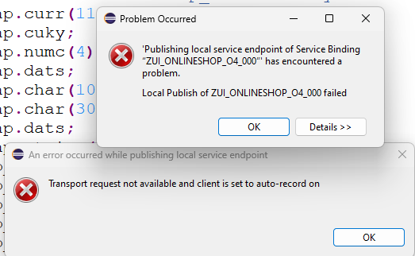
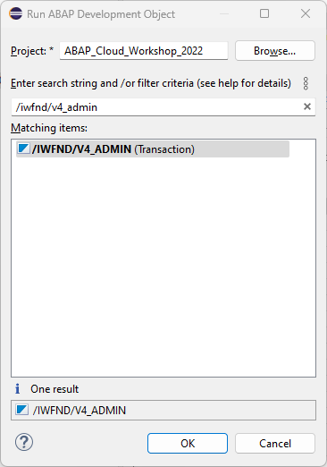
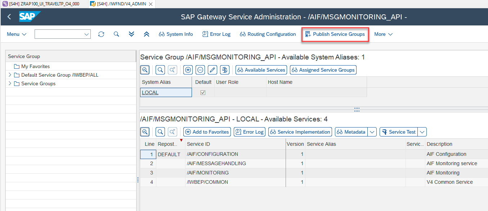
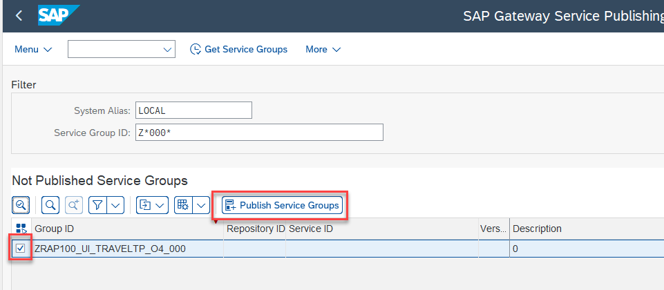
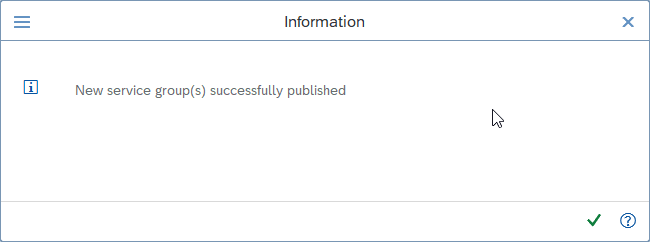

[Home ](../../README.md)  

# Exercise 2: Create the OnlineShop Application

## Introduction

In this exercise, you will use the package `Z_ONLINESHOP_###`that you have created earlier. 
Here you will create a database table where you will define all important fields for the OnlineShop application.  

This RAP BO represents an online shop, where you can order laptops or other articles you need as an employee. After an article such as a laptop is ordered, a purchase requisition can be created by pressing a button in your application which will trigger an action in your RAP BO.  

(TODO: Check this sentence with respect to the Build exercise:)
This could also simulate an additional approval step that can only be performed if the application is used by a manager. 

We will start our implementation by building a simple managed RAP business object and we will add the business logic to call the released RAP API in SAP S/4HANA in the second exercise of this workshop.

You will use an ADT wizard to generate all the needed development RAP artefacts of your UI service. This includes the data model, projection view, service definition and service binding. Afterwards you will check your _OnlineShop_ application with the SAP Fiori elements preview. 

> **Reminder:**   
> Don't forget to replace all occurences of the placeholder **`###`** with your group ID in the exercise steps below.  
> You can use the ADT function **Replace All** (**Ctrl+F**) for the purpose.    

## Exercise 2.1: Create database table

Create a database table to store the _OnlineShop_ data.   
A OnlineShop entity defines general data, such as the item name or or the number of items, overall status of the order, and the total price of the order. Once the order is checked out the number of the purchase requisition that will be created by using our released API will be stored as well.   

> Hint: 
> The tasks are also desribed in the following tutorial (step 2). Just replace the names with those that are mentioned in this how to guide.  
> https://developers.sap.com/tutorials/abap-environment-rap100-generate-ui-service.html

 

  
Click to expand!

   1. Right-click on your ABAP package **`z_online_shop_###`** and select **New** > **Other ABAP Repository Object** from the context menu.
         
   2. Search for **database table**, select it, and click **Next >**.
   
   3. Maintain the required information (`###` is your group ID) and click **Next >**.
   <!--   - Name: **`zaonlineshop_###`**  -->
      - Description: _**`Persistence for online shop`**_                  

   4. Select a transport request, and click **Finish** to create the database table.
   
   5. Replace the default code with the code snippet provided below and replace all occurences of the placeholder **`###`** with your group ID using the **Replace All** function (**Ctrl+F**).    
 
      > **Hint**: Hover the code snippet and choose the _Copy raw contents_ icon  appearing in the upper-right corner to copy it. 
      
<pre lang="ABAP">
@EndUserText.label : 'Persistence for online shop'
@AbapCatalog.enhancement.category : #NOT_EXTENSIBLE
@AbapCatalog.tableCategory : #TRANSPARENT
@AbapCatalog.deliveryClass : #A
@AbapCatalog.dataMaintenance : #RESTRICTED
define table zaonlineshop_### {
  key client               : abap.clnt not null;
  key order_uuid           : sysuuid_x16 not null;
  order_id                 : abap.char(10) not null;
  order_item_id            : abap.char(40) not null;
  @Semantics.amount.currencyCode : 'zaonlineshop_###.currency'
  order_item_price         : abap.curr(11,2);
  order_item_quantity      : abap.numc(4);
  @Semantics.amount.currencyCode : 'zaonlineshop_###.currency'
  total_price              : abap.curr(11,2);
  currency                 : abap.cuky;
  overall_status           : abap.char(30);
  overall_status_indicator : abap.int1;
  delivery_date            : abap.dats;
  notes                    : abap.string(256);
  purchase_requisition     : abap.char(20);
  purch_rqn_creation_date  : abap.dats;
  created_by               : abp_creation_user;
  created_at               : abp_creation_tstmpl;
  last_changed_by          : abp_lastchange_user;
  last_changed_at          : abp_lastchange_tstmpl;
  local_last_changed_at    : abp_locinst_lastchange_tstmpl;

}
</pre>
       
   6. Save  and activate  the changes.
   

## Exercise 2.2: Generate the transactional UI services

Create your OData v4 based UI services with the built-in ADT generator.   
The generated business service will be transactional, draft-enabled, and enriched with UI semantics for the generation of the Fiori elements app.

> Hint: 
> The tasks are also desribed in the following tutorial (step 2). Just replace the names with those that are mentioned in this how to guide.  
> https://developers.sap.com/tutorials/abap-environment-rap100-generate-ui-service.html

  

  
Click to expand!

   1. Right-click your database table **`zaonlineshop_###`**  and select **Generate ABAP Repository Objects** from the context menu.        
   
   2. Maintain the required information  (`###` is your group ID) and click **Next >**:
        - Description: **`Onlineshop App ###`**
        - Generator: **`ABAP RESTful Application Programming Model: UI Service`**
        
   3. Maintain the required information on the **Configure Generator** dialog to provide the name of your data model and generate them.         

      For that, navigate through the wizard tree (_Business Objects_, _Data Model_, etc...), maintain the artefact names provided in the table below, 
      and press **Next >**.
 
      Verify the maintained entries and press **Next >** to confirm. The needed artefacts will be generated. 

      > ℹ **Info about Naming Conventions**     
      > The main aspects of the naming conventions of SAP S/4HANA's Virtual Data Model (VDM) are used in this exercise.  
      > More information on VDM can be found on the SAP Help portal: **[Here](https://help.sap.com/docs/SAP_S4HANA_CLOUD/0f69f8fb28ac4bf48d2b57b9637e81fa/8a8cee943ef944fe8936f4cc60ba9bc1.html)**.
 
  
      
      | **RAP Layer**          |  **Artefacts**           | **Artefact Names**                                       |     
      |:---------------------- |:------------------------ |:-------------------------------------------------------- |
      | **Business Object**    |                          |                                                          |                        
      |                        |  **Data Model**          |  Data Definition Name:   **`ZR_ONLINESHOP_###`**    |
      |                        |                          |  Alias Name:             **`OnlineShop`**                    |   
      |                        |  **Behavior**            |  Implementation Class:   **`ZBP_R_ONLINESHOP_###`**   |
      |                        |                          |  Draft Table Name:       **`ZDONLINESHOP_###`**          |
      | **Service Projection** (BO Projection)  |         |  Name:                   **`ZC_ONLINESHOP_###`**    |   
      | **Business Services**  |                          |                                                          |          
      |                        |  **Service Definition**  |  Name:         **`ZUI_ONLINESHOP_###`**               |
      |                        |  **Service Binding**     |  Name:         **`ZUI_ONLINESHOP_O4_###`**            |
      |                        |                          |  Binding Type: **`OData V4 - UI`**                       |
                       
      
   4. Go to the **Project Explorer**, select your package **`Z_ONLINESHOP__###`**, refresh it by pressing **F5**, and check all generated ABAP repository objects 

 

 
## Exercise 2.3: Preview the OnlineShop App in in SAP S/4HANA Cloud

In this exercise you will publish the local service endpoint of your service binding  and start the _Fiori elements App Preview_.

> **Note:**
> If you are using an on premise system please continue with the next exercise.

 

  
Click to expand!

<!--
> **On premise issue**   
> If you are working on an on premise system and try to use the **Publish** or **Publish Locally** button you will see the following error message
> 
-->

   1. Open your service binding **`ZUI_ONLINESHOP_O4_###`** and click **Publish**.

   
   
   2. Double-click on the entity **`OnlineShop`** in the **Entity Set and Association** section to open the _Fiori elements App Preview_.   
   
   3. Click the button on the _OnlineShop_ app **Go** to load the data.
       
   4. Check your result.
      

## Exercise 2.4: Preview the Online Shop App in SAP S/4HANA on premise

> Publishing the local service endpoint of your service binding **in on premise systems** does not work from within ADT. 
> Therefore you have to publish the Service Binding locally using transaction **/IWFND/V4_ADMIN**.

> Hint:
> The screen shots show the steps for the *Travel* app. Please use the names and strings provided in this script in **step 4 & 5** and do NOT enter the names you see on the screen shots.  

  
Click to expand!

   1. In the menu click on the button *Run ABAP Development Object as ABAP Application in SAPGUI* or press **Alt+F8**
 
         
   
   2. Type **/iwfnd/v4_admin** as a search string and double-click on the entry **/IWFND/V4_ADMIN (Transaction)**   
     
         
   
   3. Click the button **Publish Service Groups** to get a list of service groups that can be published.
 
        
 
   4. Enter following values to search for the service group of your service and press the button **Get Service Groups**   
      
      System Alias: `LOCAL`  
      Service Group ID: `Z*###*`  

              

   5. Select the entry `ZUI_ONLINESHOP_O4_###` from the list and press the button **Publish Service Groups**   
 
       
 
   6. In the following popup enter a meaningful description such as `Online Shop App ###`   
      
       
 
   7. You are now asked to provide a customizing request. Choose an existing customizing request or create a new one and choose a meaningful description.
 
         
 
   8. Confirm the success message and press **Enter**. 
 
          
 
   9. Navigate back to your service binding in the project explorer. Right click on it and choose **Refresh**   
 
         ** 
 
   10. Check that your service bindings is now published and choose the entity **OnlineShop** and press the button **Preview**   
 

## Summary 

Now that you've... 
- created an ABAP package,
- created a database table and fill it with demo data,
- created a transactional UI service,
- published a local service point, and started the _Fiori elements App Preview_ in ADT,

you can continue with the next exercise - **[Exercise 3: Adapt the data model](../ex3/README.md)**.

---

## Appendix

Find the source code for the database table definition and the data generator class in the [sources](sources) folder. Don't forget to replace all occurences of the placeholder `###` with your group ID.

-  [Table zaonlineshop_###](sources/zaonlineshop_%23%23%23.txt)

