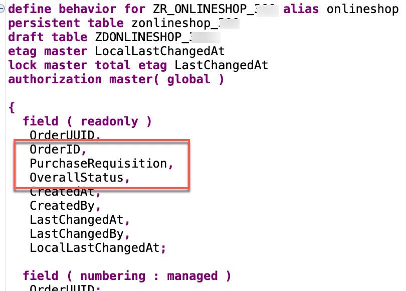
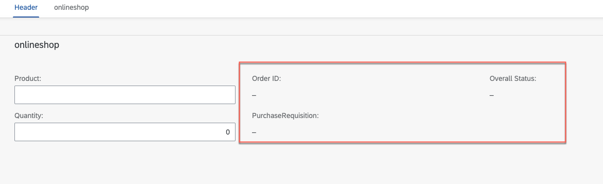
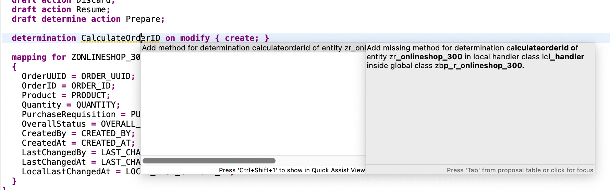

[Home ](../../README.md)  

# Exercise 3: Adapt the data model

## Introduction

In this exercise, you will adapt the data model of the newly generated RAP business object `ZR_ONLINESHOP_###`

<!--
## Exercise 3.0: Enhance the data model

In this step we will use a value help `ZI_PRODUCT_VH_REUSE` that has been provided for your in this workshop in the demo system. In addition some fields that are accessible via this association (e.g. the product description) will be included in the data model.  

When working with a system provided as part of a SAP workshop this view will be provided. If you try out this script in your own SAP S/4HANA 2022 on prem system you would have to create this view manually.  

The source code of ZI_PRODUCT_VH_REUSE can be found here:   
 [ZI_PRODUCT_VH_REUSE](sources/ZI_PRODUCT_VH_REUSE.txt) 

1. Open the cds view `ZR_ONLINESHOP_###` 

  

2. Add an association to the released CDS view for product data to it.
<pre lang="ABAP">
association [1..1] to ZI_PRODUCT_VH_REUSE as _Product on $projection.OrderItemID = _Product.Product
</pre>

3. Add the fields `_Product.ProductGroup`, `_Product.ProductText`, `_Product.BaseUnit` and the association `_Product` to the field list.

<pre lang="ABAP">
      ,
      _Product.ProductGroup,
      _Product.ProductText,
      _Product.BaseUnit,
      _Product
</pre>

  

4. Save and activate your changes

5. Open the cds view `ZC_ONLINESHOP_###` 
   
6. Add a value help for the field `OrderItemID`.
<pre lang="ABAP">
      @Consumption.valueHelpDefinition: [{ entity: { name: 'ZI_PRODUCT_VH_REUSE', element: 'Product' },
                                     useForValidation: true }  ]
</pre>

7. Add the fields `ProductGroup`, `ProductText`, `BaseUnit`, `CreatedAt` and the association `_Product` to the field list.
<pre lang="ABAP">
       ,
      CreatedAt,
      ProductGroup,
      ProductText,
      BaseUnit,
      _Product
</pre>

 

8. Save and activate your changes

-->
<!--
> **Note:**   
> When a starter project has been generated the field `CreatedAt` has already been added to the projection view.  
> You will thus get the following error message: *The name CreatedAt is not unique*   
> In this case simply delete or comment out the duplicate `CreatedAt` entry.
>    
>  
-->
 
## Exercise 3.1: Provide Metadata for Fiori elements UI
 
1. Replace the complete source code of the Metadata Extension File **ZC_ONLINESHOP_###**.   

 

  Replace the placeholder `###` with your group number and save and activate your changes.    

 
<pre lang="ABAP">
@Metadata.layer: #CORE
@UI: {
  headerInfo: {
    typeName: 'onlineshop',
    typeNamePlural: 'onlineshops'
  }
}
annotate view ZC_ONLINESHOP_XXX with
{
  @UI.facet: [ {
    id: 'idIdentification',
    type: #IDENTIFICATION_REFERENCE,
    label: 'onlineshop',
    position: 10
  } ]
  @UI.hidden: true
  orderuuid;

  @UI.lineItem: [ {
    position: 10 ,
    label: 'Order ID' ,
    importance: #MEDIUM
  } ]
  @UI.identification: [ {
    label: 'Order ID',
    position: 10
  } ]
  orderid;

  @UI.lineItem: [ {
    position: 20 ,
    label: 'Product' ,
    importance: #MEDIUM
  } ]
  @UI.identification: [ {
    position: 20,
    label: 'Product'
  } ]
  product;

  @UI.lineItem: [ {
    position: 30 ,
    label: 'Quantity' ,
    importance: #MEDIUM
  } ]
  @UI.identification: [ {
    position: 30 ,
    label: 'Quantity'
  } ]
  quantity;

  @UI.hidden: true
  locallastchangedat;
}
</pre>

  This meta data extension file includes the annotations that tell the Fiori elements UI which columns should go into the result list and which fields group a form on the object page. While most of the code was already generated automatically, we now add a couple of labels to the column headers and for the form.

2. Save and activate your changes

## Exercise 3.3: Adapt the behavior definition

Since we have changed the field list of the projection view `ZC_ONLINESHOP_###` we have to regenerate the draft table.

In the behavior definition we will also set several fields as readonly.

For fields that are read-only and that are not read from the value help we have to create determinations. 

 

  
Click to expand!

  
  1. Open the behavior definition `ZR_ONLINESHOP_###`.  

    

  2. Select the draft table name and press **Ctrl + 1** (Mac **Command + 1**) to show the quick fix.
  3. Select the quick fix that offers you to regenerate the draft table 

       

  4. Change the data elements of the fields `productgroup` and `producttext` to build in types `abap.char(9)` and `abap.char(40)`.   
       <pre lang="ABAP">
         productgroup         : abap.char(9);
         producttext          : abap.char(40);
       </pre>
  5. Activate the regenerated draft table.

       

     > Hint:
     > If you try to activate the draft table without changing the data element definition you will get the following error messages:
     > *The use of Data Element PRODUCTDESCRIPTION is not permitted.*  
     > *The use of Data Element PRODUCTGROUP is not permitted.*

   6. Back at behavior definition `ZR_ONLINESHOP_###`, add the following list of fields to mark them as read-only.  
       <pre lang="ABAP">
       field ( readonly )
       OrderID,
       OverallStatus, TotalPrice, Currency, //order
       OrderItemPrice, ProductGroup, ProductText, BaseUnit, //product;
       PurchaseRequisition, PurchRqnCreationDate; //purchase rqn
       </pre>
       
         

       > **Note:**   
       > When a starter project has already been generated you might get the error message:  
       > *"readonly" is specified more than once for "OrderID".*  
       > In this case simply comment out the duplicate entry `OrderID,`   
       >     
       > 
 
      

   7. Save and activate your changes
   8. In the project explorer under `Business Services`->`Service Bindings`->`ZU_ONLINESHOP_O4_###` check the UI using the Fiori Elements preview. 

      On the list, press **Create** and you should see a form like this:  

         

 
  

## Exercise 3.4: Define constants for lhc_onlineshop

As a preparation for implementing determinations and validations we will add constants in the local handler class `lhc_onlineshop` of the the behavior implementation class `ZBP_R_ONLINESHOP_###` so that these variables can be used by all implementations.  

   

  
Click to expand!

  
  1. Navigate to the behavior implementation class `ZBP_R_ONLINESHOP_###` in the *Project Explorer* and then click on the tab *Local Types*.   

    
  
  2. Start the implementation by adding the following constants in the private section of your local handler class `lhc_onlineshop`.   

  <pre lang="ABAP">
  
CLASS lcl_OnlineShop DEFINITION INHERITING FROM cl_abap_behavior_handler.
  PRIVATE SECTION.

    CONSTANTS:
      BEGIN OF is_draft,
        false TYPE abp_behv_flag VALUE '00', " active (not draft)
        true  TYPE abp_behv_flag VALUE '01', " draft
      END OF is_draft.
    CONSTANTS:
      BEGIN OF c_overall_status,
        new            TYPE string VALUE 'New / Composing',
        new_code       TYPE int1   VALUE 2, "'New / Composing'
        submitted      TYPE string VALUE 'Submitted / Approved',
        submitted_code TYPE int1   VALUE 3, "'Submitted / Approved'
      END OF c_overall_status.
      
   </pre>

   3. Save and activate your changes.

 

## Exercise 3.5: Define determinations

  We now have to create several determinations that will do the following: 
  - Set initial values for certain fields (e.g. the delivery date)  
  - Calculate the total price when the OrderItemID or the OrderItemQuantity is changed by the user  

 

  
Click to expand!

 
  1. Add the following determinations to your behavior definition **ZR_ONLINESHOP_###** (in the project explorer under **Core Data Services**** ->**Behavior Definitions**)

  <pre lang="ABAP">
  determination setInitialOrderValues on modify { create; }
  determination updateProductDetails on modify { field OrderItemID; }
  determination calculateTotalPrice on modify { create; field OrderItemID; field OrderItemQuantity; }
  </pre>

  
    

  2. Use the quick fix **Ctrl+1** (**Command+1** on Mac)to generate the appropriate methods in the behavior definition class.

    

  3. Add the following code snippet to implement the determination `calculateTotalPrice`. The code updates the field `TotalPrice` when the field `OrderItemID` and thus the `OrderItemPrice` has changed or if the field `OrderItemQuantity` has changed. 

  
   <pre lang="ABAP">
   
    METHOD calculateTotalPrice.
    DATA total_price TYPE ZR_OnlineShop_###-TotalPrice.

    " read transfered instances
    READ ENTITIES OF ZR_OnlineShop_### IN LOCAL MODE
      ENTITY OnlineShop
        FIELDS ( OrderID TotalPrice )
        WITH CORRESPONDING #( keys )
      RESULT DATA(OnlineShops).

    LOOP AT OnlineShops ASSIGNING FIELD-SYMBOL(&lt;OnlineShop&gt;).
      " calculate total value
      &lt;OnlineShop&gt;-TotalPrice = &lt;OnlineShop&gt;-OrderItemPrice * &lt;OnlineShop&gt;-OrderItemQuantity.
    ENDLOOP.

    "update instances
    MODIFY ENTITIES OF ZR_OnlineShop_### IN LOCAL MODE
      ENTITY OnlineShop
        UPDATE FIELDS ( TotalPrice )
        WITH VALUE #( FOR OnlineShop IN OnlineShops (
                           %tky       = OnlineShop-%tky
                           TotalPrice = OnlineShop-TotalPrice
                        ) ).
    ENDMETHOD.
 
  </pre>

 
  4. Add the following code snippet to implement the determination `setInitialOrderValues`. The code selects the next weekday in two weeks as a delivery day, it sets the initial status and it calculates a semantic key for the field `OrderID`

 <pre lang="ABAP">
     METHOD setInitialOrderValues.
      DATA delivery_date TYPE I_PurchaseReqnItemTP-DeliveryDate.

"read transfered instances via EML
READ ENTITIES OF ZR_OnlineShop_### IN LOCAL MODE
  ENTITY OnlineShop
    FIELDS ( OrderID OverallStatus DeliveryDate )
    WITH CORRESPONDING #( keys )
  RESULT DATA(OnlineShops).

"delete entries with assigned order ID
DELETE OnlineShops WHERE OrderID IS NOT INITIAL.
CHECK OnlineShops IS NOT INITIAL.

" ** ABAP logic to determine order IDs and delivery date**

" get max order ID from the relevant active and draft table entries
SELECT MAX( order_id ) FROM zaonlineshop_### INTO @DATA(max_order_id). "active table
SELECT SINGLE FROM zdonlineshop_### FIELDS MAX( orderid ) INTO @DATA(max_orderid_draft). "draft table
IF max_orderid_draft > max_order_id.
  max_order_id = max_orderid_draft.
ENDIF.

"set delivery date proposal
cl_scal_api=>date_compute_day(
    EXPORTING
      iv_date           = cl_abap_context_info=>get_system_date(  )
    IMPORTING
      ev_weekday_number = DATA(weekday_number)
      ev_weekday_name = DATA(weekday_name)
     ).
CASE weekday_number.
  WHEN 6.
    delivery_date = cl_abap_context_info=>get_system_date(  ) + 16.
  WHEN 7.
    delivery_date = cl_abap_context_info=>get_system_date(  ) + 15.
  WHEN OTHERS.
    delivery_date = cl_abap_context_info=>get_system_date(  ) + 14.
ENDCASE.

"set initial values of new instances via EML
MODIFY ENTITIES OF ZR_OnlineShop_### IN LOCAL MODE
  ENTITY OnlineShop
    UPDATE FIELDS ( OrderID OverallStatus DeliveryDate OrderItemPrice )
    WITH VALUE #( FOR OnlineShop IN OnlineShops INDEX INTO i (
                       %tky           = OnlineShop-%tky
                       OrderID        = max_order_id + i
                       OverallStatus  = c_overall_status-new  "'New / Composing'
                       DeliveryDate   = delivery_date
                    ) ).
    ENDMETHOD.
    
</pre>

 5. Add the following code snippet to implement the determination `updateProductDetails`. The code selects data from the value help `zi_product_vh_reuse`.

 <pre lang="ABAP">
 
  METHOD updateProductDetails.
    "read transfered instances
    READ ENTITIES OF ZR_OnlineShop_### IN LOCAL MODE
      ENTITY OnlineShop
        FIELDS ( OrderItemID )
        WITH CORRESPONDING #( keys )
      RESULT DATA(OnlineShops).

    "read and set product details
    LOOP AT OnlineShops ASSIGNING FIELD-SYMBOL(&lt;OnlineShop&gt;).
      "read and set relevant product information
      SELECT SINGLE * FROM zi_product_vh_reuse WHERE product = @&lt;OnlineShop&gt;-OrderItemID INTO @DATA(product).
      &lt;OnlineShop&gt;-OrderItemPrice = product-price.
      &lt;OnlineShop&gt;-Currency       = product-Currency.
    ENDLOOP.

    "update instances
    MODIFY ENTITIES OF ZR_OnlineShop_### IN LOCAL MODE
      ENTITY OnlineShop
        UPDATE FIELDS ( OrderItemPrice Currency )
        WITH VALUE #( FOR OnlineShop IN OnlineShops INDEX INTO i (
                           %tky           = OnlineShop-%tky
                           OrderItemPrice = OnlineShop-OrderItemPrice
                           Currency       = OnlineShop-Currency
                        ) ).
  ENDMETHOD.
    
    
</pre>

 6. Save and activate your changes.
 7. Open the service binding `ZUI_ONLINESHOP_O4_###` to test your implementation by using the ADT Fiori preview.
 
 

## Exercise 3.6: Define validations

Finally we have to implement validations to make sure that the data that is sent to the API is valid.  

In addition there will be a check that make sure that not too many items can be ordered

 

  
Click to expand!

  1. Add the following code snippet into your behavior definition, so that the following three validations will be added:  

  <pre lang="ABAP">
    validation checkOrderedItem     on save { create; field OrderItemID; }
    validation checkOrderedQuantity on save { create; field OrderItemQuantity; }
    validation checkDeliveryDate    on save { create; field DeliveryDate; }
  </pre>

  2. Use the quick fix **Ctrl+1** to generate the appropriate methods in the behavior definition class.

    

  2. Validation checkOrderedItem

  <pre lang="ABAP">
  
    METHOD checkOrderedItem.
    "read relevant order instance data
    READ ENTITIES OF ZR_OnlineShop_### IN LOCAL MODE
    ENTITY OnlineShop
     FIELDS ( OrderID OrderItemID )
     WITH CORRESPONDING #( keys )
    RESULT DATA(OnlineShops).

    DATA products TYPE SORTED TABLE OF zi_product_vh_reuse WITH UNIQUE KEY Product.

    "optimization of DB select: extract distinct non-initial product IDs
    products = CORRESPONDING #( OnlineShops DISCARDING DUPLICATES MAPPING Product = OrderItemID EXCEPT * ).
    DELETE products WHERE Product IS INITIAL.

    IF products IS NOT INITIAL.
      "check if product ID exists
      SELECT FROM zi_product_vh_reuse FIELDS product
                                FOR ALL ENTRIES IN @OnlineShops
                                WHERE product = @OnlineShops-OrderItemID
        INTO TABLE @DATA(valid_ordereditem).
    ENDIF.

    "raise msg for non existing and initial order id
    LOOP AT OnlineShops INTO DATA(OnlineShop).
      APPEND VALUE #(  %tky                 = OnlineShop-%tky
                       %state_area          = 'VALIDATE_PRODUCTID'
                     ) TO reported-onlineshop.

      IF OnlineShop-OrderItemID IS  INITIAL.
        APPEND VALUE #( %tky         = OnlineShop-%tky ) TO failed-onlineshop.
        APPEND VALUE #( %tky         = OnlineShop-%tky
                        %state_area  = 'VALIDATE_PRODUCTID'
                         %msg         = new_message_with_text(
                                             severity     = if_abap_behv_message=>severity-error
                                             text         = |Select the product to be ordered|  )
                        %element-orderitemid = if_abap_behv=>mk-on
                      ) TO reported-onlineshop.

      ELSEIF OnlineShop-OrderItemID IS NOT INITIAL AND NOT line_exists( valid_ordereditem[ product = OnlineShop-OrderItemID ] ).
        APPEND VALUE #(  %tky = OnlineShop-%tky ) TO failed-onlineshop.

        APPEND VALUE #(  %tky                 = OnlineShop-%tky
                         %state_area          = 'VALIDATE_PRODUCTID'
                         %msg         = new_message_with_text(
                                             severity     = if_abap_behv_message=>severity-error
                                             text         = |Product unknown|  )
                         %element-orderitemid = if_abap_behv=>mk-on
                      ) TO reported-onlineshop.
      ENDIF.
    ENDLOOP.
    ENDMETHOD.
   
</pre>

3. validation checkDeliveryDate     

  <pre lang="ABAP">
   METHOD checkdeliverydate.

    READ ENTITIES OF zr_onlineshop_### IN LOCAL MODE
      ENTITY OnlineShop
        FIELDS ( DeliveryDate )
        WITH CORRESPONDING #( keys )
      RESULT DATA(OnlineOrders).

    DATA(today_date) = cl_abap_context_info=>get_system_date(  ).

    LOOP AT OnlineOrders INTO DATA(online_order).

      cl_scal_api=>date_compute_day(
           EXPORTING
             iv_date           = online_order-DeliveryDate
           IMPORTING
             ev_weekday_number = DATA(weekday_number)
             ev_weekday_name = DATA(weekday_name)
             ).

      "raise msg if no delivery date is selected
      IF online_order-DeliveryDate IS INITIAL OR online_order-DeliveryDate = ' '.
        APPEND VALUE #( %tky = online_order-%tky ) TO failed-onlineshop.
        APPEND VALUE #( %tky         = online_order-%tky
                        %state_area  = 'VALIDATE_DELIVERYDATE'
                        %msg         = new_message_with_text(
                                            severity = if_abap_behv_message=>severity-error
                                            text     = 'Select a delivery date' )
                        %element-deliverydate  = if_abap_behv=>mk-on
                      ) TO reported-onlineshop.

        "raise msg if selected delivery date is less than 14 days from today
      ELSEIF  ( ( online_order-DeliveryDate ) - today_date ) < 14.
        APPEND VALUE #(  %tky = online_order-%tky ) TO failed-onlineshop.
        APPEND VALUE #(  %tky         = online_order-%tky
                         %state_area  = 'VALIDATE_DELIVERYDATE'
                         %msg         = new_message_with_text(
                                             severity     = if_abap_behv_message=>severity-error
                                             text         = |Delivery date must be at least 14 days from today.|  )
                         %element-deliverydate  = if_abap_behv=>mk-on
                      ) TO reported-onlineshop.
      ELSEIF weekday_number = 5 OR weekday_number = 6.
        APPEND VALUE #(  %tky = online_order-%tky ) TO failed-onlineshop.
        APPEND VALUE #(  %tky          = online_order-%tky
                         %state_area  = 'VALIDATE_DELIVERYDATE'
                         %msg          = new_message_with_text(
                         severity = if_abap_behv_message=>severity-error
                         text     = | No delivery on a weekend ({ weekday_name })|  )
                         %element-deliverydate  = if_abap_behv=>mk-on
                      ) TO reported-onlineshop.

      ENDIF.

    ENDLOOP.
  ENDMETHOD.

  </pre>

4. validation checkOrderedQuantity
  
  <pre lang="ABAP">
    METHOD checkOrderedQuantity.
    "read relevant order instance data
    READ ENTITIES OF ZR_OnlineShop_### IN LOCAL MODE
    ENTITY OnlineShop
     FIELDS ( OrderID OrderItemID OrderItemQuantity )
     WITH CORRESPONDING #( keys )
    RESULT DATA(OnlineShops).

    "raise msg if 0 > qty <= 10
    LOOP AT OnlineShops INTO DATA(OnlineShop).
      APPEND VALUE #(  %tky           = OnlineShop-%tky
                       %state_area    = 'VALIDATE_QUANTITY'
                     ) TO reported-onlineshop.

      IF OnlineShop-OrderItemQuantity IS INITIAL OR OnlineShop-OrderItemQuantity = ' '
         OR OnlineShop-OrderItemQuantity <= 0.
        APPEND VALUE #( %tky = OnlineShop-%tky ) TO failed-onlineshop.
        APPEND VALUE #( %tky          = OnlineShop-%tky
                        %state_area   = 'VALIDATE_QUANTITY'
                         %msg         = new_message_with_text(
                                             severity     = if_abap_behv_message=>severity-error
                                             text         = |Enter a valid quantity (up to 10)|  )
                        %element-orderitemquantity = if_abap_behv=>mk-on
                      ) TO reported-onlineshop.

      ELSEIF OnlineShop-OrderItemQuantity > 10.
        APPEND VALUE #(  %tky = OnlineShop-%tky ) TO failed-onlineshop.
        APPEND VALUE #(  %tky          = OnlineShop-%tky
                         %state_area   = 'VALIDATE_QUANTITY'
                         %msg         = new_message_with_text(
                                             severity     = if_abap_behv_message=>severity-error
                                             text         = |More than 10 items cannot be ordered|  )
                         %element-orderitemquantity  = if_abap_behv=>mk-on
                      ) TO reported-onlineshop.
      ENDIF.
    ENDLOOP.
  ENDMETHOD.
  </pre>

 4. Save and activate your changes.
 5. Open the service binding `ZUI_ONLINESHOP_O4_###` to test your implementation by using the ADT Fiori preview.

 
 

 ## Summary  
 
 You have implemented checks (validations) and determinations to prepare the data that is sent via EML to the released API.   
 
 you can continue with the next exercise - **[Exercise 4: Developer extensibility](../ex4/README.md)**.

