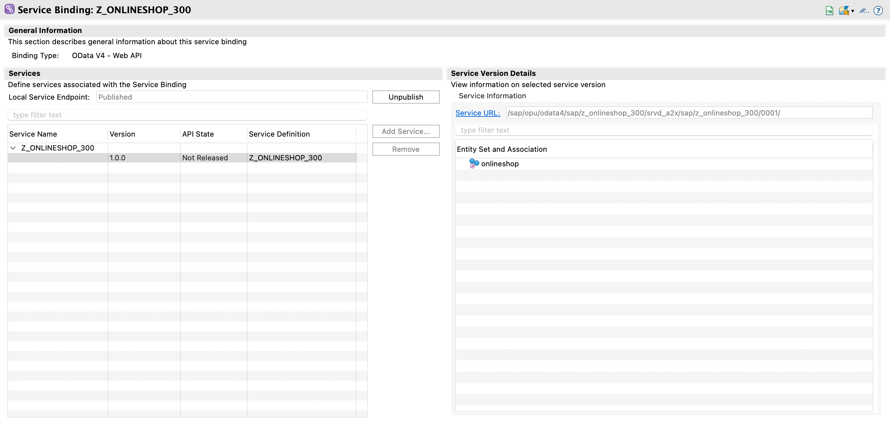

# Exercise 4: Create a Web API for the Onlineshop

## Exercise 4.1: 

1. 

  

   

2. Overwrite the contents of the generated data definition like this

<pre lang="ABAP">
@AccessControl.authorizationCheck: #CHECK
@Metadata.allowExtensions: true
@EndUserText.label: 'Projection View for ZR_ONLINESHOP_###'
define root view entity ZAPI_ONLINESHOP_###
  provider contract transactional_query
  as projection on ZR_ONLINESHOP_###
{
  key OrderUUID,
  OrderID,
  Product,
  Quantity,
  LocalLastChangedAt
}
</pre>

3. Save and Activate your change

4.

 

 

 

<pre lang="ABAP">
projection;
strict ( 2 );

define behavior for ZAPI_ONLINESHOP_### alias onlineshop
{
  use create;
  use update;
  use delete;
}
</pre>

 

 

Add alias `as onlineshop`

<pre lang="ABAP">
@EndUserText.label: 'Service Defition Z_ONLINESHOP_300'
define service Z_ONLINESHOP_300 {
  expose ZAPI_ONLINESHOP_300 as onlineshop;
}
</pre>

Save and Activate your change

 

 

Activate

Publish

 

In Browser:

https://34.233.103.22:44301/sap/opu/odata4/sap/z_onlineshop_300/srvd_a2x/sap/zui_onlineshop_300/0001/onlineshop

  

## Summary   
You can continue with the next exercise - **[Build Exercise 1: Create Actions in SAP Build to access the Onlineshop API](../../../build/exercises/ex1/README.md)**
